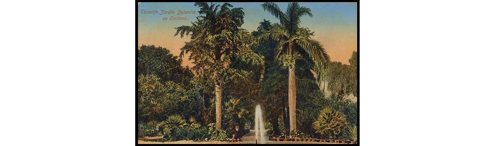
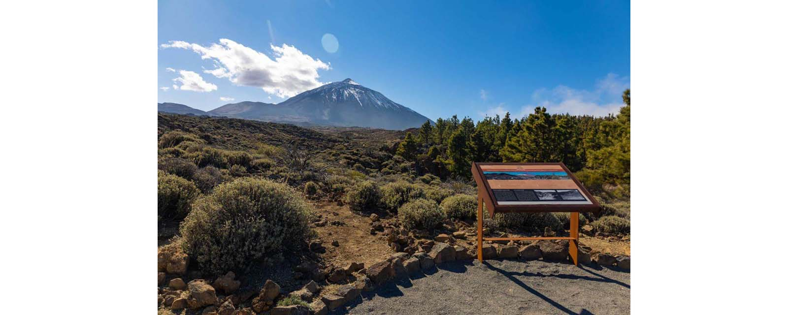
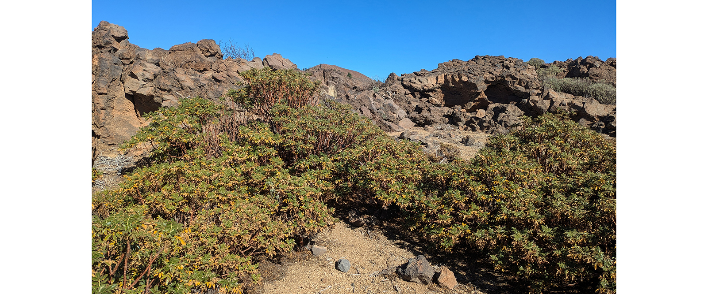
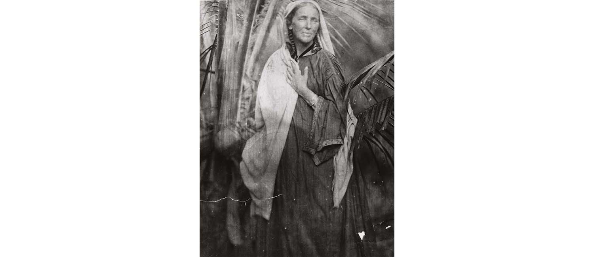

Gran parte de la literatura sobre jardinería y jardines son libros con directrices de diseño, fotos con ejemplos de jardines perfectos, herramientas, accesorios, materiales, etc. A veces son libros maravillosos, pero casi siempre poco útiles.

Me parece más interesante encontrar libros de pensamiento sobre jardinería y plantas. Aquí hay una pequeña selección.

La sabiduría del jardinero. Gilles Clément. Gustavo Gili. 2021

Jardinosofía. Una historia filosófica de los jardines. Santiago Beruete. Turner. 2016

Loa a la tierra. Un viaje al jardín. Byung-Chul Han. Herder. 2023

Una breve historia del jardín. Gilles Clément. Gustavo Gili. 2021

Planta Sapiens. Paco Calvo, Natalie Lawrence. Seix Barral. 2023

La mente bien ajardinada. Sue Stuart-Smith. Debate. 2021

Color schemes for the flower garden. Gertrude Jekyll. Country Life. 1919.

Gertude Jekyll me interesa, no tanto por sus ideas sobre el uso del color (con tanta influencia posterior), o por tantas de sus propuestas, sino por pensamientos tan acertados como este fragmento de _On gardening_:

> *Un credo de jardinería*(fragmento)
> No pretendo tener habilidades literarias ni conocimientos botánicos, ni siquiera conocer los mejores métodos prácticos de cultivo; pero he vivido entre flores al aire libre durante muchos años, sin escatimar esfuerzos en el trabajo, y he llegado a tener una relación muy íntima y amistosa con muchas plantas en crecimiento, adquiriendo ciertos instintos que, aunque no están claramente definidos, constituyen un conocimiento útil.
Pero la lección que he aprendido a fondo, y deseo transmitir a otros, es conocer la felicidad duradera que brinda el amor por un jardín. Me alegra ver a alguien, y especialmente a los niños, preguntando por las flores, deseando tener su propio jardín y trabajando con esmero en ellos. Porque el amor por la jardinería es una semilla que, una vez sembrada, nunca muere, sino que siempre crece y crece hasta convertirse en una fuente duradera y cada vez mayor de felicidad.
Soy una firme defensora de un tratamiento pictórico del jardín y el bosque, principalmente con grandes efectos y, en segundo lugar, con detalles menos bellos. Además, de organizar las plantas, los árboles y los espacios verdes de forma que se vean felices y acogedores, sin que se note el esfuerzo consciente. Busco la belleza y la armonía en todas partes, y especialmente la armonía del color. Un jardín así tratado brinda la deliciosa sensación de reposo, frescura y el más puro disfrute de la belleza, que, a mi entender, es el mejor cumplimiento de su propósito; mientras que para el trabajador diligente, su felicidad es como la ofrenda de un himno constante de alabanza. Pues sostengo que el mejor propósito de un jardín es deleitar y refrescar la mente, calmar, refinar y elevar el corazón con un espíritu de alabanza y agradecimiento. Es cierto que quienes practican la jardinería de la mejor manera lo encuentran así. He aprendido mucho, y sigo aprendiendo, de los jardines de otras personas, y la lección más profunda es no decir nunca "Lo sé": hay muchísimo que aprender, y las condiciones de los diferentes jardines varían enormemente, incluso cuando el suelo y la situación parecen similares y se encuentran en la misma zona.
He aprendido mucho de los pequeños jardines rurales que contribuyen a que nuestros caminos ingleses sean los más bonitos del mundo templado. Es difícil entrar en el jardín rural más pequeño sin aprender u observar algo nuevo. Pueden ser dos plantas que crecen maravillosamente juntas por una feliz casualidad, o una bonita maraña de enredaderas, o algo que siempre se pensó que debía tener una pared sur que prosperaría mejor en una este. Pero la vista y la mente deben estar alerta para recibir la impresión y ser estudiosos para almacenarla, para enriquecer el acervo de experiencias.
> <cite>― [Gertrude Jekyll](https://www.countrylife.co.uk/gardens/gardening-tips/great-british-garden-makers-gertrude-jekyll-25395)</cite>

***
** Referencias

[Diversidad florística en los jardines públicos de la ciudad de La Laguna (Tenerife), Patrimonio de la Humanidad](https://www.museosdetenerife.org/assets/downloads/file-147-6011eda4a3.pdf)

[Charla sobre jardines históricos en Canarias por Dr. Arnoldo Santos](https://youtu.be/gdMhMR-dAIs)

[Guía de jardinería responsable en la Reserva de la Biosfera de La Palma](https://atajatusmatos.lapalmabiosfera.es/publicaciones/guia/)

[Manual para creación de un jardín canario](https://fundacioncanarina.org/wp-content/uploads/2022/05/Manual-para-creacion-de-un-jardin-canario.pdf)

[Species Plantarum](https://bibdigital.rjb.csic.es/idurl/1/10612)

[Biblioteca Digital del Real Jardín Botánico](https://bibdigital.rjb.csic.es/)

[Catálogo Español de Especies Exóticas Invasoras](https://www.miteco.gob.es/es/biodiversidad/temas/conservacion-de-especies/especies-exoticas-invasoras/ce-eei-catalogo.html)

[Atlas de las plantas alóctonas invasoras](https://www.miteco.gob.es/es/biodiversidad/temas/inventarios-nacionales/inventario-especies-terrestres/inventario-nacional-de-biodiversidad/ieet_flora_vasc_aloct_invas.html)

[Publicación del Jardín Botánico de la Universidad de Valencia](https://espores.org/es/)

[Histoire Naturelle des Îles Canaries](https://bibdigital.rjb.csic.es/idurl/1/9789)

[Hortus Cliffortianus](https://bibdigital.rjb.csic.es/idurl/1/11198)

[Ecología del gato cimarrón en el ecosistema termófilo de El Hierro (Islas Canarias) y su impacto sobre el lagarto gigante ( Gallotia simonyi) (1999)](https://accedacris.ulpgc.es/bitstream/10553/18184/1/0570396_00000_0000.pdf)

[Gatos en islas. Un problema global de conservación. CISIC 2016](https://digital.csic.es/bitstream/10261/215154/1/Cat-Nogales-2016-ElinDiferente.pdf)

***
***
	
# Apéndice: Otros jardines en Tenerife y Gran Canaria

## Jardín de flora canaria de la ULL
[Sitio web](https://www.ull.es/centros/jardin-flora-canaria/jardin-canario-campus-central/)

Este es un jardín creado por el Servicio de Parques y Jardines de la Universidad de La Laguna. 
Los inicios del jardín se remontan a las primeras plantaciones realizadas por estudiantes de Biología y residentes del Colegio Mayor Fernando. El espacio vivió diferentes etapas, que comenzaron con un diseño tradicional estilo versallesco y prosiguió con periodos de abandono. Sin embargo, en algo más de una década este espacio ha experimentado una profunda transformación hacia un modelo de jardinería sostenible y con identidad propia. En este sentido es interesante consultar el apartado [Metodología de trabajo](https://drive.google.com/file/d/1Ld8fxeftfDg1ZkDQrRLNJgEIEcQubHj6/view?usp=share_link).
En este Parque Central se utiliza la vegetación natural de la isla de Tenerife en un modelo de jardinería diferente, con la menor antropización posible. Se trata de cerrar el ciclo natural de la vida dentro del espacio dando la misma importancia a todos los elementos, desde los más pequeños e invisibles que componen el suelo, hasta los más grandes y visibles, como los árboles. 

Los distintos parterres del Parque no son restauraciones ecológicas sino exposiciones de plantas en parcelas realizadas por pisos de vegetación: Tabaibal Cardonal, Piso Termoesclerófilo Sabinar, Piso Termoesclerófilo Bosque Mixto, Piso Termoesclerófilo Sauceda Barranco, Piso Pinar, Piso Monte Verde, Piso Termoesclerófilo Transición a Monte Verde, Aprovechamiento de residuos orgánicos, Zona de Jardín Ornitófilo, Piso Matorral de Cumbre, Piso Termoesclerófilo Mixto, Zona de Experimentación, Piso Termoesclerófilo Mixto, Plantas singulares.

&emsp;&emsp;_Representación del monteverde, 2016 y 2022._

Esta renovación ha sido fruto de la colaboración entre el Servicio de Parques y Jardines de la ULL y expertos en flora y fauna endémica de la Universidad de La Laguna, con el respaldo de los órganos de gestión universitarios. Prima la biodiversidad y los ecosistemas regionales con un enfoque multidisciplinar y sostenible y además cumple con una función didáctica y divulgativa:
Este jardín también es una herramienta tanto para la docencia en los grados de Educación, Biología y Ciencias Ambientales, como para la investigación y transferencia a diferentes etapas educativas y a la sociedad. Así, el alumnado de Educación tiene en este jardín una representación de la flora canaria estructurada en los pisos de vegetación presentes en el archipiélago, permitiéndoles estudiar in situ la flora representativa de cada nivel, así como la formación y conservación de los diferentes ecosistemas. El alumnado de Ciencias Ambientales y Biología realiza supuestos prácticos con observación y recogida de datos y muestras para el desarrollo de trabajos en asignaturas generales de Botánica y Zoología. También se puede apreciar flora amenazada cuyas localidades naturales son escasas y de difícil acceso y que se encuentra en estos jardines.
Por otra parte, este jardín ha sido y continúa siendo base de numerosos proyectos de innovación y transferencia educativa, así como proyectos regionales, nacionales e internaciones.

&emsp;&emsp;_Continuación del proyecto de renaturalización en el patio interior del edificio Central_  

### Ladera ajardinada en el Campus de Guajara.

En el Campus de Humanidades de Guajara se ha reacondicionado una ladera, al suroeste del recinto, aplicando los mismos criterios de renaturalización que en Campus Central.

***
## Jardín Canario Viera y Clavijo
[Sitio web](https://jardincanario.grancanaria.com)

&emsp;&emsp;_Plano del jardín, en [Recursos digitales de Ecoescuela, Gobierno de Canarias](https://www3.gobiernodecanarias.org/medusa/ecoescuela/recursosdigitales/tag/botanico/)_

El Jardín Botánico Canario Viera y Clavijo, conocido también como Jardín Canario, se encuentra en Gran Canaria, Islas Canarias, nombrado en honor de José de Viera y Clavijo, naturalista canario del siglo XVIII, pionero de las Ciencias de la Naturaleza en el archipiélago. Está dedicado principalmente a las flores y plantas endémicas de las siete islas del Archipiélago Canario, incluyendo además especies de la Macaronesia. 
La mayoría del Botánico se encuentra en terrazas del costado del barranco de Guiniguada. Cada especie posee su propia zona delimitada. 

ZONAS:
- Vegetación rupícola
- Pinar
- Monteverde (Laurisilva y Fayal-brezal)
- Bosque termófilo
- Tabaibal-cardonal
- Vegetación halófila costera

- Jardín del mundo
- Palmetum
- Jardín Macaronésico ornamental
- Jardín de suculentas
- Jardín de las Islas

El Jardín Botánico Viera y Clavijo fue fundado el año 1952 por Don Matías Vega Guerra, Presidente del Cabildo, que hizo realidad el sueño del botánico sueco Eric Sventenius, quien permaneció como director hasta su muerte en un accidente de tráfico en 1973. El propósito de su fundación era el de preservar y proteger la flora endémica de las Islas Canarias.
Sventenius contó con grandes colaboradores, entre los que destacan el Dr. Juan Nogales Hernández (ingeniero forestal), Don Fernando Navarro Valle (perito agrícola), Don José Alonso Socorro (capataz-jardinero mayor), Don Graciliano Morales Ramos (Consejero del Cabildo) o Don Jaime O'Shanahan Bravo de Laguna (perito agrícola), entre otros.
En 1974, el Dr. David Bramwell fue nombrado segundo director del Jardín. En esa etapa el Botánico se consolida como un Centro de conservación, investigación y educación ambiental. Se construyen nuevos laboratorios, un herbario, una biblioteca y un vivero en donde mantener las colecciones de plantas vivas. En 2012 hay un periodo de transición bajo la dirección de D. Bernardo Navarro, y en 2014 es nombrado director el Dr. Juli Caujapé, con numerosas publicaciones sobre flora canaria y especialista en conservación genética y filogenia molecular de plantas terrestres. En este periodo se crea un laboratorio molecular, un banco de ADN y software especializado.

> “La idea que inspiró la creación de este jardín botánico en 1952 fue la de conservar en un lugar toda la riqueza botánica de los archipiélagos de Canarias, Azores, Madeira, Cabo Verde y de un pequeño enclave del continente africano que constituye en su conjunto la denominada Región Macaronésica.
> El Jardín Botánico Canario Viera y Clavijo puede considerarse como pionero en la nueva filosofía imperante del último tercio del siglo XX de considerar los jardines botánicos como centros dedicados a la conservación de plantas y en especial de aquellas especies amenazadas de extinción que viven en el propio territorio o área en que se encuentran enclavados.
> La colección de planta viva cultivada en el Jardín está compuesta fundamentalmente de endemismos canarios y macaronésicos, pero también hay una importante representación de elementos exóticos en las colecciones del "jardín de cactus", "jardín del mundo" y "palmetum".
> (del folleto del Jardín)
***
## Jardín de Aclimatación de La Orotava e Hijuela del Botánico

&emsp;&emsp;_Plano del jardín. La leyenda de  las especies se puede consultar en [Recursos digitales de Ecoescuela, Gobierno de Canarias](https://www3.gobiernodecanarias.org/medusa/ecoescuela/recursosdigitales/tag/botanico/)_

Es un jardín botánico situado en Puerto de la Cruz., aunque en su fundación el Puerto de la Cruz pertenecía al municipio de La Orotava y era conocido como Puerto de La Orotava, de ahí su nombre. Es Bien de Interés Cultural, con categoría de jardín histórico, desde 1994.
Tiene sus orígenes en una orden de fundación de 1788, por el rey Carlos III de España,. Su labor inicial fue la de reunir plantas exóticas en las colonias españolas del Nuevo Mundo, para que después de un periodo de aclimatación en el Archipiélago, se trasladasen a los jardines reales de Madrid y Aranjuez. El Jardín de Aclimatación de La Orotava, era pues, tras el Real Jardín Botánico de Madrid, que también poco antes fue fundado por orden del rey Carlos III, el segundo jardín botánico de España. 

Conserva un amplio herbario con más de 30.000 exsicatas, un banco de germoplasma, un vivero y otras instalaciones que lo convierten en un importante centro de investigación científica.
Aparte de la finalidad, científicamente poco objetiva de aclimatar especies tropicales, va surgiendo un interés internacional por el Jardín, Desde los comienzos de su puesta en marcha, el jardín se convirtió en un punto de atracción para todos aquellos visitantes que por diversas razones, comerciales, científicas o “turísticas” se acercaban a la Isla, y sus testimonios nos ayudan, en muchos casos, a comprender su paradójica historia. El papel que el Jardín Botánico ha jugado en el mundo de la cultura canaria ha sido importante, como lugar de paso de ilustres visitantes desde fines del s. XVIII o como protagonista en la investigación agraria y botánica. En 1796, la expedición del capitán francés Baudin tuvo que recalar en Tenerife por un temporal y algunos miembros de la expedición tuvieron ocasión de trabajar en la Isla recolectando materiales, como el naturalista Riedlé, y principalmente J.P. Ledru el cual no solamente herborizó, sino que trabajó directamente en el jardín botánico realizando un catálogo de las plantas existentes en el mismo y, además, junto con el dibujante Le Gros, miembro igualmente de la expedición, que permaneció en Tenerife, trazó sobre el terreno, en los cuatro rectángulos mayores distribuidos en torno al estanque central, la delimitación de las 24 clases del Sistema de clasificación botánica de Linneo. Esa delimitación se perdió en el tiempo y en la actualidad no existe ningún tipo de ordenación científica en las colecciones del jardín.
En su [Voyage aux îles de Ténériffe, la Trinité, Saint-Thomas, Sainte-Croix et Porto Ricco](https://archive.org/details/voyageauxlesdetn01ledr), Ledru nos relata un episodio en el que está a punto de morir por recolectar una planta, en una zona de barrancos, al norte de La Laguna:

> Unos días después, regresé al bosque y, en lugar de seguir el sendero habitual del acueducto, tomé otro más rico en plantas, más pintoresco, pero más peligroso que el primero. La ladera de las montañas es tan empinada que uno se encuentra con frecuencia con precipicios tan profundos, que hay que estar constantemente atento para evitar una caída de 150 a 200 metros.
Todavía me estremezco al recordar el extremo peligro que corrí durante esta exploración botánica. Un arbusto florido (1), plantado oblicuamente en una roca, asomaba su copa rojiza y verde sobre el borde de un barranco escarpado, en cuyo fondo apenas distinguía un rebaño de cabras. Para alcanzarlo, tuve que descender y apoyarme en su tronco. No lo dudé; pero al extender la mano para agarrar una rama florida, el frágil soporte en el que me apoyaba se rompió bajo mis pies. Todo habría terminado para mí si, al primer crujido que oí, no hubiera agarrado rápidamente una raíz de laurel que tenía a mi lado. El peligro me agilizó y me precipité hacia la roca, donde permanecí al menos tres minutos, temblando de miedo. Finalmente, tras recobrar el sentido, corté una rama, con cuya ayuda alcancé fácilmente la parietaria, que colgaba de la roca por una sola raíz. (1) _Parietaria arborea_

En 1799, Humboldt llega al Jardín, se encuentra con Le Gros (que hace de guía para la subida al Teide) y cita diversas especies cultivadas en él. Este peregrinaje científico y “turístico” se continúa en la primera mitad del s. XX para culminar con la llegada, en 1943, de Sventenius, primer investigador que queda ligado de forma permanente al jardín y a la investigación botánica en las Islas durante 30 años. Sus labores estaban relacionadas con la investigación de la flora canaria y la formación de un excelente herbario, fruto de sus herborizaciones por todo el archipiélago canario, Madera, Salvajes y Cabo Verde, que cuenta con una colección de más de 30.000 ejemplares. Gracias a su interés se conserva una biblioteca, escasa en volúmenes, pero importante en contenido, especialmente en obras relacionadas con la botánica canaria, con un ejemplar de la Historia Natural de las Islas Canarias, que según don Bello y Espinosa perteneció al propio Berthelot.
El Jardín posee un rico patrimonio vegetal, iniciado desde fines del siglo XVIII. Sin embargo, la carencia de registros históricos completos desde los inicios de su fundación, no nos permiten saber con exactitud la edad de los ejemplares más antiguos y su procedencia, pero son diversas las especies que superan los 150 años de antigüedad.
Entre sus funciones está el mantenimiento y conservación de la Hijuela del Jardín Botánico ubicada en el centro de La Orotava, junto a la trasera del Ayuntamiento, pequeño y curioso espacio ajardinado con algo más de un siglo de existencia. 

_(Texto basado en el [artículo de Arnoldo Santos](https://www.rinconesdelatlantico.com/num2/jardin_orotava.html) para la revista Rincones del Atlántico)_

### Hijuela del Botánico

La Hijuela del Botánico, conocido simplemente como La Hijuela, es un espacio público ajardinado en la parte trasera del Ayuntamiento de la Villa de La Orotava. Fue creado en 1788 por iniciativa del VI Marqués de Villanueva del Prado, Alonso de Nava y Grimón, quien lo concibió como un centro complementario del Jardín de Aclimatación de la Orotava, que se encuentra en el municipio del Puerto de la Cruz. Este jardín, está ubicado en el que fue el huerto del antiguo convento de San José, en la trasera del actual Ayuntamiento. Alberga numerosas especies de plantas y árboles de todos los continentes.
***
## Jardín Botánico de El Portillo “Wolfredo Wildpret”

Este jardín, integrado dentro del Parque Nacional del Teide, ocupa una parcela de 4 hectáreas y ha sido creado para exponer, interpretar didácticamente, investigar y reproducir la flora autóctona de este territorio. El Jardín Botánico de El Portillo forma parte de la Asociación Internacional de Jardines Botánicos.

Están representadas más del 75% de las especies superiores que alberga el Parque Nacional. Existen además laboratorios con cámaras de germinación y banco de germoplasma, desarrollando un programa de recuperación de especies en peligro de extinción. En el vivero del Jardín Botánico de El Portillo se desarrolla todo el ciclo de la planta: la selección de semillas, crecimiento en invernaderos y en zonas de acondicionamiento climático, la plantación controlada y protegida y la definitiva cuando adquiera el porte necesario para su supervivencia.
El Jardín Botánico de El Portillo se denomina desde 2024 ‘Jardín Botánico Wolfredo Wildpret’, en homenaje al biólogo y catedrático de Botánica de la Universidad de La Laguna.
***
## Jardín Sitio Litre
[Sitio web](https://jardindeorquideas.com/historia/)

El Jardín Sitio Litre es un jardín de propiedad privada que mantiene una gran colección de plantas tropicales y subtropicales en el Puerto de la Cruz. Es el jardín más antiguo de Tenerife con más de 220 años. 
El nombre actual le viene dado por su primer propietario Archibald Little, quien compró la finca en 1774, dando lugar a que esta hacienda se denominase _Little´s Place_ o el _Sitio Little_, localmente transformado en _Sitio Litre_ para los isleños.
Little realizó un conjunto de reformas para convertirla en un lugar de ocio y distracción. De este modo, la mansión fue reestructurada para transformarse en una fonda o quinta de descanso. Archibald Little, además, diseñó un jardín al característico estilo británico en el que plantó especies típicas de la flora canaria y tropical. 

&emsp;&emsp;_Foto Till Krech.CCBy_

La casona del Sitio Litre es de estilo colonial con elementos de arquitectura doméstica canaria. El edificio está rematado por un mirador octogonal de estilo inglés colonial.
Sitio Litre fue lugar de estancia o de visita para muchos extranjeros que visitaban la isla, como André Pierre Ledru, Humboldt, Marianne North,, Alfred Diston, Charles Piazzi Smyth, Agatha Christie o Richard F. Burton. 
En 1852 fue vendido a Charles Smith y en 1996 a John Lucas, quien abrió al público los jardines.

&emsp;&emsp;_Marianne North fotografiada por Julia Margaret Cameron en Ceilán, la actual Sri Lanka, 1877_

Hay un nexo muy interesante entre Sitio Litre, la isla de Tenerife y uno de los jardines más importantes del mundo, Kew Gardens: la artista Marianne North. La famosa viajera y artista inglesa pasó dos meses en Tenerife en 1875, hospedada en la mansión, y pintó 26 cuadros con la flora y paisajes de la isla: vistas de este jardín, plantas endémicas incluyendo diversos dragos, panorámicas de diversos puntos del norte de la isla, etc.

&emsp;&emsp;_Marianne North dibujando en Ceilán, 1877. Foto de Julia Margaret Cameron_

Tras viajar por todo el mundo pintando Marianne North donó su obra a Kew Gardens, donde se construyó un edificio, la [Marianne North Gallery](https://www.kew.org/kew-gardens/whats-in-the-gardens/marianne-north-gallery), específicamente para reunir más de 800 piezas, con un diseño de la propia artista.
Allí están expuestos los 26 cuadros de Tenerife, juntos en uno de los paneles. Una visita a Londres no está completa sin ir a Kew Gardens y visitar ese reducto de imágenes insulares en el contexto de una colección mundial. [Reproducciones de las pinturas de North.](https://en.wikipedia.org/wiki/User:Jane023/Paintings_by_Marianne_North)

&emsp;&emsp;_Exterior y vista del interior. A la izquierda de la foto podemos ver la esquina del panel de Tenerife, abajo del todo, la 514. Vista del Puerto de Orotava, Tenerife._

Esta es la lista completa de pinturas de Tenerife:
- Número 502. Flores de granado, pintadas en Tenerife.
- Número 503. Drago en San Juan de Rambla, Tenerife.
- Número 504. Grupo de flores, pintado en Tenerife.
- Número 505. Aloe común en flor, Tenerife.
- Número 506. Drago en La Orotava, Tenerife.
- Número 507. Racimo de raíces aéreas de un drago, Tenerife.
- Número 508. Planta parecida a un cactus que crece cerca del mar en Tenerife. (Euphorbia canariensis)
- Número 509. Siempreviva y canarios en Tenerife.
- Número 510. Vista del Pico desde el puente de Icod, Tenerife.
- Número 511. Drago en el jardín del Sr. Smith, Tenerife.
- Número 512. Vista del Pico de Tenerife. 
- Número 513. Vista del Sitio del Pardo, Orotava, Tenerife.
- Número 514. Vista del Puerto de Orotava, Tenerife, desde el Sitio del Pardo.
- Número 515. Vista en el Jardín Botánico de Tenerife.
- Número 516. Ensete abisinio en un jardín de Tenerife. (platanera)
- Número 518. Dracunculus canariensis y Cineraria en flor, Tenerife.
- Número 519. Una especie de buglosa, Tenerife. — Echium simplex.
- Número 520. Flores y frutos de naranjo, pintados en Tenerife.
- Número 521. Escena en el jardín del Sr. Smith, Tenerife.
- Número 522. Vista en los jardines de cochinilla de Santa Cruz, Tenerife.
- Número 523. Drago en un jardín de Santa Cruz, Tenerife.
- Número 524. Vista de Icod, Tenerife. 
- Número 525. Antigua casa solariega de Castro, Tenerife
- Número 526. El pino canario en Icod, Tenerife.
- Número 527. Rosa Cherokee con el pico de Tenerife a lo lejos. (Rosa laevigata)
- Número 528. Aloe y cochinilla en flor, Tenerife.

&emsp;&emsp;_Pintura Número 514. Vista del Puerto de Orotava, Tenerife, desde el Sitio del Pardo.
En término medio se ve la mansión de Sitio Litre con su característico mirador hexagonal  y su drago._

***
url: [www.jardinedu.es](https://jardinedu.github.io/cifpcm/inicio) / contacto: correoprofe@gmail.com / [bio](https://jardinedu.github.io/cifpcm/about) 

***
