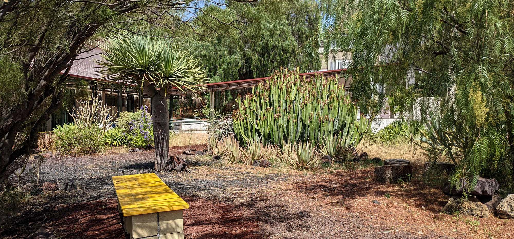
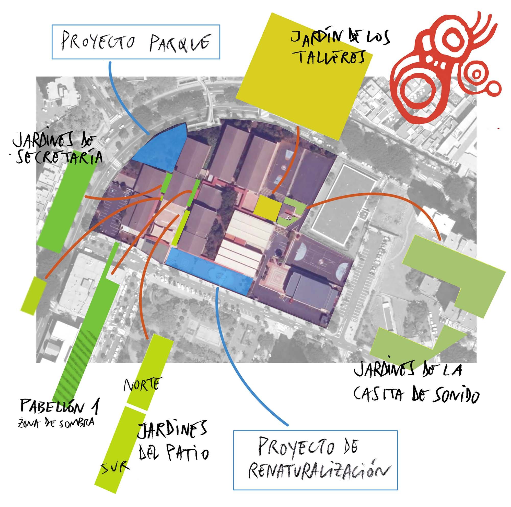
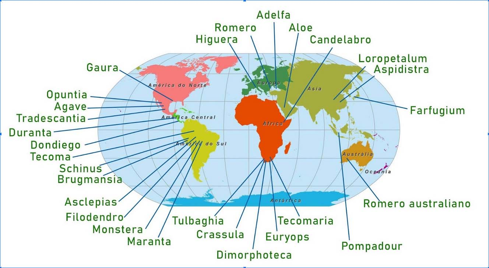

> “A garden is a grand teacher. 
It teaches patience and careful watchfulness; it teaches industry and thrift; above all it teaches entire trust."

> "Un jardín es un gran maestro. 
Enseña paciencia y atención cuidadosa; enseña laboriosidad y ahorro; sobre todo enseña la confianza absoluta.”
> <cite>― [Gertrude Jekyll](https://www.countrylife.co.uk/gardens/gardening-tips/great-british-garden-makers-gertrude-jekyll-25395)</cite>

			
Este proyecto empezó con una acción educativa de concienciación sobre especies invasoras en las islas, recuperación de un jardín con endemismos y trabajo sobre valores ambientales en el Centro Integrado de Formación Profesional (CIFP) César Manrique, en Santa Cruz de Tenerife. 

El jardín inicial de flora canaria que se recuperó (el de los Talleres) necesita ya (2025) pocos cuidados y es de bajo mantenimiento, aunque en su aparente sencillez ha necesitado varios años de evolución para llegar a este punto. 

Igual que las plantas, los proyectos crecen: luego ha venido el trabajo con más parterres, con otros problemas, otros objetivos y otros retos.

Me llamo Jose, profesor del Centro. Siempre me ha gustado cuidar de las plantas, desde mis años en Bachillerato donde coleccionaba plantas nativas canarias en la azotea de mi casa hasta el jardín que trabajé y disfruté muchos años, en mi casa natal en Güímar. En este documento te hablaré del desarrollo de los jardines del CIFP desde 2018, con una guía de especies y datos sobre ellas que me parecen suficientemente interesantes. 

* * *

## Los inicios: el control del rabo de gato

Hacia 2017 todos los parterres que rodean los edificios del Instituto estaban siendo colonizado por una especie invasora muy agresiva, el “rabo de gato” (_Pennisetum_), una de las especies más dañinas para la flora nativa de las Islas Canarias. 
Como primer paso hice un trabajo sistemático (que  se ha desarrollado a lo largo de varios años) para eliminar esta especie siguiendo un protocolo adecuado. Se realizó una pequeña campaña informativa en los paneles de anuncios del Centro. Nunca es suficiente con la concienciación sobre la problemática de las especies exóticas en un sistema insular. Conozco el protocolo de contención del Pennisetum porque con regularidad colaboro con la Asociación Abeque, que hace salidas de control de esta especie en los barrancos de Teno.

* * *

## El primer jardín 

Tras quitar _Pennisetum_ durante un año, y sin ser este estrictamente un Proyecto de Innovación, sino una iniciativa educativa de concienciación, hacía 2018 le planteé al Director (en ese momento Michel) una intervención para recuperar un jardín frente a los Talleres 1 2 y 3. Razones didácticas en la puesta en valor de la flora canaria; también la flora que se ha usado en jardinería popular en las islas. En otro apartado escribo un poco más sobre esto.

Por supuesto también está siempre presente una educación ambiental en su más puro sentido: valorar la Naturaleza y la Vida.
Y más razones didácticas en ese despertar de la curiosidad sobre el mundo y la historia de los descubrimientos botánicos y el viaje de las plantas que supone un jardín. 

Por último, no creo que ni siquiera sea necesario explicar los beneficios para la salud mental de tener un entorno con jardines equilibrados en un centro educativo, pero si buscas encontrarás mucha literatura sobre esto, incluidos [informes de la Organización Mundial de la Salud](https://www.who.int/europe/tools-and-toolkits/greenur--the-green-urban-spaces-and-health-tool) (WHO). Si tienes interés en saber más sobre esto, recomiendo especialmente el libro de 2021 _La mente bien ajardinada_, de Sue Stuart-Smith, _“La mente bien ajardinada es una combinación de neurociencia, literatura, historia y psicoanálisis que indaga en el secreto que muchos jardineros conocen desde siempre: el contacto con la naturaleza puede transformar radicalmente nuestra salud y nuestra autoestima”_.  (Al final del texto, tras la Bibliografía, incluyo una cita más larga de este libro)

* * *

## ¿Qué jardinería?

Si tuviera que definir qué tipo de jardínes se trabaja, sería simplemente ir construyendo diferentes entornos en una línea de una jardinería paisajística que busca volúmenes y colores, un lugar para contemplar al pasar y también estar (he colocado algunos bancos). Alrededor de los edificios del CIFP hay parterres con todo tipo de condiciones de insolación, humedad, acceso de personas, etc que se pueden abordar con diferentes estrategias.

Procuro tener jardines sostenibles, de bajo mantenimiento, adaptado en este caso a suelos pobres, alta insolación y poco riego, con plantas de larga vida, si es posible que se desarrollen desde pequeñas en el propìo jardín, incluso de semilla, evitando la _jardinería instantánea_ basada en plantas de vivero en floración que se retiran al cabo de pocos meses, o en esa otra variante en la que se compran plantas con muchos años de vida y se trasplantan. Por desgracia así funcionan muchos ajardinamientos. 
No utilizo herbicidas ni tampoco sistemas como cubrir la tierra con malla, ni desbrozadoras o cortadoras de hilo (en los dos casos, fuentes de microplásticos). Elimino las malas hierbas a mano, respetando en lo posible plantas nativas que aparecen espontáneamente. Aquí no se trata de productividad -estamos haciendo jardinería, no agricultura- ni de prisas. 
No soy jardinero profesional, ni siquiera tengo formación, como cursillos, en esta disciplina, y trabajo desde la observación y la intuición. Con un poco de creatividad, porque entiendo un jardín también como una obra plástica, efímera y en cambio constante.

* * *

## Educar sobre nuestro territorio, nuestro patrimonio cultural y el planeta donde vivimos: 
### Plantas canarias, plantas de jardinería tradicional canaria, plantas sostenibles, plantas como un viaje cultural

Por sentido común en cuanto a sostenibilidad, singularidad e identidad he usado muchas especies nativas de las Islas Canarias, como: cardón, tabaiba dulce, amarga y púrpura, drago, guaydil, magarza, lavanda, salado, vinagrera, cardoncillo, senecio, balo. Pero esto no significa que pretenda tener un _jardín de flora canaria_, sino poner en valor estas especies usándolas en combinación y diálogo con otras no nativas, con criterios de jardinería. Esto es algo que tardé años en aprender: hay que guardar las debidas precauciones con el uso indiscriminado de flora nativa en jardines en Canarias. Traslocar especies entre zonas o pisos de vegetación dentro de una isla, o incluso entre islas no siempre es lo más deseable, y puede causar, por ejemplo, hibridaciones no deseadas.

Me parece importante incluir especies que se han usado en la jardinería popular canaria: dondiegos, brugmansias, pompadour, capa de la reina, etc. La jardinería tradicional nos conecta con nuestros antepasados. Tengo recuerdos de infancia en los que tumbado en el piso de madera de la galería de la casa de mi abuela miraba por las rendijas de las tablas miraba una selva de hojas de salón  (_Aspidistra_, endémicas de China) en el patio debajo de mí. Lo que me lleva al siguiente punto:

La historia de las plantas, su conocimiento y su difusión por el mundo forman parte de un viaje cultural muy rico. Cierto que unida a una historia de colonialismos, saqueos, etc. que por supuesto hay que conocer, pero también de ciencia, aventuras, el descubrimiento del mundo y la valoración de su enorme diversidad. No quiero renunciar a esto, y me parece tan necesario como bello que en estos jardines se puedan encontrar plantas de selvas y de desiertos, de América del Norte, Central y del Sur, África del sur, África oriental, Australia, China, Japón.  

Las Islas Canarias han tenido un importante papel en esta historia de expediciones botánicas, siendo las propias islas, por su alta biodiversidad, destino de científicos. Esto, junto a las condiciones climatológicas, podría explicar en parte la larga tradición de uso de flora exótica de todo el planeta en los jardines de Canarias. Como leemos en el estudio [Diversidad florística en los jardines públicos de la ciudad de La Laguna (Tenerife), Patrimonio de la Humanidad](https://www.museosdetenerife.org/assets/downloads/file-147-6011eda4a3.pdf):

> “La procedencia de las especies catalogadas en el ámbito de este estudio es muy diversa y abarca los cinco continentes, lo cual refleja la amplia y antigua tradición canaria de albergar en nuestros jardines una rica flora ornamental originaria de muchas zonas geográficas del planeta. “

## Algunos materiales de trabajo
Voy reuniendo las recomendaciones que puedo encontrar, con un mínimo de rigor, sobre jardinería en estas islas, que no son muchas. 

### Charla sobre jardines históricos en Canarias
Hay una interesante charla del Dr. Arnoldo Santos sobre jardines históricos en Canarias, en la RACBA. Se unen aspectos históricos, recomendaciones de especies nativas, etc.  [Enlace a YouTube](https://youtu.be/gdMhMR-dAIs). 

### Guía de jardinería responsable
En 2022 se publicó la [Guía de jardinería responsable en la Reserva de la Biosfera de La Palma](https://atajatusmatos.lapalmabiosfera.es/publicaciones/guia/), por la Fundación Canaria Reserva Mundial de la Biosfera La Palma, elaborada por Cristina González Montelongo y Marco Díaz-Bertrana, con el apoyo del Gobierno de Canarias. Aún estando referida a La Palma la mayoría de sus principios básicos es aplicable a Tenerife. Según sus propios objetivos, persigue:
- dar respuesta a profesionales de la jardinería (viveristas, jardineros y paisajistas) y particulares que, sensibilizados con el problema que suponen las especies exóticas invasoras en el archipiélago canario, desean ajardinar con plantas exóticas y nativas que no generen un problema medioambiental en la isla de La Palma.
- aportar a la ciudadanía una serie de recomendaciones sobre el uso de la flora ornamental, tanto nativa como exótica, con la finalidad de ahorrar recursos (esfuerzo de mantenimiento, agua…).
- informar sobre algunos problemas asociados a la jardinería con planta nativa de Canarias (contaminación genética, hibridación, introducción de flora exótica, etc.), al mismo tiempo que valorizar la flora propia de la isla para su uso en la jardinería.

Esta Guía está dentro de “Ataja tus matos” ([atajatusmatos.lapalmabiosfera.es/](https://atajatusmatos.lapalmabiosfera.es/)), la aplicación en La Palma de un programa de prevención y temprana contra plantas invasoras del proyecto integrado LIFE IP Azores Natura, financiado por la Unión Europea y el Cabildo Insular de La Palma.

### Manual para creación de un jardín canario
La [Fundación Canarina](https://fundacioncanarina.org) publicó en 2021 el breve Manual para creacion de un jardin canario ([Descargable en PDF](https://fundacioncanarina.org/wp-content/uploads/2022/05/Manual-para-creacion-de-un-jardin-canario.pdf)). 

Además de casi 30 fichas con una selección de especies nativas recomendadas, destaco varios puntos de su preámbulo que coinciden en lo fundamental con los que se han ido desarrollando en estos Jardines de CIFP:
- Los jardines autóctonos están compuestos por plantas adaptadas al clima y al suelo de su entorno.
- Se trata de plantas poco exigentes en cuanto al agua, por lo que las necesidades de riego serán bajas.
- Las plantas autóctonas no tienen necesidad de fertilizantes y productos químicos, ya que presentan una mayor resistencia contra plagas y enfermedades.
- Los jardines autóctonos son de bajo mantenimiento. Por ello, el jardín canario resulta más económico que un jardín convencional o exótico.
- Existe una amplia variedad de plantas autóctonas para su uso en jardinería, lo que supone múltiples posibilidades de color, textura, forma y sus combinaciones.
- Es posible encontrar diferentes especies de plantas autóctonas que florezcan a lo largo de todo el año, de modo que un jardín canario puede diseñarse para que esté florido en todas las estaciones.
- La mayoría de plantas autóctonas son de hoja perenne, es decir, que no pierden su follaje. Por consiguiente, el jardín canario se mantiene siempre verde y vivo.
- Este tipo de jardines son más diversos en cuanto a la flora y a la fauna, siendo mucho más valiosos ecológicamente que los jardines convencionales. - - Asimismo, un jardín diverso es un jardín sano, con plantas que cumplen distintas funciones y se aportan beneficios mutuos.
- Un jardín canario atrae especies autóctonas de animales (aves, insectos, polinizadores, etc.), ayudando así a la recuperación de la fauna asociada.
- Los jardines autóctonos pueden servir de corredores ecológicos y ayudar así a minimizar los efectos negativos que causa la fragmentación de los hábitats naturales debido a la urbanización excesiva.
- Un jardín canario da a conocer la flora local, poniéndola en valor desde un punto de vista paisajístico y didáctico. Proporciona, asimismo, el marco ideal para reivindicar la naturaleza de las islas frente a la vegetación exótica, tan utilizada en la jardinería convencional, acercando así la vegetación natural de nuestro archipiélago a la población residente y visitante. Nuestra vegetación es única y debemos conocerla y difundirla. 

### Una cita para concluir este apartado

Ya se ha hablado de los objetivos educativos, la educación ambiental, el conocimiento del medio de las Islas Canarias, la educación en sostenibilidad, la jardinería como cultura, solo quiero añadir una cita de uno de los libros que incluyo en la Bibliografía (no son libros técnicos de jardinería, sino de pensamiento):

> “El jardín tiene su propio tiempo, sobre el que yo no puedo disponer. Cada planta tiene su propio tiempo específico. Es asombroso cómo cada planta tiene una conciencia del tiempo muy marcada, quizá incluso más que el hombre, que hoy de alguna manera se ha vuelto atemporal, pobre de tiempo. El jardín posibilita una intensa experiencia temporal. Durante mi trabajo en el jardín me he enriquecido de tiempo. El jardín para el que se trabaja devuelve mucho. Me da ser y tiempo. La espera incierta, la paciencia necesaria, el lento crecimiento, engendran un sentido especial del tiempo. En la Crítica de la razón pura, Kant describe el conocimiento como una actividad remunerada. Según Kant, el conocimiento trabaja por una «ganancia realmente nueva». En la primera edición de la Crítica de la razón pura, Kant habla de «cultivo» en lugar de «ganancia». ¿Qué motivo pudo haber tenido Kant para reemplazar «cultivo» por «ganancia» en la segunda edición? Acaso «cultivo» le recordara demasiado a Kant la amenazadora fuerza del elemento, la tierra, la incertidumbre y la imprevisibilidad inmanentes a ella, la resistencia, el poder de la naturaleza, que habrían incomodado sensiblemente el sentimiento de autonomía y libertad del sujeto kantiano. El asalariado urbanita podrá desempeñar su trabajo independientemente del cambio de las estaciones, pero eso le resulta imposible al campesino, que está sujeto a su ritmo.”
> <cite>― Byung-Chul Han, en Loa a la tierra. Un viaje al jardín.</cite>

# Algo de botánica

## Conocer los nombres de las plantas

La taxonomía botánica clasifica y nombra a las plantas. Los nombres de las plantas reflejan su origen, características, propiedades, su historia. La asignación de nombres botánicos no es un proceso arbitrario: tiene profundas raíces históricas y culturales. En el siglo XVIII, el botánico sueco Carl Linnaeus (en español Linneo) introdujo un sistema binomial de nomenclatura, donde cada especie se identifica mediante dos términos: el género y la especie. Este sistema se usa aún hoy en día y es la base de los nombres botánicos que conocemos. El género es un grupo de especies relacionadas, mientras que la especie es la unidad básica de clasificación. Por ejemplo, una de nuestras plantas, _Dracaena draco L._: _Dracaena_ es el género y _draco_ es la especie. Este enfoque sistemático permite una clasificación precisa y universal de las plantas. 

### Los nombres comunes
El  nombre común de _Dracaena draco_ es drago, y en este caso podríamos pensar que es un nombre inconfundible. Pero hay muchas plantas de nuestro Archipiélago que según la isla o incluso la localidad se conocen con nombres distintos. Veamos un ejemplo extremo de una planta originaria de México y extendida por todo el mundo: la _Mirabilis jalapa_, que también está en estos jardines, tiene infinidad de nombres comunes en diversas partes del mundo:

> arrebolera, bella de noche, buenas noches, buenas tardes, dama de noche, diego, diego de noche, diegos de nit, dompedro, dompedros, don Diego de noche, don Pedro, don Pedros, don diego de noche, don diegos de noche, don juan de noche, don pedro, don pedro de llamas, don pedro desmayado, don pedro enamorado, don pedro pintado, don pedro remendado, don pedro salpicado, dondiego , dondiego de noche, donjuán de noche, falsa jalapa, flor de Panamá , galán de noche, hierba triste, jalapa, jalapa falsa, jazmines de Méjico, jazmines de México, juan de noche, maravilla, maravilla de Indias, maravilla de noche, maravilla del Perú, maravillas de Indias, maravillas de noche, noches, pedros, pepicos, pericones, pericos, pericón, periquitos, sampedros, san pedros, sanpedros, suspiros, trompetilla, zapatillos, marvel of Peru, four o'clock flower, marvel of the World, Pretty-by-night, Japanese Wonder Flower, Pearl of Egypt, etc.

“dondiego de noche” es el nombre más común en España, pero por ejemplo “galán de noche” se usa para también referirse a _Cestrum nocturnum_, una planta completamente diferente, aunque tienen en común que al anochecer abren sus flores y difunden su aroma.

Así pues, los nombres comunes pueden ser muy inexactos y no nos sirven para identificar y clasificar.

### Linneo
En 1753, Linneo publicó el primer volumen de su obra _Species plantarum_, recogiendo todas las especies de plantas conocidas, alrededor de 6.000 (hoy en día se calculan en unas 300.000).

[_Species Plantarum_](https://bibdigital.rjb.csic.es/idurl/1/10612) (abreviado Sp. Pl.) es el punto de partida de la nomenclatura botánica que se usa hoy en día. La nomenclatura binomial propuesta por Linneo es un método sencillo para poner "nombre y apellidos" a todos los seres vivos. Las palabras usadas en esta nomenclatura hacen referencia a características distintivas de la planta, como su forma, color o lugar de origen. Otros nombres de plantas honran a botánicos famosos, exploradores o figuras históricas relevantes, identidad cultural del sitio de origen de la planta, usos tradicionales, etc.

El nombre científico de una especie está compuesto en realidad por tres elementos: el nombre genérico, el epíteto específico y la autoría de quienes propusieron el nombre. Las dos primeras partes se escriben en cursiva o se subrayan y se escriben o declinan en latín. Por ejemplo, la tabaiba dulce, _Euphorbia balsamifera Aiton_, fue descrita por el botánico escocés William Aiton en 1789. Hay botánicos que tienen su propia abreviatura: El drago es _Dracaena draco L._ donde la “L.” nos dice que lo describió el mismísimo Linneo. 

## Un poco más de ciencia

Los nombres científicos de las plantas son estandarizados de acuerdo con el Código Internacional de Nomenclatura Botánica y facilitan su estudio, identificación y conservación.
El Código Internacional de Nomenclatura para algas, hongos y plantas es el conjunto de reglas y recomendaciones que _“rigen la denominación científica de todos los organismos tradicionalmente tratados como algas, hongos o plantas, ya sean fósiles o no fósiles, incluidas las algas verdeazuladas (cianobacterias), los quitridios, los oomicetos, los mohos mucilaginosos y los protistas fotosintéticos con sus grupos no fotosintéticos relacionados taxonómicamente (pero excluyendo a los microsporidios)”_. Muchos de estos nombres nos parecen extraños, pero quiero poner aquí al menos una pequeña pincelada de lo compleja que es la vida en nuestro planeta, y lo más complejo aún que ha sido el proceso por el cual la Ciencia ha ido entendiendo y organizando un enorme cuerpo de conocimiento a lo largo de casi tres siglos. Un respeto a la Ciencia.
Este Código está coordinado por la [International Association for Plant Taxonomy](https://www.iaptglobal.org/) (IAPT). Antes de 2011 se denominaba _Código Internacional de Nomenclatura Botánica_ (ICBN).
La ciencia es algo vivo, y el Código se corrige cada seis años en un Congreso Internacional de Botánica (IBC). El Código actual, la 17.ª edición, es el resultado del XIX IBC celebrado en Shenzhen en 2017, así que ahora se llama **Shenzhen Code**.

## Biodiversidad y el caso de las Islas Canarias

El Archipiélago canario es la región más biodiversa de España.
A pesar de su escasa superficie, alberga 17.631 especies terrestres y 7.888 marinas, cifras del Banco de Datos de Biodiversidad de Canarias. Junto con los archipiélagos de la Macaronesia y la cuenca del Mediterráneo, las Islas Canarias forman parte de uno de los 25 puntos calientes de biodiversidad mundial. 

Canarias tiene más de la mitad de endemismos de España: alrededor de 4.000 especies, de las cuales 3.000 son animales y 680 plantas. Un endemismo es una especie cuya distribución se restringe a un determinado territorio. 

En 2023 han sido descritos al menos 45 endemismos en el Archipiélago. No significa que se haya descubierto ese año, son el resultado de años o décadas de investigación hasta que la especie es definitivamente descrita y aceptada. La alta biodiversidad de las Islas también propicia que haya mayor investigación que en otras áreas.

Desgraciadamente la fragilidad de los ecosistemas en Canarias también es una realidad. Nuestros endemismos disponen de menos recursos, sus poblaciones son reducidas y, por lo general, carecen de mecanismos de defensa ante depredadores. 
El cambio climático, la introducción de especies exóticas invasoras (animales y vegetales), la presión humana, la saturación urbanística y el modelo de turistocracia afectan gravemente a las especies endémicas, muchas de ellas en peligro de extinción. 

### Dos ejemplos recientes para llorar: 
- Una de las especies aceptadas en 2023, la _Mourgona bethencourti_ es una babosa marina encontrada en charcos de Gran Canaria y Tenerife. Únicamente se han encontrado dos ejemplares en San Miguel de Abona y en Punta de Pasito Blanco, donde fueron localizados en las piedras con algas.
- En los últimos años, la población de lagarto gigante de Tenerife _Gallotia intermedia_, se ha reducido de manera significativa por la proliferación de gatos asilvestrados. Una investigación de la ULL sobre la dieta de los felinos (gatos, no hay tros felinos en estas islas) ha descubierto que ahora se alimentan el triple de estos reptiles. Se estima que, si la situación no mejora, la especie se extinguirá en 10 o 15 años. (Con la indiferencia de La Ley de Bienestar Animal, de 2023, que especifica niveles de protección para los gatos asilvestrados).

>Quien cuida un jardín vive sorprendido. Una sorpresa casi siempre feliz, que ahuyenta la nostalgia o los sentimientos negativos. (...) Nos adentramos en un registro que llamo el territorio mental de la esperanza.
> <cite>― Gilles Clément

***
url: [www.jardinedu.es](https://jardinedu.github.io/cifpcm/inicio) / contacto: correoprofe@gmail.com / [bio](https://jardinedu.github.io/cifpcm/inicio) 

***
