1. [Jardín de los Talleres](#1-jard%C3%ADn-de-los-talleres)
2. [Jardines del patio central](#2-jardines-del-patio-central)
3. [Jardines del patio central - sombra](#3-jard%C3%ADn-del-patio-central---sombra)
4. [Jardín de Secretaría](#4-jardines-de-secretar%C3%ADa)
5. [Jardín de la casita de sonido](#5-jardines-de-la-casita-de-sonido)

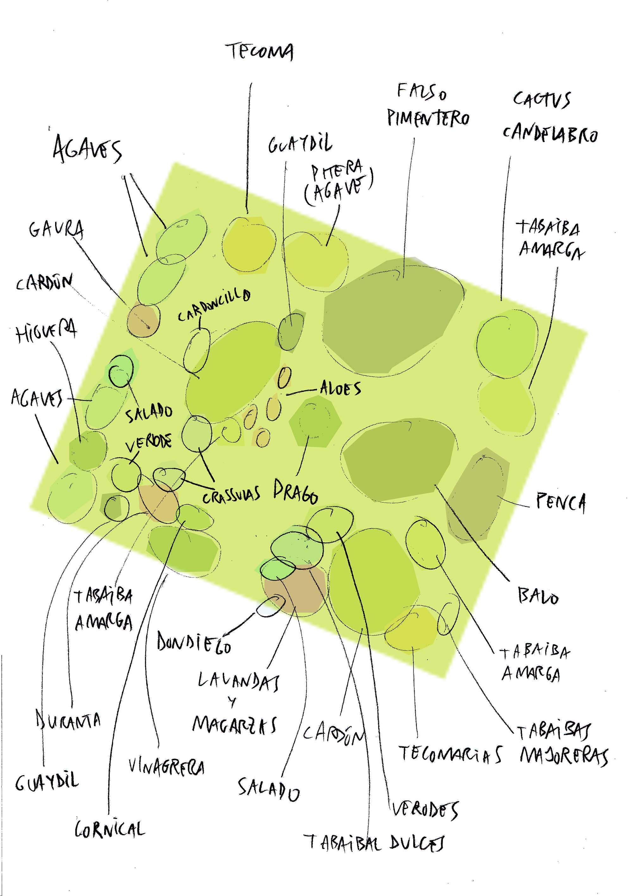

# 1. Jardín de los Talleres

Después del asunto del rabo de gato (que a fecha 2025 aún no se ha resuelto del todo) empecé a trabajar en este primer jardín, que estaba en estado de abandono.

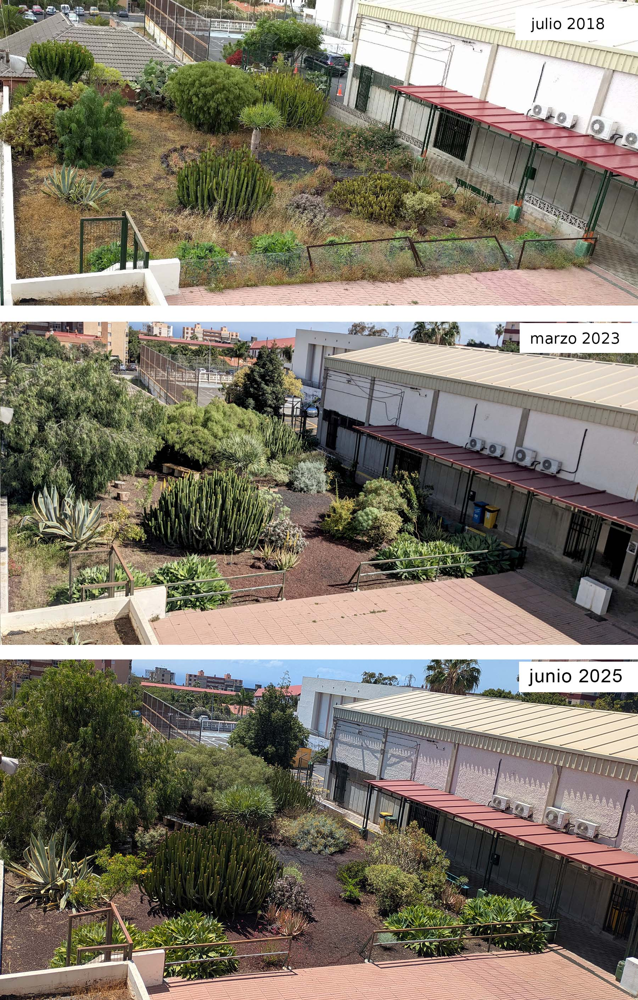

Mi teoría es que hacia la década de 1980, sobre una parcela donde previamente hubo un terrero de lucha, se intentó crear un jardín exclusivamente de especies nativas de las Islas Canarias (en un momento de búsqueda de elementos de identidad, esto llegó a ser común en muchos centros educativos) que luego fue incluyendo otras especies adaptadas a alta insolación y poco riego. De esa época tenemos dos excelentes ejemplares de cardón y un drago, pequeño de tamaño pero con más años de lo que parece, varias euforbias, un balo majestuoso, etc. El jardín fue mantenido por el personal del Centro y en una época se contó con una jardinera (compartida entre varios Institutos). Luego, en algún momento, se dejó de atender, fue siendo invadido por malas hierbas, algunas plantas sobrecrecieron ahogando a otras, aparecieron y tomaron fuerza malas hierbas, etc.
Lo fundamental fue poner en valor la flora canaria ya existente y acompañarla de especies adecuadas.
A partir de 2018 reordené plantas, eliminé especies inadecuadas para un jardín transitable (algunas cactáceas realmente peligrosas) y fui introduciendo especies nuevas: magarzas, lavandas, cardoncillo, salado, etc. Instalé bancos, dejé un paso transitable a lo largo del jardín y año a año el proyecto llega hasta hoy, siempre en proceso, y cada vez más equilibrado.

Actualmente (2025) hay aproximadamente un 50% de especies nativas de Canarias, unas 14 especies, junto a otras 14 exóticas en las Islas.

## ESPECIES NATIVAS DE CANARIAS

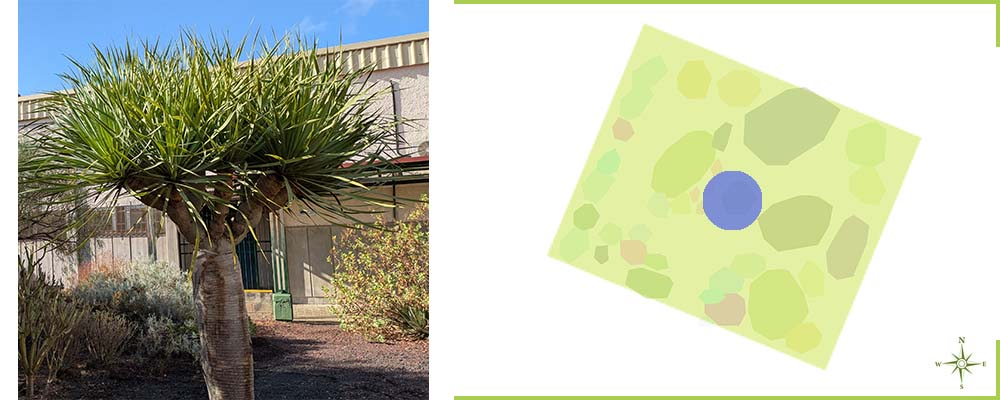

### Drago
_Dracaena draco_

En el centro del jardín tenemos un drago. No es realmente un árbol, su tronco no es de madera sino la acumulación de las cicatrices de sus antiguas hojas, más o menos como las palmeras (ambas son monocotiledóneas). Las estimaciones de edad de los dragos se han basado en el conteo de ramas, aunque es un método poco exacto. Aplicándolo a nuestro drago su edad aproximada (unos 15 años por cada vez que ha florecido y se ha ramificado) debe ser al menos 30 años.

Estas dataciones poco exactas pueden estar cambiando. Hay estudios recientes, además realizados en Canarias, que establecen nuevos métodos de datación de las monocotiledóneas. En equipo de Franco Biondi, de la Universidad de Nevada, Reno, USA, con un equipo que incluía investigadores de la ULPGC, llevó a cabo un estudio de dragos y palmeras en Canarias, publicado en 2023 en el boletín [Plants](https://www.mdpi.com/journal/plants) [Longevity Estimates of Canary Palms and Dragon Trees via Radiocarbon Dating: Initial Results](https://accedacris.ulpgc.es/bitstream/10553/128675/1/plants-13-00045.pdf).

> Estimar correctamente la esperanza de vida máxima de las especies vegetales es fundamental para los estudios demográficos y de historia de vida, necesarios para comprender los impactos climáticos. Las monocotiledóneas arbóreas, que pueden alcanzar más de 30 m de altura y más de 5 m de perímetro de tronco, son difíciles de datar debido a que no presentan dormancia estacional; por lo tanto, su longevidad se ha estimado mediante diversos métodos basados ​​en el tamaño. En este estudio, se evaluó la datación por radiocarbono (¹⁴C) con espectrometría de masas con acelerador (AMS) como herramienta complementaria para determinar la edad de dos monocotiledóneas emblemáticas: la palmera canaria y el drago ... Gracias a la constante mejora de las herramientas de espectrometría de masas con carbono 14 (14C-AMS), estas pueden contribuir a perfeccionar el conocimiento científico existente sobre la megaflora carismática de la Macaronesia.

_Dragos y palmeras de los que se tomaron muestras en el estudio del equipo de Biondi_

En las Islas Canarias encontramos al drago en la naturaleza en barrancos y medianías, aunque su hábitat favorito es -mala suerte- justo la zona dónde ahora están la mayoría de los pueblos: las medianías. Los indígenas y los primeros colonizadores europeos debieron poder pasar entre bosques de dragos, dragonales. Hoy quedan, en la naturaleza, unos pocos grupos de dragos salvajes, y ejemplares aislados en barrancos. Muchos topónimos nos hablan de dragos, algunos que servían precisamente como referencias geográficas: Barranco del Drago, Lomo del Drago, El Draguillo, etc. En en Gran Canaria los topónimos Dragonal Bajo y Dragonal Alto recuerdan que por allí, en el Barranco de Guiniguada, muy cerca del Jardín Canario, debió haber un bosque de dragos.

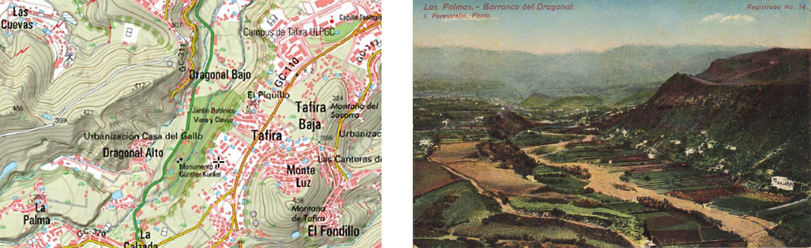
&emsp;&emsp;_Mapa de Dragonal y antigua postal de la zona: Barranco de Guiniguada_

Tenerife es la isla con un mayor número de poblaciones naturales que se encuentra sobre todo en las zonas geológicamente más antiguas de esta isla, destacando el Macizo de Anaga, Macizo de Teno y Adeje. En La Palma destacan los bosquetes de dragos de Las Tricias y Buracas. En Gran Canaria hay algunos dragos silvestres y se identificó, en 1990, una nueva especie denomina drago de Gran Canaria _Dracaena tamaranae_. El hallazgo de esta especie se cuenta [en este artículo](https://pellagofio.es/islas/naturaleza-y-territorio/flora-y-fauna/la-primera-floracion-veinte-anos-despues/). Actualmente deben quedar alrededor de 70-80 ejemplares silvestres en la isla, además de otros en el Jardín Canario, de semillas recolectadas. Un artículo interesante:  [Los dragos del archipiélago canario](https://www.rinconesdelatlantico.es/num6/lector.php?id=142) por Rafael S. Almeida, en la revista Rincones del Atlántico.

Primos del drago son los Troncos de Brasil, esa planta inmortal que siempre  has visto en la oficina donde vas a sacar un certificado. También son de la familia los preciosos árboles-drago de la isla de Socotra, en el este de África (y que quizá desaparezcan debido al calentamiento global).

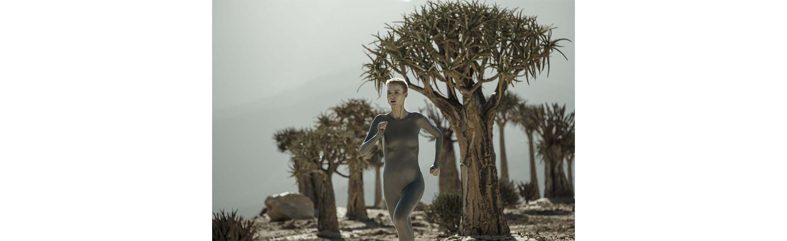
&emsp;&emsp;_Raised by wolves, 2020. Los dragos de Socotra como paisaje de ciencia-ficción_

El drago ha despertado mucho interés en científicos y viajeros a lo largo de la historia de Canarias, no sólo por ser especie emblemática de la Macaronesia y Canarias, sino por sus peculiaridades, como su longevidad o las propiedades curativas de su savia, alcanzando un estatus casi mítico.
El estudio [La ilustración científica de la Dracaena draco de Canarias (1576-1970)])(https://www.ull.es/revistas/index.php/artes/article/download/6593/4479/) recopila una historia gráfica de este interés.

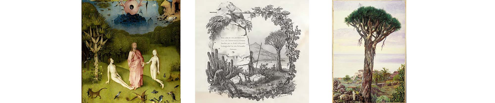
&emsp;&emsp;_El Bosco, El jardín de las delicias, 1500-1505. | Sergent-Marceau, 1832, para Histoire Naturelle des Îles Canaries. | Marianne North, Drago San Juan de la Rambla, 1875._

Su nombre científico, _Dracaena draco_, proviene de la raíz latina _Draco_, dragón. En la Edad Media su savia de color rojizo se asociaba a la mítica sangre de dragón, de propiedades mágicas.

Oficialmente el drago es el símbolo vegetal oficial de la isla de Tenerife. Obviamente a la especie, que pudo llegar a las Islas hace 10 millones de años (en el Mioceno) esto poco le importa.

***

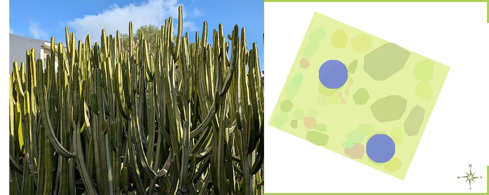

### Cardón
_Euphorbia canariensis_

Tenemos dos ejemplares de cardón, aproximadamente de unos 30 años de edad.
Aunque la primera impresión es que es un cactus, no es así, es de otro grupo de plantas, las euforbias. Las espinas que vemos en el cardón son en realidad hojas transformadas en defensas. Su savia es una especie de látex blanco, tóxico e irritante para la piel y -mucho cuidado- para los ojos.
Florece a principios de verano, con unas curiosas flores rojas, como cápsulas exóticas, que a finales del verano ya son frutos y los días de calor estallan para lanzar las semillas a distancia, un sistema de esparcir semillas muy singular (y con nombre también singular: autocoria).

Euphorbos era el nombre del médico del rey Juba II, que escribió sobre botánica y dio este nombre al género. 
La palabra deriva del griego _eu-_ ‘bueno’, y _-phorbe_ ‘pasto o forraje’, por lo que _Euphorbos_ tendría el significado de ‘bien alimentado’. _Canariensis_, por las Canarias, aunque hay más euforbias en las Islas.

Oficialmente es el símbolo vegetal oficial de la isla de Gran Canaria.

***

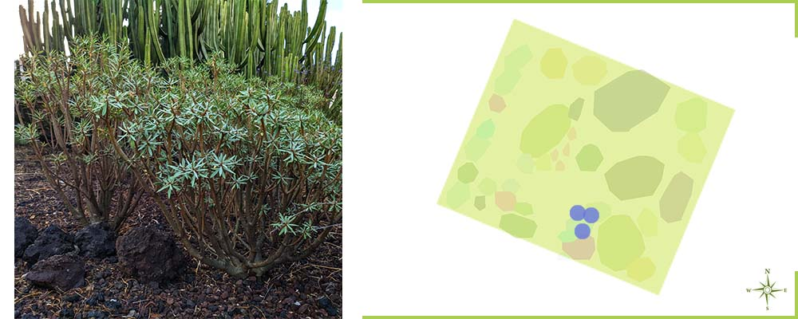

### Tabaiba dulce
_Euphorbia balsamifera_

Esta planta es de la familia de las euforbias, en Tenerife la podemos encontrar en toda la costa del sur, a veces en comunidades extensas, los tabaibales. 
Es fácil de distinguir por su forma redondeada, porte bajo, incluso se aplasta contra la tierra o la lava de los malpaíses, y color rojizo.
Se adapta muy bien a la falta de lluvia acumulando agua en sus ramas para la estación seca. En cuanto caen las primeras lluvias del invierno desarrolla rápidamente hojas, flores y frutos.
Su savia o látex no es tóxico (al contrario que la mayoría de plantas de su familia), y ha tenido diversos usos se cree que desde tiempos prehispánicos. incluso usos alimentarios, seguramente por eso se la conoce como tabaiba dulce. 

Una investigación reciente dirigida desde el Real Jardín Botánico (RJB) del Consejo Superior de Investigaciones Científicas (CSIC), con la participación de otras instituciones sobre las poblaciones canarias de la tabaiba dulce ha reconstruido las relaciones filogenéticas entre la _E. balsamifera_ y sus parientes _Euphorbia adenensis_ y _Euphorbia sepium_, presentes en varias zonas del continente africano, mediante estudios del genoma nuclear. Según sus conclusiones, lo más probable es que las balsamiferas se extinguieran en el continente, quedando algunas poblaciones residuales (las actuales _adenensis y sepium_), y también desaparecieran en Fuerteventura y Lanzarote, y en una etapa posterior se recolonizaran estas islas desde Tenerife y Gran Canaria y de ahí de nuevo las tabaibas llegaran a la costa oeste de África. Un viaje de ida y vuelta.
Esta investigación, que nos muestra qué direcciones pueden seguir las investigaciones actuales en botánica, se ha publicado en la revista [Annals of Botany de mayo/junio 2024](https://academic.oup.com/aob/article/133/5-6/883/7514051
https://pmc.ncbi.nlm.nih.gov/articles/PMC11082519/)

&emsp;&emsp;_E. balsamifera_ (círculos), _E. adenensis_ (rombos) y _E. sepium (triángulos)_ en África_  | _Poblaciones de _E. balsamifera_ estudiadas en las Islas Canarias._

***

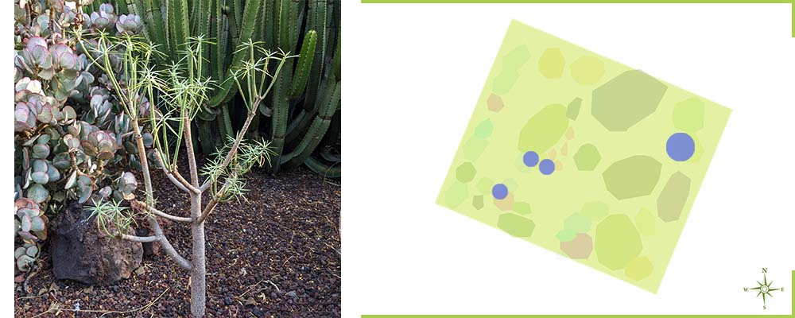

### Tabaiba amarga
_Euphorbia lamarckii_ 

Con bastantes similitudes con la tabaiba dulce, pero sus ramas son verdosas y de crecimiento vertical. En este jardín hay un ejemplar especialmente alto.
Cuidado con su látex, que es irritante para la piel y sobre todo ojos y mucosas.

Hasta hace pocos años se la llamaba _Euphorbia regis-jubae_, en honor al rey Juba de Mauritania, pero un estudio más detallado encontró algunas diferencias que hacen que la especie de Gran Canaria mantiene el nombre _regis-jubae_ y la que se encuentra en Tenerife se llame ahora _Euphorbia lamarckii_, nombre puesto en honor al naturalista francés de los siglos XVIII y XIX Jean-Baptiste Lamarck. 

Me permito incluir aquí un apunte para un desvío: Lamarck es quien estableció el término **biología**, y desarrolló la primera teoría sobre la evolución de la vida en su obra _Filosofía Zoológica_, publicada en 1809. La propuesta de Lamarck propició grandes debates, que hicieron posible las investigaciones de Darwin. Charles Darwin nació el mismo año de publicación de _Filosofía Zoológica_, y medio siglo después, en paralelo a Alfred Russel Wallace, desarrolló teorías que explicaban los mecanismos básicos de la evolución de las especies. Antes de eso Lamarck  ya había sido denostado y olvidado, terminando su vida en la miseria, dictando (estaba ciego) sus últimas obras a sus hijas. Sin embargo, a finales del siglo XX, científicas como Lynn Margulis han recuperado parte del pensamiento de Lamarck, por ejemplo en su obra _Planeta simbiótico_, de 1998, y con su hipótesis de la simbiogénesis como principal fuerza evolutiva. Esta hipótesis contradice el actual paradigma de la síntesis evolutiva moderna y los postulados de Darwin y por tanto del neodarwinismo. Vemos de nuevo cómo la Ciencia no trata de verdades absolutas, sino que propone teorías que más adelante serán extendidas o rebatidas. 

&emsp;&emsp;_Lamarck, Darwin y Margulis_

***

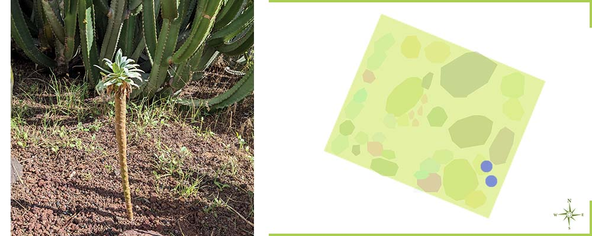

### Tabaiba majorera
_Euphorbia atropurpurea_

A pesar de su nombre vulgar, tabaiba majorera, nada tiene que ver con la isla de Fuerteventura. Es endémica de la isla de Tenerife. Se desarrolla entre los 300 a 1100 msnm en el sur y oeste de la isla, desde el valle de Güímar hasta el macizo de Teno, creciendo en barrancos y laderas. Sus flores son llamativas inflorescencias de color rojo-púrpura. En este jardín tiene un crecimiento muy lento.
Al igual que otras especies del género _Euphorbia_, toda la planta posee un látex de color blanco, pegajoso y detóxico.

Ocasionalmente se hibrida con _Euphorbia lamarckii_, dando lugar a un híbrido denominado _Euphorbia x navae_, y con _Euphorbia aphylla_, generando el híbrido llamado _Euphorbia x petterssonii_. También se ha citado su hibridación con _Euphorbia bourgeana_ en la Ladera de Güímar.
Este caso es un buen ejemplo de por qué en jardinería con plantas nativas es recomendable usar especies que estén dentro de su área de distribución natural, dado el peligro de contaminación genética que supone el ponerlas en contacto con poblaciones de otras especies de su mismo género. Por ejemplo, ¿qué pasaría si usaras tajinaste rojo, especie de Tenerife, especialmente Las Cañadas del Teide y La Palma (_Echium Wildpretii_) en jardines en la zona del campus de Tafira, en Gran Canaria? ¿Afectaría a las poblaciones endémicas de tajinaste blanco (_Echium decaisnei_). De hecho, ya se considera una especie traslocada a la isla de Gran Canaria, escapada de su uso en jardinería, lo que quizá no haya sucedido aún es esa contaminación genética.

***

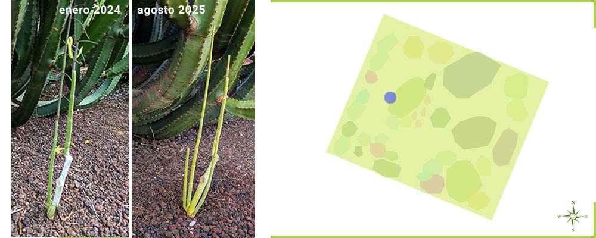
_18 meses de crecimiento_

### Cardoncillo
_Ceropegia dichotoma_

Aunque se llame cardoncillo es una especie totalmente diferente al cardón.
Después de varios intentos estoy teniendo la suerte de que arraigue una de las dos especies que existen en Tenerife de cardoncillo, la del norte de la isla (_dichotoma_). En los jardines del patio he introducido en marzo 2025 la especie del sur (_Ceropegia fusca_). 

***

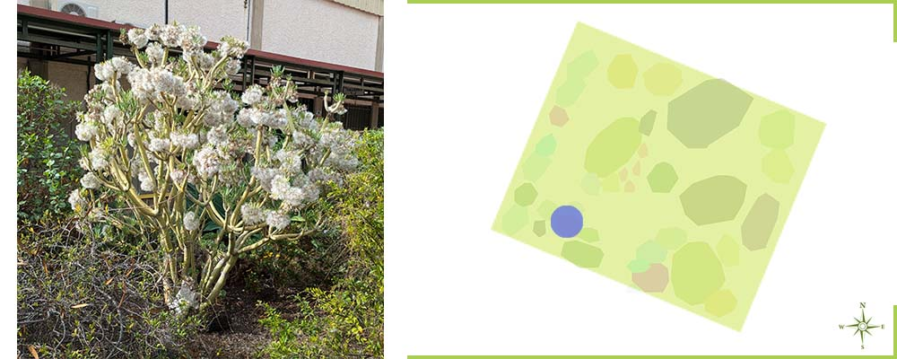
_El senecio más antiguo de estos jardines, en plena dispersión de semillas, un show veraniego_

### Senecio / Verode
_Kleinia neriifolia_

Se le suele llamar también verode, aunque el nombre, como muchos nombres comunes, va cambiando según las islas y las zonas. Esto es confuso ya que también se llama verodes a casi todo el género Aeonium.
Es una planta muy resistente, que aquí se reproduce por sí misma con las semillas transportadas por el viento. En verano pierde todas sus hojas y las recupera en invierno.

***

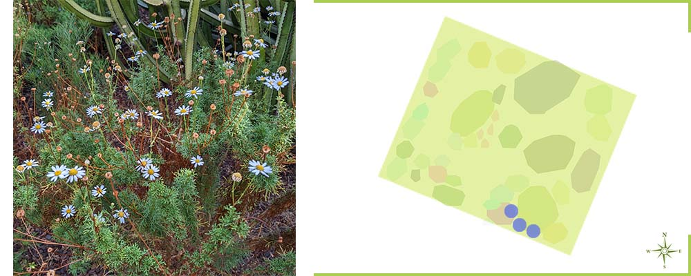

### Margarita / Magarza
_Argyranthemum frutescens_

Margarita nativa de las Islas Canarias que llegó a este jardín por sí misma, transportada por el viento o por los pájaros, y que llegó a Inglaterra, transportada por algún botánico para la colección de la reina Mary II en el [palacio de Hampton Court](https://www.hrp.org.uk/hampton-court-palace/whats-on/hampton-court-gardens/national-plant-collections/) ya en el siglo XVI, luego a Holanda, Francia etc, y desde entonces se han desarrollado (y siguen desarrollándose y patentándose) miles de cultivares con todo tipo de tamaños, colores y adaptaciones a otros climas. 
Su familia, las _Asteraceae_, está formada por unas 24 especies de Canarias y Madeira.

Su nombre _Argyranthemum_ procede del griego _argyros_, "plateado" y _anthemom_ "planta de flor", aludiendo a sus flores radiantes pálidas. _Frutescens_ del latín frutescere, que significa "echar o producir vástagos o renuevos" como referencia a su ramificación exuberante.

***

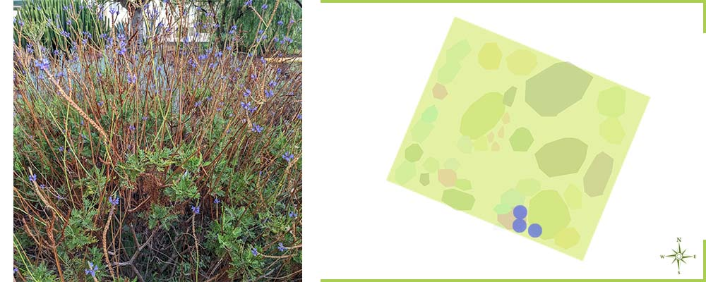

### Lavanda
_Lavandula canariensis_ 

También llamada mato risco, lavanda, romanillo o yerba risco, es un endemismo canario, frecuente y hasta abundante en barrancos y laderas pedregosas del Cardonal-tabaibal, formando parte de la vegetación típica de ese ecosistema. Aparece menos en áreas cálidas y soleadas de los bosques termófilos.
En el año 2004 se publicó una revisión del género Lavandula que determinó que hay hasta siete subespecies de esta planta, una por cada una de las islas de nuestro archipiélago
Las lavandas de este jardín se trajeron de la zona costera del Valle de Güímar. Tras varios intentos una de ellas arraigó y ahora su propia semillas van haciendo que aparezcan nuevas plantas.
Es resistente a la sequía y a la insolación y es de la misma familia que las lavandas que se utilizan comercialmente para fabricar perfumes, aunque con menos olor. También se han llevado plántulas al jardín del patio y allí se está multiplicando.

***

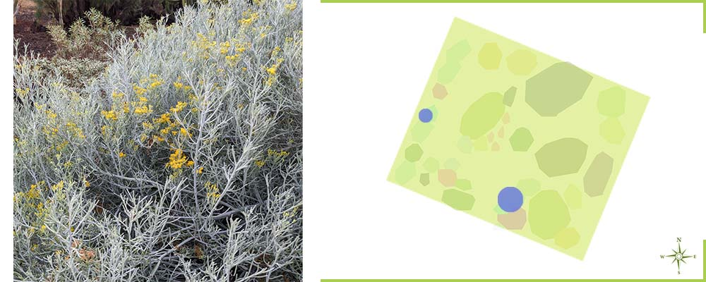
_Una de mis plantas nativas favoritas para jardinería sostenible: pocos cuidados, gran volumen, color y floración_ 

### Salado
_Schizogyne sericea_

El salado blanco, también conocido como dama en algunas islas es un endemismo macaronésico presente en el Archipiélago Canario y en las islas Salvajes, al norte de Canarias. En El Hierro la única voz que se usa es _irama_, que ha dado nombre incluso a una zona de la costa del Sur de la isla, cercana a La Restinga, en plural, Iramas. El nombre le viene, evidentemente, de la abundancia de estas plantas en el lugar.

Crece en la zona litoral de las islas, sobre sustratos de rocas, laderas y enclaves arenosos, donde la influencia de la maresía generalmente está presente. También es habitual encontrar el salado blanco colonizando los caminos y bordes de carreteras, así como aquellos terrenos alterados por la acción humana. Su área de distribución abarca desde las zonas costeras o litorales hasta altitudes de más de 400 metros. Se ha utilizado en la medicina popular canaria para el tratamiento de algunas dolencias.
Estos ejemplares se han recolectado recién nacidos en la zona costera del Valle de Güímar. Se ha adaptado muy bien, y aparte de sus pequeñas flores amarillas sus hojas tienen un color verde pálido que da una buena nota de contraste.

_Schizogyne_ procede del griego _schizein_, "partir o separar" y _gyne_, "hembra", refiriéndose al estigma partido de las flores. De la misma raíz viene la palabra “esquizofrenia” (esquizo: dividir, fren:mente). _Sericea_ procede del latín sericum, "seda", aludiendo a su textura sedosa al tacto.

***

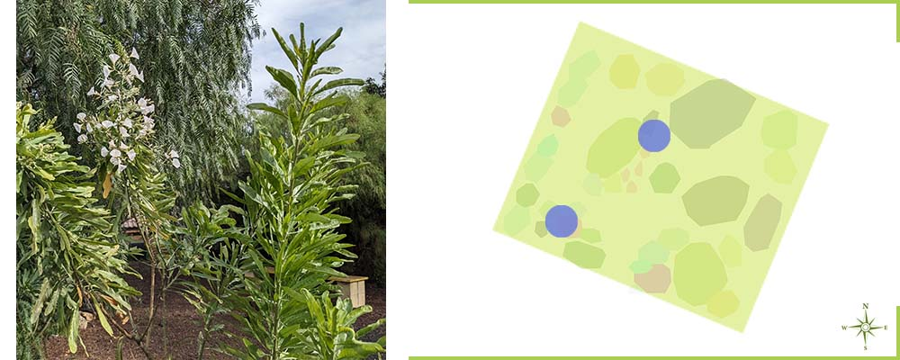

### Guaydil
_Convolvulus floridus_

Es una  planta presente en todas las islas del archipiélago canario (aunque rara en Lanzarote y Fuerteventura). Es una endémica de carácter heliófilo y xerófilo (o sea, le gusta el sol y está adaptada a medios secos), característica de los bosques termófilos y de las zonas altas del cardonal-tabaibal. Su hábitat está entre 200 y 700 metros de altitud en riscos, laderas y barrancos. 

Tenemos dos ejemplares de guaydil, una planta nativa de Canarias, a las que les ha costado adaptarse y han crecido muy lentamente, aunque en teoría aquí tiene buenas condiciones. En unos años, si siguen progresando, serán arbustos grandes con flores blancas muy vistosas. Por su floración y su resistencia a condiciones adversas es una planta que se usa frecuentemente en jardinería pública de carreteras en Canarias.

_Convolvulus_ viene del latín _convolvere_ (enredar). _Floridus_ por su abundante y llamativa floración. El nombre _guaydil_ se considera una palabra indígena, aunque no se ha podido precisar su significado. La especie fue descrita por Carlos Linneo el Joven (hijo de Linneo)

***

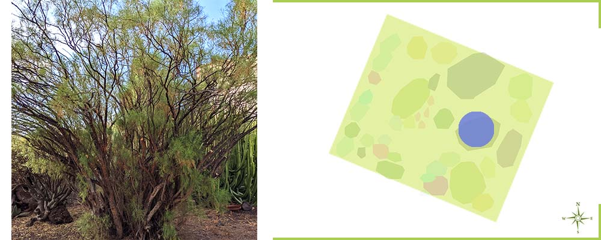

### Balo
_Plocama pendula_

El balo es un arbusto bastante denso, con ramas frágiles, colgantes y hojas filiformes que puede superar los 3 metros de altura. Cualquier parte de la planta al estrujarla desprende un olor bastante característico. Su fruto son racimos de pequeñas bayas redondas y de color blanco, que suelen comer los lagartos (dispersando luego la semilla con sus excrementos).
Es un endemismo canario abundante en las islas de Gran Canaria, Tenerife y La Gomera, siendo más raro en La Palma y El Hierro, mientras que en Fuerteventura solo se ha podido localizar poquísimos ejemplares. El balo nace de forma natural en las zonas de cardonal-tabaibal y sobre todo, en los tramos inferiores de algunos barrancos, donde forma a veces comunidades.
Las ramas del balo se han usado en el campo para cubrir las papas y así evitar la proliferación de plagas durante su almacenamiento. Asimismo se han utilizado las ramas, hojas y frutos para alimentar los conejos o cabras, aunque hay alguna referencia que afirma que le puede dar mal sabor a la leche. En apicultura, el balo es considerado una planta de interés melífero ya que produce una de las mieles más dulces y claras. Tiene unas espectaculares raíces que profundizan mucho, hasta 12 metros, en una estrategia para acceder al agua. Este dato lo escuché en una conferencia hace años, y no he podido encontrar la fuente ni estudio de referencia. 

La palabra _balo_ se considera prehispánica, se recoge en el [Diccionario histórico del español de Canarias](https://www.rae.es/tdhle/balo) con usos escritos desde el siglo XVI, y se encuentra en la toponimia de las islas dando nombre a lugares con variantes como balo, baliera, balillo.

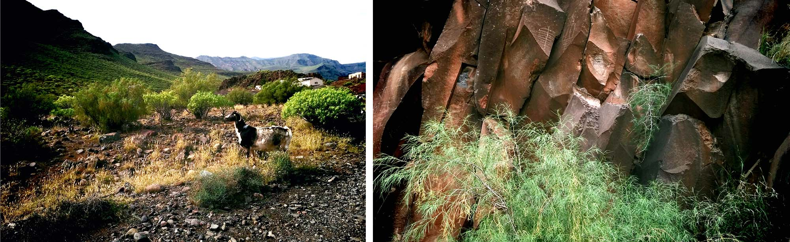
&emsp;&emsp;_Balos en el Barranco de Balos, Gran Canaria_ | _Balos junto a la estación de grabados indígenas [Los letreros de Balos](https://guanchismos.ulpgc.es/item/11613)_

_Plocama_ podría proceder del griego _plochamos_, que significa cestería, aludiendo a sus ramillas intrincadas. _Pendula_ del latín _pendulus_, colgante, en referencia a sus ramas, que tienen un aspecto similar al del sauce llorón.

Estos datos y más se recogen en la extensa [ficha sobre la _Plocama pendula_](https://www.conecte.es/media/com_concibe/files/Plocama%20pendula.pdf) dentro del Inventario Español de los Conocimientos Tradicionales relativos a la Biodiversidad, IECTB](https://www.miteco.gob.es/es/biodiversidad/temas/inventarios-nacionales/inventario-espanol-de-los-conocimientos-tradicionales/inventario_esp_conocimientos_tradicionales.html), promovido por el Ministerio de Agricultura, Alimentación y Medio Ambiente. Otra forma de ver estos datos es en [su ficha](https://www.conecte.es/index.php/es/plantas/1710-plocama-pendula/usos-tradicionales).

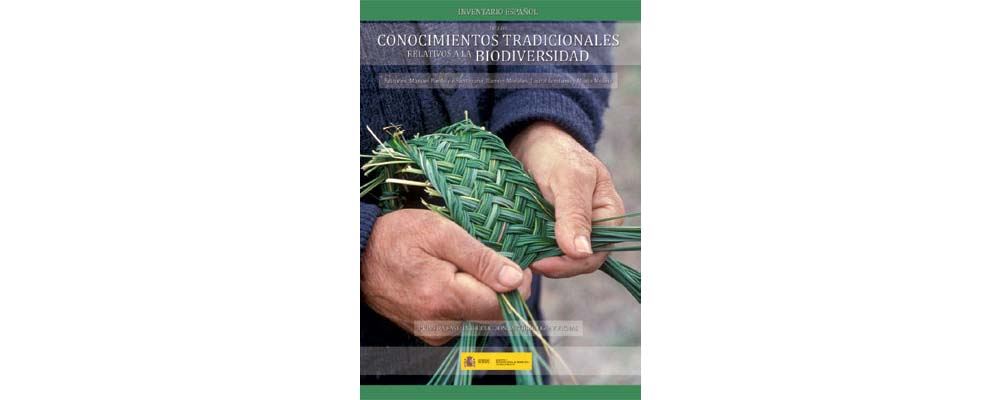

Algunas [directrices básicas de este inventario](https://www.revistaambienta.es/es/historico/2015/110/110-l1.html):

>La inclusión de los conocimientos tradicionales en el Convenio de Naciones Unidas sobre Diversidad Biológica (1992) constituyó un hito fundamental tanto para el reconocimiento de su valor e importancia como para explicitar su íntima relación con la conservación y uso de la biodiversidad. Este Convenio reconoce la estrecha dependencia que tienen las comunidades indígenas y locales con los sistemas de vida tradicionales basados en los recursos biológicos,
...
Los conocimientos tradicionales se consideran una fuente de información para el diseño de políticas ambientales relacionadas con la biodiversidad. 
...
El Inventario Español de los Conocimientos Tradicionales relativos a la Biodiversidad se centra en los conocimientos tradicionales relacionados con la biodiversidad silvestre de España –flora, fauna y ecosistemas.
...
Los conocimientos tradicionales se estudian desde diferentes ámbitos académicos, por lo que una comprensión completa de los mismos requiere una visión holística y multidisciplinar. La aproximación fundamental para la elaboración de este inventario parte de la etnobiología. 
...
El inventario recoge conocimientos tradicionales previamente publicados, habiéndose utilizado únicamente obras en las que los conocimientos han sido recopilados mediante técnicas directas de recogida de datos, es decir, a partir de entrevistas _in situ_ a informantes locales y observación participante (fuentes primarias).

***

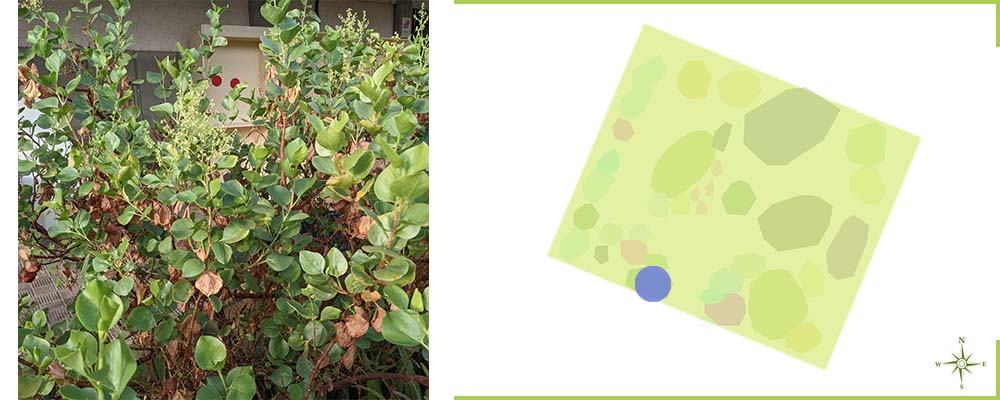

### Vinagrera
_Rumex lunaria_

La vinagrera o calcosa es un arbusto que puede alcanzar una altura entre 1-3 metros. Inflorescencias en racimos, compuestos de pequeñas flores de color verdoso. Está presente en todas las islas del archipiélago canario.
Es una especie bastante común en la comunidad del Tabaibal-Cardonal, aunque su hábitat se extiende hasta la zona de medianías y en los límites marginales de los bosques de monteverde y pinar. Es un arbusto muy extendido que crece tanto en terrenos pedregosos como en zonas de huertas abandonadas, terrenos removidos, bordes de pistas, caminos e incluso en los márgenes de las carreteras. También se le considera como una especie de las que primero colonizan las coladas de lava, conos volcánicos, laderas de lapilli más recientes.
Aseguran algunos campesinos que la mejor manera de cuidarse la garganta y tener una buena voz consiste en masticar de vez en cuando algunas hojas crudas de vinagrera, sin que deba importamos el sabor ácido (avinagrado) de las mismas, ni la sensación "rasposa" que dejan en el paladar. Aún se aprovecha como planta forrajera para las cabras.

_Rumex_ es el nombre que se le daba en latín a todo el género (hay unas 120 especies). _Lunaria_: procede del latín _luna:, aludiendo a la similitud de las valvas de los frutos, más o menos orbiculares, con la luna llena.

***

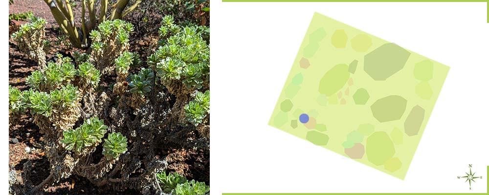

### Margarita de mar
_Pallenis maritima_

Esta es una de las primeras plantas que compré en vivero y traje al jardín, pensando que era el endemismo de Fuerteventura _jorao_ (me lo vendieron como "margarita majorera", pero nunca ha crecido más allá de unos 30 cm de alto, con lo cual ya sé que se trata de una especie muy cercana, la _Panellia maritima_, que últimamente se suele encontrar en algunos viveros. 

Es un arbusto de tamaño pequeño, hasta 30cm. de alto, de base leñosa con hojas vellosas y llamativas flores amarillas (en realidad son inflorescencias, o sea grupos de flores) semejantes a las margaritas. Florece casi todo el año, en especial desde la primavera hasta bien entrado el verano. Son sinónimos: _Asteriscus maritimus_ y _Odontospermum maritimum_. 

Soporta altos niveles de insolación, prolongadas sequías estivales y suelos salinos (halófila). Por esto es una planta ideal para xerojardinería. Es pionera en la colonización de suelos pobres, arenosos o rocosos, ayudando en la formación y estabilización de dunas costeras y previniendo la erosión. En el medio natural se la encuentra en acantilados, arenales costeros, de 0 a 200 msnm. 

Es originaria del Mediterráneo occidental y central hasta Grecia, norte de África e islas Canarias. Se la llama también margarita de mar, asterisco marítimo, estrella de mar, Mediterranean Beach Daisy o Gold Coin. En inglés se la nombra también como _Canary Island daisy_, lo que quizá explique que a veces en viveros se la llame _margarita majorera_, causando confusión con el _jorao_.

_Pálea_ (del Latín paja), es un término empleado por Carlos Linneo para las escamitas que existen en el receptáculo de numerosos miembros de la familia Asteraceae en la base de las flores, y se llama «receptáculo paleáceo» al que las tiene. _Maritima_, del mar.

**El [jorao](https://es.wikipedia.org/wiki/Asteriscus_sericeus)**

Por otra parte, el _Asteriscus sericeus_, comúnmente llamado jorao, jorjao, jorado o tojia, es un endemismo de la isla de Fuerteventura, aunque se ha introducido como ornamental en otras islas (sinónimo _Odontospermum sericeum_). Es un arbusto con aroma intenso, muy ramificado desde la base, de tallos ascendentes siendo los más viejos de color gris oscuro, de hasta 1m. de altura. En Fuerteventura se la encuentra a unos 400-800m de altitud en Betancuria, Jandía, montaña Cardón y Tindaya. 
En la actualidad la especie está amenazada por la presencia de herbívoros que si bien no  comen sus tallos si lo hacen con sus flores impidiendo así la regeneración, también el tránsito de estos rebaños rompe las ramas y desestabiliza el sustrato.

&emsp;&emsp;_Jorao en su medio natural en Fuerteventura. Foto: GH.Zell. CC-By_

_Histoire Naturelle des Îles Canaries_ (Webb et Berth. 1842.) en su Sección II: pag.237 recoge el _Odontospermum maritimum_ o _Asteriscus maritimus_ para Canarias, sin especificar localizaciones, y el Odontospermum sericeum, "Tojia en Fuerteventura", localizada "cerca del templo de Nuestra Señora de la Peña, en la isla Fuerteventura" pag.238

***

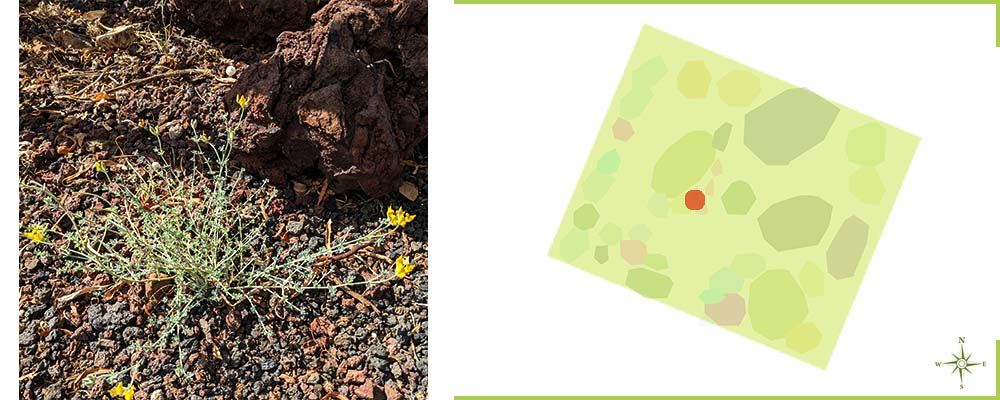

Corazoncillo
_Lotus sessilifolius_ - 💀 desaparecido

El corazoncillo, una planta rastrera que se recolectó muy joven de la zona costera del Valle de Güímar. De color verde pálido, con pequeñas hojas sin pedúnculo de aspecto delicado y unas flores de amarillo intenso.

Finalmente después de una floración al cabo del primer año desapareció. 

***

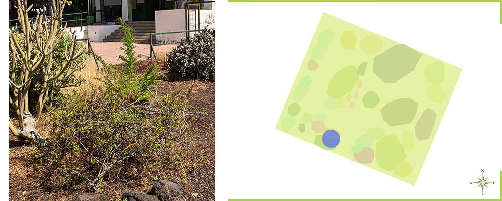

### Cornical
_Periploca laevigata_

Es un arbusto de tallos muy entrelazados unos con otros, de estrechas hojas lanceoladas y opuestas¡. El fruto de entre 5 y 10 cm de longitud tiene de cuernos opuestos, de ahí su nombre vulgar. Las semillas son de color pardo con un penacho de pelos blancos que las hace volar en el viento. 
Crece en terrenos volcánicos o calizos, pedregosos  secos, próximos al mar, en comunidades de tabaibal-cardonal o matorral, entre 5 y los 50 msnm. de altitud. 

Además de en las Islas Canarias se distribuye por el norte de África y sureste de España. En la península ibérica  está en la Región de Murcia, Almería y parte de Alicante. 

_Periploca laevigata_ fue descrita por el botánico William Aiton y publicado en Hortus Kewensis. Este libro de 1789 era un catálogo de 1789 de todas las especies de plantas y luego en cultivo en el Royal Botanic Gardens, Kew, que eran la gran mayoría de las especies de plantas en el cultivo de toda Inglaterra.

Del griego _periploke_, abrazo, por cómo se enredan en sí mismo y también en plantas cercanas. De esa misma raiz viene la palabra periplo, un largo viaje, recorrido o circunnavegación que por lo general regresa al punto de partida.  _laevigata_ viene del latín liso.

***
***

## ESPECIES NO NATIVAS DE CANARIAS

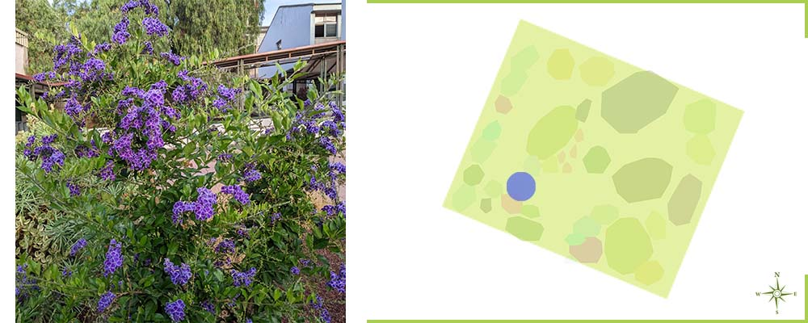

### Duranta
_Duranta erecta_

Es un arbusto distribuido desde México a América del Sur y las Antillas. Se usa como planta ornamental en jardines tropicales y subtropicales de todo el mundo, y se ha naturalizado en muchos lugares. En México, los originarios de habla náhuatl la nombraban _xcambocoché_. En nuestro entorno no tiene nombres comunes conocidos, pero los ingleses, en una demostración de su interés en identificar las plantas, y también de su cursilería, le dan varios nombres comunes, como: _golden dewdrop_, _pigeon berry_, o _skyflower_ (gota de rocío dorada, baya de paloma o flor de cielo).
Tiene flores muy vistosas color violeta y frutos amarillos lo convierten en un elemento destacado en los jardines. Las flores atraen a las mariposas.

Las hojas y bayas de la planta pueden ser tóxicas, así que no te las comas.

El nombre _Duranta_ le fue dado en honor de Castor Durantes, un botánico italiano del siglo XV.  
Este ejemplar fue una donación de un profesor.

***

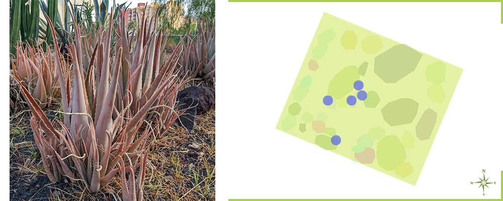
_Aloes a finales de verano_

### Aloe
_Aloe vera_

Hasta el siglo XIX, su nombre más popular era _acíbar_, también se le conoce como aloe, aloe vera, zábila, penca zábila o aloe de Barbados, entre otros, es una especie suculenta de la familia _Asphodelaceae_. Con unas quinientas especies, el aloe está muy distribuido y se considera una especie invasora en muchas regiones del mundo. 
Es una planta de hoja perenne, probablemente se originó en la Península Arábica, pero crece de forma silvestre en climas tropicales, subtropicales y áridos de todo el mundo. El aloe vera ha sido ampliamente cultivado como planta ornamental por sus llamativas flores amarillas y por su forma. Los pájaros silvestres beben el néctar de sus flores, los puedes ver por las tardes en este mismo jardín. Acumula agua en sus hojas, lo que le permite sobrevivir en áreas de poca lluvia, lo que la hace ideal para rocallas y jardines de bajo consumo de agua.

Se usa como planta medicinal para la piel, en muchos productos: lociones para la piel, cosméticos, pomadas o gel para quemaduras menores y quemaduras solares, incluso en bebidas, aunque hay evidencias contradictorias sobre si el _Aloe vera_ es tan efectivo.

El nombre botánico deriva del latín, _aloe_, del griego sal que designaba tanto a la planta como a su jugo, debido a su sabor, que recuerda al agua del mar. _Vera_ por verdadero en latín.

***

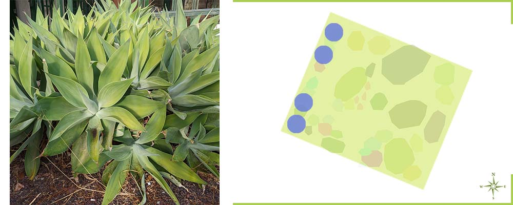

### Ágave
_Agave attenuata_

También llamado ágave atenuado, ágave del dragón o cuello de cisne, es una especie suculenta perteneciente a la familia de las agaváceas. Es originaria de México, raro en el medio natural pero muy popular en jardinería.
Es una planta monocárpica, es decir, que florece una sola vez en su vida y luego muere (muere esa planta pero siguen creciendo todos los brotes a su alrededor). La floración es espectacular, con flores amarillas verdosas agrupadas en una densa inflorescencia, que alcanza los 3 m de altura, en principio vertical, pero que después cuelga, de forma muy característica.

&emsp;&emsp;_Ágave florecido, oeste de Tenerife_

***

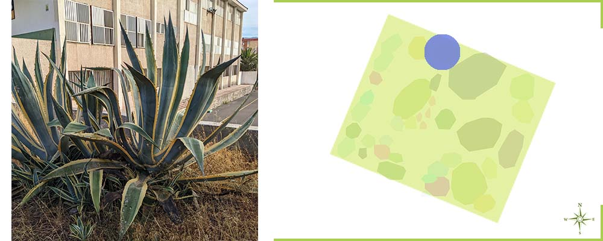

### Pitera 
_Agave americana_ - 💀 Exótica invasora

El ágave amarillo, pita o pitera (_henequén_ en Fuerteventura, a algunas variedades de pitera) es una planta originaria de México y el sur de Estados Unidos distribuida mundialmente. Cristóbal Colón describió en una ocasión que él había visto en el Caribe una planta que confundió con el aloe. Otros viajeros europeos la encontraron en zonas semidesérticas de Las Américas (razón de su nombre). En 1583 un aloe americano floreció por primera vez en Europa en el Jardín botánico de Pisa. Esta planta formó parte de las ilustraciones de la _Phytanthoza Iconografia_, un bonito libro de Johann W. Weinmann, primer ilustrador botánico.

&emsp;&emsp;_Agave americana según Weinmann_

_Phytanthoza Iconografia_ se puede descargar, junto con muchos otros materiales, de la [Biblioteca Digital del Real Jardín Botánico](https://bibdigital.rjb.csic.es/), un repositorio fabuloso.

**Pulque, mezcal y tequila**
Seguramente su uso más conocido es la producción de un licor destilado llamado mezcal, del que existen numerosas variedades, entre las que figura un mezcal conocido en todo el mundo, el tequila. El zumo azucarado extraído de la savia del tallo floral antes de la floración se fermenta para producir una bebida alcohólica, llamada pulque —una de las especies utilizada para elaborar la bebida—, que a su vez se destila para obtener el mezcal.

**Las piteras en Fuerteventura**
Desde los primeras años del siglo XX surgieron iniciativas proponiendo el cultivo de piteras en Fuerteventura para la fabricación de cuerdas, comparándose a la isla con Yucatán y sus condiciones climáticas, y realizándose algunos cultivos experimentales en Lanzarote. Entre los años 30 y 40 del siglo XX, en la zona central y norte de Fuerteventura, ya se cultivaba el henequén para producir fibras textiles, como sustituto del esparto, y para hacer cabos de barco, sacos, sogas y tejidos. En la década de 1950 el Ministerio de Agricultura compró parcelas en Fuerteventura, Lanzarote y Lobos para pruebas del rendimiento económico del cultivo. Se usó  _Agave sisalana_, _Agave fourcroydes_ y _Agave americana_. En Villaverde se estableció una _Fábrica de fibras duras_, dedicada al tratamiento y comercialización de las hojas de henequén dependiente del Servicio de fibras duras del Ministerio. Tuvo importancia económica desde la década de 1950 hasta mediados de la década de 1980, una industria única en el archipiélago. La planta, una vez cortada y limpia, se exportaba a mercados peninsulares, especialmente a Málaga, donde se usaba para la confección de cordelería. Las fibras artificiales terminaron con esta industria, y los cultivos se abandonaron,´aún se pueden ver los restos en los alrededores de La Oliva. 

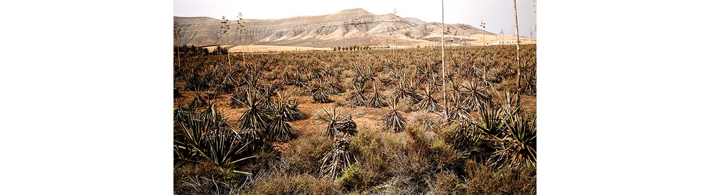
&emsp;&emsp;_Restos de cultivos de piteras cerca de La Oliva, Fuerteventura, 2020_

💀 Debido a su potencial colonizador y constituir una amenaza grave para las especies autóctonas, los hábitat o los ecosistemas, esta especie ha sido incluida en el [Catálogo Español de Especies Exóticas Invasoras](https://www.miteco.gob.es/es/biodiversidad/temas/conservacion-de-especies/especies-exoticas-invasoras/ce-eei-catalogo.html). Este ejemplar ya se encontraba en el jardín y está controlado pero si desaparece lo hay que plantearse una alternativa.

***

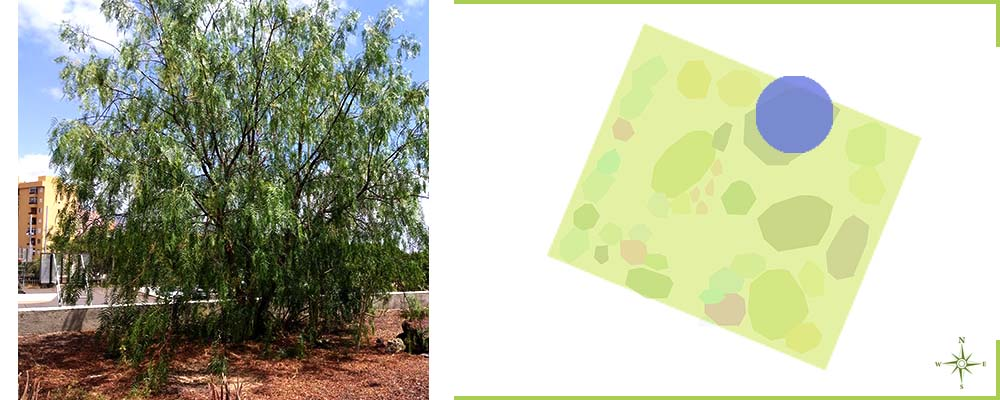

### Pimentero
_Schinus molle_

Falso pimentero, por sus pequeños frutos rojos, similares a los granos de pimienta, también se le llama _gualeguay_ o _aguaribay_ en Sudamérica. Es un árbol leñoso arborescente de hojas perennes originario de los Andes centrales. Es un árbol muy rústico que se adapta bien, prácticamente, a todo tipo de suelo. Resiste bien las sequías, sus hojas están recubiertas de una sustancia que evita la deshidratación. El tronco del falso pimentero exuda una resina muy aromática que tiene propiedades analgésicas, estimulantes, insecticidas, bactericidas, antifúngicas y antivirales, por lo que es una planta ampliamente utilizada por la medicina tradicional.

En el archipiélago canario está en casi todas las islas, inicialmente fue cultivado como planta ornamental, pero frecuentemente asilvestrado, incluso convertido en plaga en ciertos lugares. Aparece en el [Atlas de las plantas alóctonas invasoras en España](https://www.miteco.gob.es/es/biodiversidad/temas/inventarios-nacionales/inventario-especies-terrestres/inventario-nacional-de-biodiversidad/ieet_flora_vasc_aloct_invas.html). También es una especie invasora en Estados Unidos, Sudáfrica y Australia.

Considerado árbol sagrado, tuvo usos rituales en el imperio Wari (600 d. c. a 1000 d. c.) en los Andes centrales de Perú, usado para embalsamar a los muertos por los incas.

***

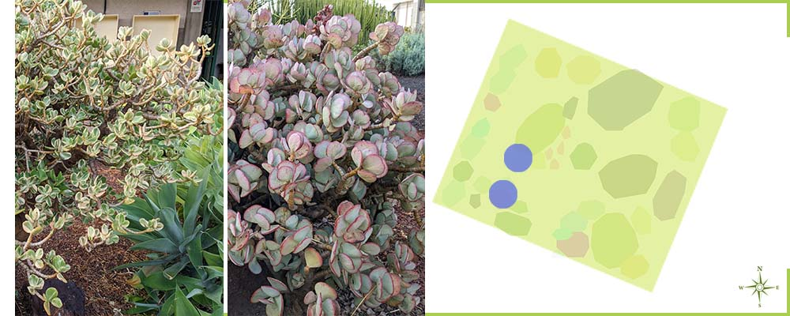

### Suculentas
_Crassula arborescens_ y _Crassula argentea_

El género _Crassula_ pertenece a la familia de las _Crassulaceas_ y engloba unas 200 especies. Las variedades más cultivadas y apreciadas por los amantes de las suculentas, provienen todas ellas de la Provincia Cabo Oriental en Sudáfrica. Además de las variedades naturales, existen numerosos híbridos.
Su nombre _Crassula_ proviene de la palabra latina _crassus_ que significa gruesa en referencia en abultadas hojas llenas de agua. Son plantas muy populares tanto para su cultivo en jardines como en macetas.
Muchas _Crassulas_ desarrollan bellos colores de tonos rojos, púrpuras, rosas, amarillos y naranjas como respuesta a una mayor exposición solar. En invierno y en condiciones de poca luz, todas las plantas volverán a su coloración verdosa.

La _Crassula arborescens_ es una de las más grandes del género, con una altura que va desde los 60 centímetros hasta el metro y medio. Es endémica de El Cabo, en Sudáfrica, y presenta hojas blanquecinas con el margen rojo.

***

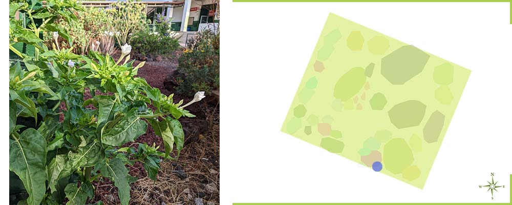

### Dondiego de noche
_Mirabilis jalapa_

Es originaria de Centro y Suramérica (Perú-México). A este jardín se trajo con semillas de un jardín particular en Tegueste y hasta ahora se ha ido multiplicando y tenemos ejemplares en por varios jardines.
Tiene varios nombres populares: Galán de noche, Bella de noche; en Canarias suele conocerse como Dondiego de noche porque sus flores se abren al atardecer y están abiertas por la noche. Se la conoce por muchos otros nombres: galán de noche, dama de noche, trompetillas, periquitos y un largo etc. Cuando las flores se abren, al atardecer, tienen un suave perfume. La polinizan polillas de esfíngidos. La mayoría de las esfinges tienen una probóscide muy larga y se alimentan de néctar mientras permanecen en vuelo frente a la flor, de forma similar a un colibrí. Al igual que los colibríes son buenos polinizadores. Las flores adaptadas a este tipo de polinización suelen ser tubulares, de colores pálidos o blancos, y se abren de noche.

El nombre _Mirabilis jalapa_ dado por Linneo en 1753 se forma a partir del latín científico _Mirabilis_ que significa "admirable" por alusión a los notables colores de sus flores y el nombre específico _jalapa_ que haría referencia a su origen en la Jalapa en Guatemala. Pero _jalapa_ también podría referirse a la ciudad de Xalapa en México de donde provenía un antiguo fármaco purgante, llamado _jalap_, tomado de los tubérculos de los tubérculos de la planta.

**Los colores del dondiego y la genética**
Aunque los ejemplares de este jardín son de flor blanca, algunos de los colores sólidos de las flores de la _Mirabilis jalapa_ que se pueden encontrar son Rojo, Rosa, Amarillo, Blanco, y Naranja. Además de estos colores sólidos, algunas variedades pueden tener flores bicolor o multicolores, lo que hace que esta planta sea atractiva para jardines ornamentales y macetas. Otro de los fenómenos que presenta es el cambio de color. Por ejemplo, en la variedad amarilla, a medida que la planta madura, puede producir flores que cambien gradualmente al rosa oscuro. Del mismo modo, las flores blancas pueden cambiar al violeta claro.

Hacia 1900, Carl Correns utilizó _Mirabilis_ como organismo modelo para sus estudios sobre la herencia citoplasmática. Usó las hojas variegadas de la planta para demostrar que ciertos factores externos al núcleo afectaban al fenotipo de una manera que no explicaban las teorías de Mendel. Correns propuso que el color de las hojas en _Mirabilis_ se transmitía a través de un modo de herencia uniparental: Cuando se cruzan plantas con flores de color rosa oscuro con plantas de flores blancas, se producen descendientes con flores de color rosa claro. Esto se considera una excepción a la Ley de dominancia de Mendel porque, en este caso, los genes de color rosa oscuro y blanco parecen tener la misma fuerza, por lo que ninguno domina completamente al otro. El fenómeno se conoce como dominancia incompleta. Es, pues, una planta que tuvo un papel importante en la historia de la genética.

&emsp;&emsp;_Esquema de la transmisión de colores en Mirabilis_

***

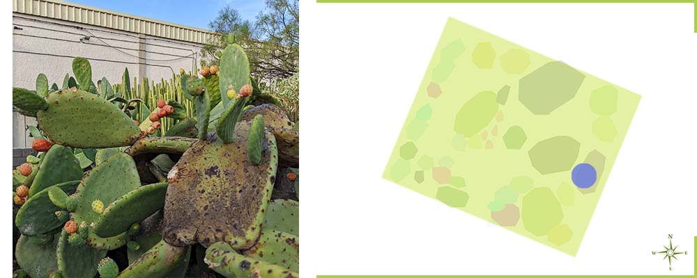

### Penca / Tunera 
_Opuntia ficus-indica_  - 💀 En desaparición

La penca o tunera, asociada al paisaje rural de Canarias. Sin embargo, es una planta introducida en el siglo XVII, habiendo pasado primero por la Península.
En Canarias fue la principal industria durante medio siglo. El cultivo de la cochinilla llegó a Canarias en el siglo XIX. Las pencas o tuneras se importaron de América para alojar al parásito (cochinilla, _Dactylopius coccus_) del que se obtenían tintes naturales en la gama de los malva. Pigmentos magníficos, muy estables. Primeras exportaciones: 1832, crisis total 1880. Un ciclo de tan solo 50 años. A la economía de la cochinilla canaria le enterró Sir William Henry Perkin, que sintetizó la malveína en el laboratorio de su casa en 1856, además ni siquiera estaba buscando eso, buscaba sintetizar quinina para la cura de la malaria. Pero la casualidad (serendipia) hizo que a los 18 años descubriera el primer tinte sintético, la malveína. El color púrpura, que desde tiempos antiguos simbolizaba la realeza, tuvo muy buena acogida, y a los veintiún años ya era millonario, mientras que en Canarias arruinó toda una economía, ayudado también por dos mujeres de la realeza: La demanda pública de malva se disparó cuando la emperatriz Eugenia de Francia y la reina Victoria de Gran Bretaña fueron vistas luciendo este color. Se dice que el malva se popularizó cuando la extravagante esposa de Napoleón III, la emperatriz Eugenia, declaró que el color combinaba con sus ojos. Cuando la propia reina Victoria lució un suntuoso vestido malva con ribete de encaje y enaguas a juego para la boda de su hija en 1858, este color, el más actual, se consolidó como la última moda.

&emsp;&emsp;_WH Perkin. | Frasco con malveína. | Chal, teñido con el tinte malva de Perkin, exhibido en la Exposición Internacional de 1862. | Traje de época teñido con malveína (las tres cosas, en el [Museo de la Ciencia de Londres](https://blog.sciencemuseum.org.uk/mauve-mania/))_

Más recientemente ha habido un resurgir para la fabricación de cosméticos con pigmentos naturales, además de que siempre se ha mantenido a su cultivo para producir higos picos o tunos. 

La abundancia de esta planta en las Islas Canarias durante siglos la convirtió casi en una seña de identidad paisajística desde mediados del siglo XIX.

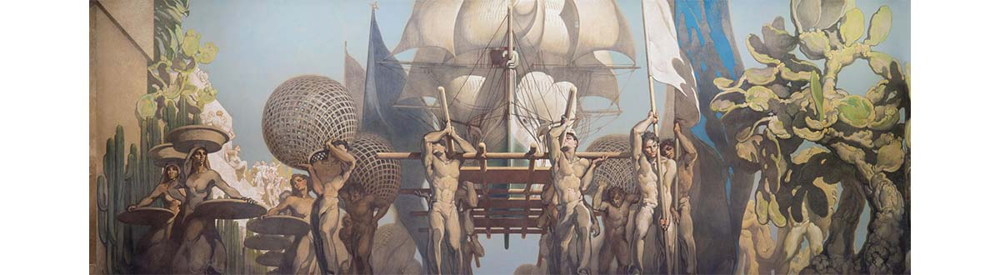
&emsp;&emsp;_Alegoría del mar. Néstor Martín Fernández de la Torre, 1935. Mural en el Casino de Tenerife. Las especies vegetales que pinta aquí Néstor son: Monstera deliciosa, Euphorbia canariensis y Opuntia ficus-indica_.

**LA PLAGA** 💀 
En los últimos años ha llegado a Canarias otro parásito, esta vez mortal, la cochinilla mexicana (_Dactilopyus opuntaie_), que pudre por completo la planta. Está empezando a afectar a los ejemplares de este jardín, y probablemente los matará a todos en uno o dos años. No se conocen tratamientos efectivos contra esta plaga. Se ha probado un tratamiento con extracto de neem (un remedio natural) pero no ha sido efectivo.
Es un síntoma más de cambios climáticos globales debido a causas humanas, y un aviso de los peligros de las especies invasoras, sobre todo en ecosistemas insulares.

&emsp;&emsp;_Plantas afectadas, en 2023._

***

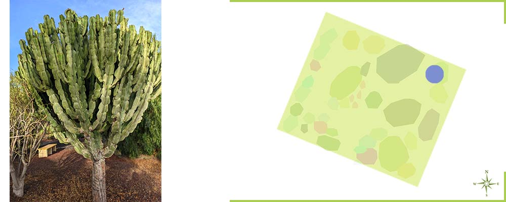

### Candelabro
_Euphorbia candelabrum_
Lleva ese nombre precisamente por tener la forma de un candelabro. A este espécimen se lo suele conocer cómo cactus candelabro y también se le puede encontrar con el nombre de _cactus mexicano_, aunque no se trata de un cactus, ni siquiera es oriundo de México. Es un árbol de la familia de las _euforbias_.

La _Euphorbia candelabrum_ tiene una forma de crecimiento muy especial y distinguible, ya que se parece precisamente a un candelabro. En su estructura es una planta de tipo columna que puede llegar a alcanzar grandes alturas, siendo sus especímenes más altos de unos 20 metros aproximadamente.

Es endémico del área del cuerno de África, también se extiende por toda la zona este del continente africano.

***

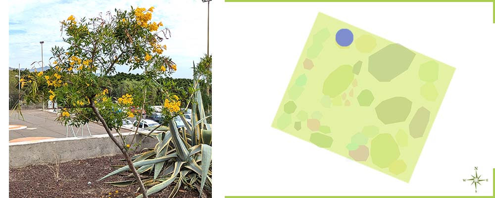

### Tecoma
_Tecoma stans_ 
Es una planta proveniente de América, también conocida como tecoma, tronadora o trompeta de oro.
Suele alcanzar unos 4 metros. Sus flores son muy llamativas por su color amarillo intenso. Se extiende desde el sur de Estados Unidos por México, Centroamérica y las Antillas hasta el norte de Venezuela, y por la cordillera de los Andes hasta el norte de la Argentina.

Nombres comunes en inglés son: yellow trumpetbush, yellow bells, yellow elder (arbusto trompeta amarillo, campanas amarillas, anciano amarillo). _Tecoma stans_ es la flor oficial de las Islas Vírgenes de los Estados Unidos y el emblema floral de las Bahamas. Se cultiva en numerosas partes del mundo por su floración, para adornar calles y jardines.

***

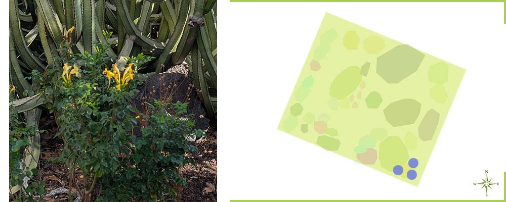

### Tecomaria
_Tecomaria capensis_
Tiene nombres comunes como Tecomaria o Bignonia de El Cabo. El género _Tecomaria_ se llama así por su parecido con el género _Tecoma_ de América. _Capensis_ significa “de El Cabo”
Es un arbusto de crecimiento rápido, revuelto, de tallos múltiples que puede crecer hasta 2-3 m de altura. Es una planta de hoja perenne en regiones cálidas. El tiempo de floración de este arbusto es muy errático y a menudo florece durante todo el año. Las flores son tubulares en vistosas cabezas de muchas flores y varían en color de rojo, naranja intenso, amarillo a salmón. En este jardín tenemos variedades rojas y amarillas.

Se cultiva en muchos países alrededor del mundo donde se ha naturalizado. Incluso en partes de Australia está catalogada como invasora.

***

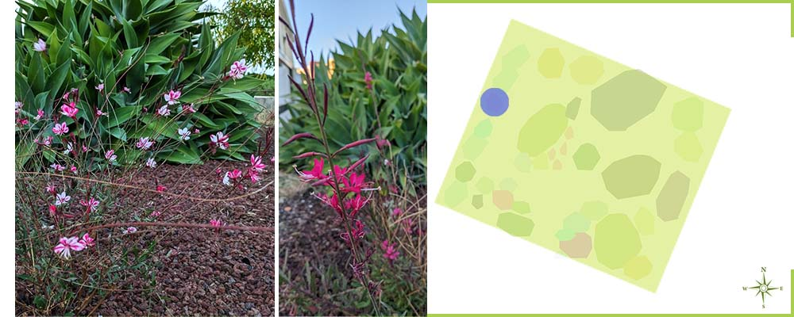

### Gaura
_Gaura lindheimeri_

Es una planta perenne de bajo mantenimiento de aspecto delicado, pero muy resistente. Originaria del sur de Luisiana y Texas. 

_Gaura_ derivado del griego _gaûros_, "soberbio" por el tamaño y floración de algunas especies de este género. _Lindheimeri_ por Ferdinand Lindheimer (1801-1879), botánico de origen alemán que en el siglo XIX recolectó extensamente en Texas para Asa Gray, el botánico estadounidense más importante del siglo XIX. Profesor de botánica en Harvard y gran amigo de Darwin, con quien colaboró y a quien apoyó con sus teorías en EE.UU.

Los cuidados de la gaura son mínimos si se planta en el lugar adecuado. En un par de años se ha adaptado bastante bien y da una nota de color y de flores en movimiento muy interesante. 

***

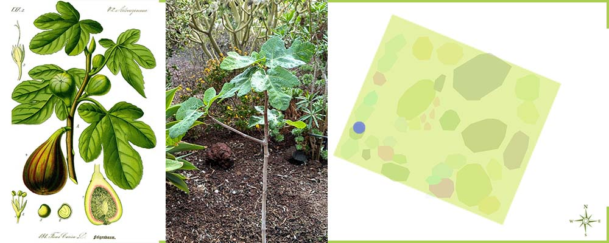

### Higuera
_Ficus carica_

La higuera es una de las numerosísimas especies del género _Ficus_, cuya infrutescencia es el higo. Originario de Asia sudoccidental, crece ahora espontáneamente en  muchas partes del mundo.

He plantado una higuera planeando orientar su crecimiento mediante podas para que en unos años dé sombra en los meses de más calor en una esquina del jardín, y en ese momento quitar uno de los agaves y parte del vallado para crear un espacio para estar, con un banco. Con suerte, además tendremos cosecha de higos.

# 2. Jardines del Patio central

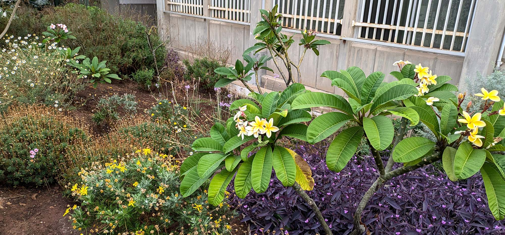
&emsp;&emsp;_Noviembre 2024_

Estos dos largos parterres, de unos 17 metros cada uno, estaban ocupados por cuatro árboles, ejemplares de flamboyán de más de 20 años de edad. Daban mucha sombra en verano y una floración espectacular hacia el mes de junio. Es una especie muy utilizada en Santa Cruz de Tenerife, y en general abundante en Canarias. En francés _flamboyant_ significa llamativo, vistoso.

Su nombre científico es _Delonix regia_, originaria de Madagascar, donde está en peligro de extinción, mientras que es muy abundante en todo el mundo, especialmente en climas subtropicales.

&emsp;&emsp;_Rambla de Santa Cruz, bordeada por ejemplares de flamboyán_

Por desgracia las raíces de esta especie son agresivas. Poco a poco fueron levantando el pavimento del patio, y en su búsqueda de agua, además de levantar el pavimento de la plaza central, llegaron subterráneamente hasta los baños del Pabellón 1, donde rompieron conducciones de agua y causaron varios problemas. Por esta razón se talaron en verano de 2022.

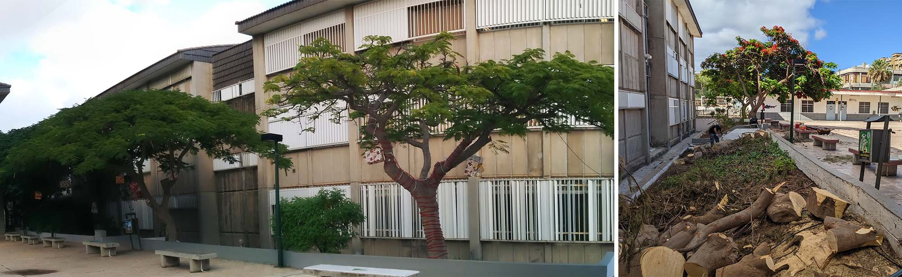
&emsp;&emsp;_Línea de flamboyanes, 2016 (y su diferencia de altura y volumen según nos alejamos de la orientación sur). | Tala en julio 2022._

En 2022 la Vicedirectora Laura me planteó la remodelación de estos dos jardines. Asesorado por un amigo jardinero, propusimos una línea principal de _plumeria_ (también conocido como frangipán), por varias razones: la poca agresividad de sus raíces, su porte mediano, resistencia a la escasez de riegos, la vistosidad de sus flores e incluso su perfume. Además de estos arbolitos, pensé en una organización inicial de plantas que los acompañaran, aunque la jardinería no es una ciencia exacta, y el propio jardín ha ido sugiriendo su forma.

&emsp;&emsp;_Proyecto original de remodelación, muy simple, 2022_

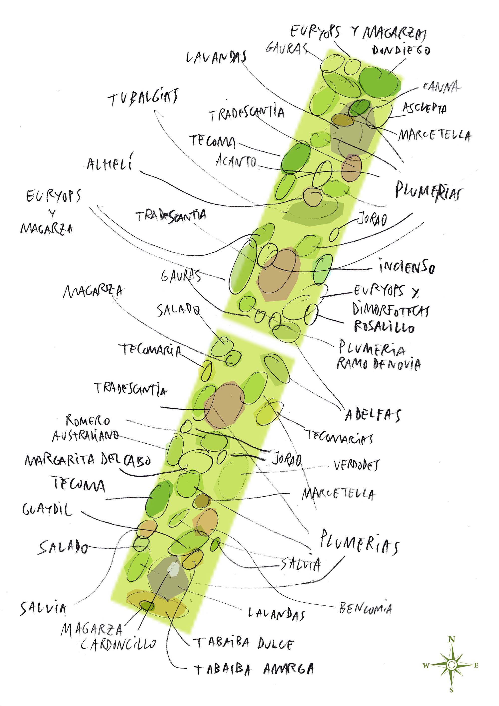
&emsp;&emsp;_El proyecto, modificado y enriquecindo por la propia dinámica del lugar, tres años después_

El parterre norte tiene menos insolación que el parterre sur. Conseguir una combinación de plantas adaptadas a cada lugar, con floración vistosa y unos mínimos de sostenibilidad ha sido proceso lento, de prueba y error.

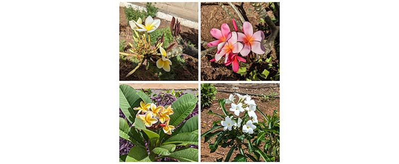
&emsp;&emsp;_Variedades de frangipán con sus primeras flores en el jardín, 2023._

## Los frangipanes o plumerias
Se hizo un esfuerzo por conseguir ejemplares de _plumeria_ con flores de colores diversos; las clásicas blancas de centro amarillo y también rosa, fucsia y naranja. Tardarán unos años en crecer pero le darán mucha personalidad al patio. En el futuro los frangipanes serán la especie visiblemente dominante pero también se está ajardinando con otras plantas. 

El frangipán es un árbol pequeño, de flores blancas o en tonos rosa o naranja, muy fragantes. Proviene de México, América central y Venezuela. 
Muy habitual en la jardinería tradicional de los patios y casas canarias. En Canarias se le suele llamar _árbol de sebo_. En este jardín hay ejemplares de _Plumeria rubra_, la más habitual en las islas.

Su nombre científico es _Plumeria_, y hay mucha historia detrás: _Plumeria_ fue acuñado en 1700 en honor a Charles Plumier, el “Padre de la Flora de las Indias Occidentales”. Plumier fue un monje, botánico y dibujante muy conocido por sus numerosos dibujos y documentación de sus expediciones a las Indias Occidentales y América Central. Estas fueron encargadas por la corona francesa y fueron parte de un patrón más amplio de imperialismo botánico que vinculó el estudio de la naturaleza al poder político y la expansión territorial. El movimiento de plantas y conocimiento botánico estuvo estrechamente vinculado a las potencias coloniales y sirvió para sostenerlas y enriquecerlas económicamente.

En el siglo XVII el botánico Ignacio de Mercado Morales escribe que el _Frangipani_ (aunque bajo el nombre _Calachuche_, una variante de la lenga náhuatl _kalachuchl_) provenía de “la Neuva Espalia” o “la Nueva España” (actual México). Esta hipótesis está respaldada por la propia familiaridad de Morales con la flora de la región, y fue reforzada por botánicos como el jesuita Georg Josef Camel SJ, quien nombra a la planta _Cacaloxochitl mexicana_ en sus _Descriptiones Fruticum et Arborum Luzonis_ (1704). Además, basándose en la filología, el botánico E. D. Merrill examinó los nombres utilizados para las especies de _Plumeria_ en todo el mundo y concluyó que muchos de ellos eran, en muchos casos, derivados de variantes mexicanas.

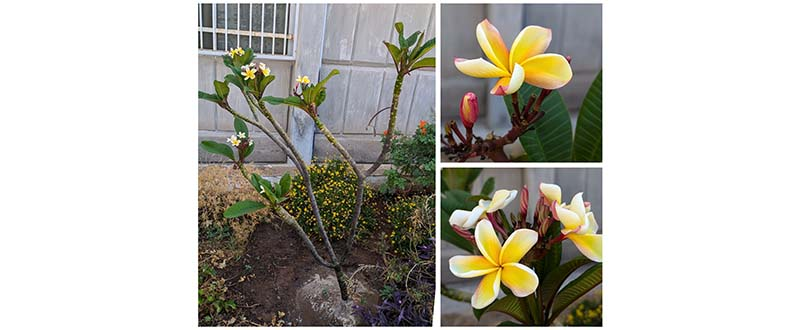
&emsp;&emsp;_Ejemplar plantado a comienzos de 2024_

El nombre común inglés _Frangipani_ también tiene un sabor misterioso, aunque es producido artificialmente por el comercio y la publicidad. Se cree que proviene de la palabra francesa _frangipanier_. Los botánicos franceses relacionaron su aroma con el _frangipane_, un popular perfume de almendras para guantes fabricado por el noble marqués Muzio de Frangipani en el siglo XVII. 

Fascinante también esta otra historia: En el siglo XIX, un grupo de perfumistas de Londres contribuyó aún más a esta confusión: para promocionar sus fragancias, crearon el mito de _Mercutio Frangipane_, un botánico ficticio asociado con los viajes de Colón al Nuevo Mundo que hizo descubrimientos sensacionales a través de su sentido del olfato. Con el objetivo de aumentar las ganancias, esta estrategia de marketing se basó en nociones de orientalismo con carga racial, vinculando el hábitat tropical nativo de la planta con la idea de un “Otro” distante para otorgarle a la fragancia un sentido de aventura y exotismo.

La relación entre las flores y el orientalismo se extiende también a las fragancias. Los escritores franceses del siglo XIX identificaban a la mujer _oriental_ estereotipada por su aroma sensual, y las flores se asociaban con la feminidad. Este legado ha llegado hasta el siglo XXI, cuando las supuestas imágenes orientales en los anuncios de perfumes transmiten una sensación de erotismo, misterio y sumisión. 

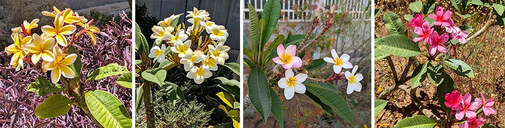
&emsp;&emsp;_Floraciones en junio 2025_

En perfumería moderna, del aceite de sus flores se extrae uno de los aromas básicos, y se puede encontrar en perfumes tan conocidos como _Coco Chanel, Versace Women, Jo Malone Frangipani Flower Cologne, Michael Kors Sparkling Blush_ o _Chanel Beige Eau de Parfum_.

Además de _Plumeria rubra_ de diferentes colores, hay un ejemplar de _Plumeria pudica_: es la variedad  “ramo de novia”, de flor totalmente blanca y diferente forma de la hoja, originaria de Panamá, Colombia y Venezuela.

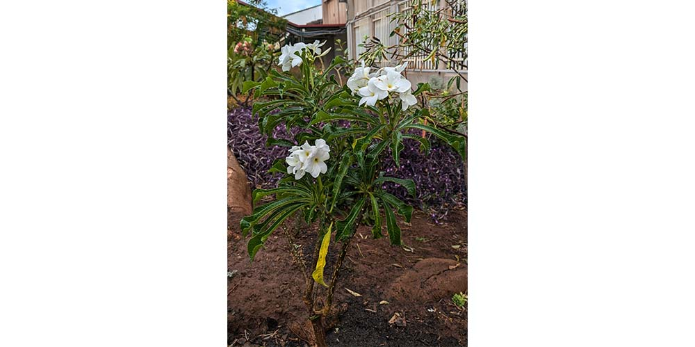
&emsp;&emsp;_Plumeria “ramo de novia”_

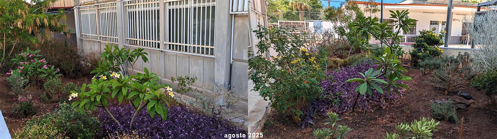

## Además de los frangipanes: LAS OTRAS ESPECIES NO NATIVAS DE CANARIAS

En estos parterres también se ha intentado combinar plantas nativas de Canarias con otras exóticas. La proporción actual es aproximadamente 15 exóticas/13 nativas.

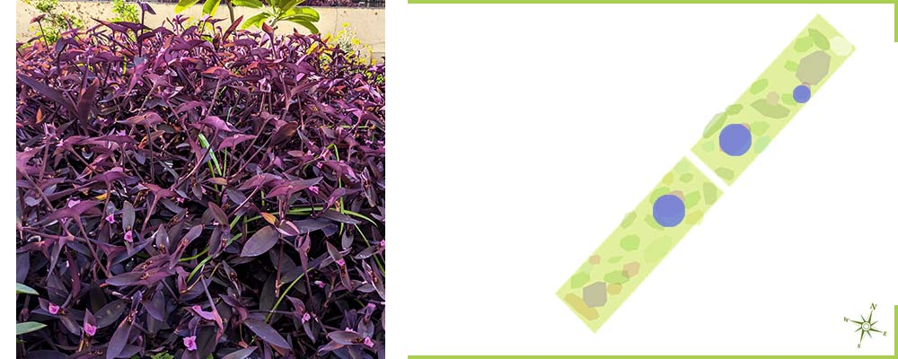

### Tradescantia
_Tradescantia pallida_

Una planta que ya estaba en el jardín, y con los cuidados se ha ido extendiendo. La idea es tener una o dos manchas ovaladas. Es una tapìzante de flores color rosa, pero lo más interesante son sus hojas moradas, que crean una masa que contrasta mucho con el verde de las otras plantas. 

Tiene como nombres comunes _amor de hombre_ o _purpurina_. Es originaria de México, y su nombre científico _Tradescantia pallida_ es un homenaje a Sir John Tradescant (hijo), botánico inglés, quien trajo a Europa, entre otras especies, las magnolias.

***

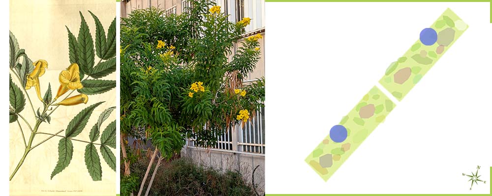

### Tecoma
_Tecoma stans_ 

Es una planta proveniente de América, también conocida como tecoma, tronadora o trompeta de oro.
Suele alcanzar unos 4 metros. Sus flores son muy llamativas por su color amarillo intenso. Se extiende desde el sur de Estados Unidos por México, Centroamérica y las Antillas hasta el norte de Venezuela, y por la cordillera de los Andes hasta el norte de la Argentina.

Nombres comunes en inglés son: yellow trumpetbush, yellow bells, yellow elder (arbusto trompeta amarillo, campanas amarillas, anciano amarillo). _Tecoma stans_ es la flor oficial de las Islas Vírgenes de los Estados Unidos y el emblema floral de las Bahamas. Se cultiva en numerosas partes del mundo por su floración, para adornar calles y jardines.

Los dos arbolitos de _Tecoma_ya estaban en el jardín, podados como arbustos pequeños, pero con la desaparición de los flamboyanes han empezado a crecer de nuevo, y aportan un elemento más alto, de flores amarillas muy vistosas.

***

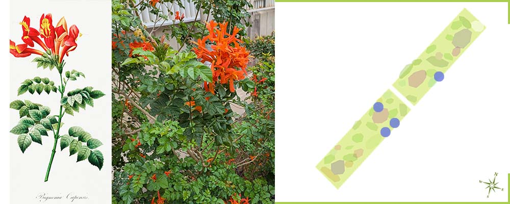

### Tecomaria
_Tecomaria capensis_
Tiene nombres comunes como Tecomaria o Bignonia de El Cabo. El género _Tecomaria_ se llama así por su parecido con el género _Tecoma de América_. _Capensis_ significa “de El Cabo”
Es un arbusto de crecimiento rápido, revuelto, de tallos múltiples que puede crecer hasta 2-3 m de altura. Es una planta de hoja perenne en regiones cálidas. El tiempo de floración de este arbusto es muy errático y a menudo florece durante todo el año. Las flores son tubulares en vistosas cabezas de muchas flores y varían en color de rojo, naranja intenso, amarillo a salmón. En este jardín tenemos variedades rojas y amarillas.

Se cultiva en muchos países alrededor del mundo donde se ha naturalizado. Incluso en partes de Australia está catalogada como invasora.

&emsp;&emsp;_Los dos colores de las tecomarias del jardín_

***

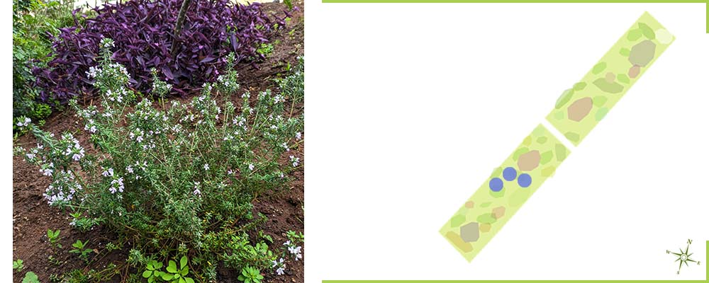
_Westringias recién plantadas, noviembre 2023 y primeras floraciones mayo 2024_

### Romero australiano
_Westringia fruticosa_

Son pequeños arbustos, de alrededor de 1m. de altura, de color verde oscuro, resistentes a la sequía, longevos y que además de su volumen tienen una floración larga, en estos ejemplares, en la gama de los colores lila.

***

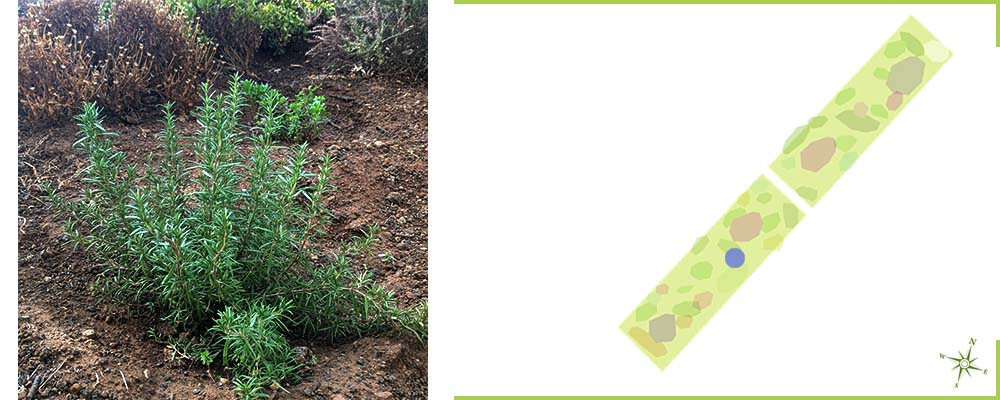
_Romero recién plantado, verano 2025, y tres meses después_

### Romero
_Salvia rosmarinus_ (hasta hace pocos años se llamaba _Rosmarinus officinalis_)

El romero es un arbusto aromático, leñoso, de hoja perenne, muy ramificado y ocasionalmente achaparrado y que puede llegar a medir hasta 2 m de altura. Es una planta con una larga historia cultural y de usos. Muy adecuada para jardines de bajo mantenimiento.

***

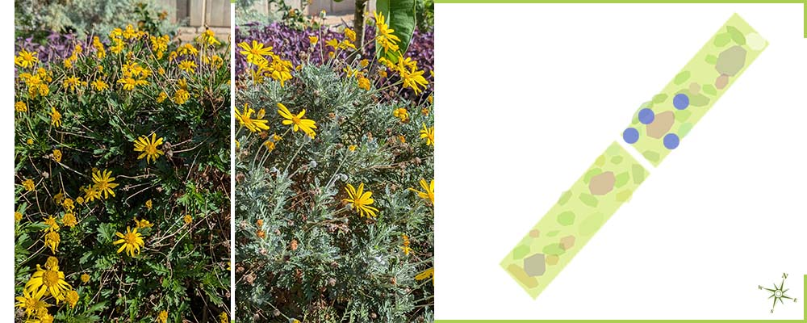

### Margarita amarilla
_Euryops pectinatum_

Pequeños arbustos con flores amarillas muy vistosas. En este jardín estoy probando dos variedades: unas con hojas verde oscuro y otras de hoja plateada.
_Euryops_ es un género de plantas con flores de la familia de los girasoles. Son originarias principalmente de zonas rocosas del sur de África, con algunas especies presentes en otras partes de África y en la Península Arábiga.

***

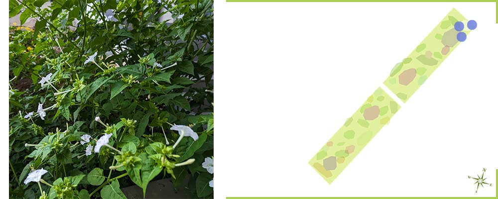

### Dondiego de noche
_Mirabilis jalapa_

Es originaria de Centro y Suramérica (Perú-México). A este jardín se trajo con semillas de un jardín particular en Tegueste y hasta ahora se ha ido multiplicando y tenemos ejemplares en por varios jardines.
Tiene varios nombres populares: Galán de noche, Bella de noche; en Canarias suele conocerse como Dondiego de noche porque sus flores se abren al atardecer y están abiertas por la noche. Se la conoce por muchos otros nombres: galán de noche, dama de noche, trompetillas, periquitos y un largo etc. Cuando las flores se abren, al atardecer, tienen un suave perfume. La polinizan polillas de esfíngidos. La mayoría de las esfinges tienen una probóscide muy larga y se alimentan de néctar mientras permanecen en vuelo frente a la flor, de forma similar a un colibrí. Al igual que los colibríes son buenos polinizadores. Las flores adaptadas a este tipo de polinización suelen ser tubulares, de colores pálidos o blancos, y se abren de noche.

El nombre _Mirabilis jalapa_ dado por Linneo en 1753 se forma a partir del latín científico _Mirabilis_ que significa "admirable" por alusión a los notables colores de sus flores y el nombre específico _jalapa_ que haría referencia a su origen en la Jalapa en Guatemala. Pero _jalapa_ también podría referirse a la ciudad de Xalapa en México de donde provenía un antiguo fármaco purgante, llamado _jalap_, tomado de los tubérculos de los tubérculos de la planta.

**Los colores del dondiego y la genética**
Aunque los ejemplares de este jardín son de flor blanca, algunos de los colores sólidos de las flores de la _Mirabilis jalapa_ que se pueden encontrar son Rojo, Rosa, Amarillo, Blanco, y Naranja. Además de estos colores sólidos, algunas variedades pueden tener flores bicolor o multicolores, lo que hace que esta planta sea atractiva para jardines ornamentales y macetas. Otro de los fenómenos que presenta es el cambio de color. Por ejemplo, en la variedad amarilla, a medida que la planta madura, puede producir flores que cambien gradualmente al rosa oscuro. Del mismo modo, las flores blancas pueden cambiar al violeta claro.

Hacia 1900, Carl Correns utilizó _Mirabilis_ como organismo modelo para sus estudios sobre la herencia citoplasmática. Usó las hojas variegadas de la planta para demostrar que ciertos factores externos al núcleo afectaban al fenotipo de una manera que no explicaban las teorías de Mendel. Correns propuso que el color de las hojas en _Mirabilis_ se transmitía a través de un modo de herencia uniparental: Cuando se cruzan plantas con flores de color rosa oscuro con plantas de flores blancas, se producen descendientes con flores de color rosa claro. Esto se considera una excepción a la Ley de dominancia de Mendel porque, en este caso, los genes de color rosa oscuro y blanco parecen tener la misma fuerza, por lo que ninguno domina completamente al otro. El fenómeno se conoce como dominancia incompleta. Es, pues, una planta que tuvo un papel importante en la historia de la genética.

&emsp;&emsp;_Esquema de la transmisión de colores en Mirabilis_

***

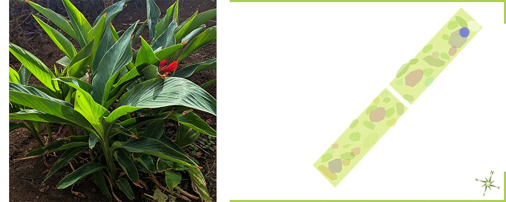

### Platanillo
_Canna indica_

Es originaria de América del Sur: Colombia, Venezuela, Ecuador, Perú, Brasil, Uruguay y Argentina, así como de las Indias Occidentales y América Central. En Canarias se usa en jardinería popular de manera habitual, estando muy bien adaptada a la climatología de las islas En América del Sur su nombre más común es _achira_, y se cultiva como alimento: los rizomas se comen crudos u horneados y sobre todo se usa como materia prima para harinas.

Estos ejemplares de platanillo, de flor roja, se han trasladado y agrupado de otros parterres donde estaban en mal estado. Aquí tendrán más humedad y en grupo serán más visibles.

***

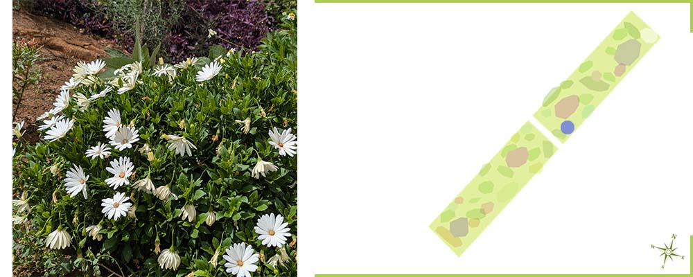

### Margarita del Cabo
_Dimorphoteca Ecklonis_

Las _dimorphothecas_ se parecen a las margaritas, pero no lo son. Vienen de Sudáfrica y tienen una floración con colores más variados que van desde el blanco, al morado, el naranja y el amarillo. Incluso los morados pueden incluir distintas gamas entre rojo y violeta. Esta planta herbácea, vivaz y rústica, se autorreproduce con facilidad y se adapta a climas secos y soleados.
Su nombre viene del griego _dis_ _morphe_ y _theka_, que significa _la fruta en forma de dos_, refiriéndose al dimorfismo de las _asteráceas_. _ecklonis_ por el botánico danés Christian Friedrich Ecklon. 

Ecklon nació en 1795 y realizó expediciones de recolectas en Sudáfrica, siendo su primer viaje en 1823, primero como aprendiz de botica y luego farmacéutico, tratando a la flora con fines medicinales. Sin fondos y con su salud deteriorada se ve forzado a vivir en la pobreza, vendiendo bulbos o preparando remedios herbales. Así todo, regresa a Europa en 1828, llevando una importante cantidad de especímenes de herbario.  Este herbario es la base de la [Flora Capensis](https://www.biodiversitylibrary.org/bibliography/821), escrito por su amigo, el farmacéutico hamburgués Otto W. Sonder en colaboración con su colega irlandés William H. Harvey, profesor de botánica, publicado en Londres en 7 volúmenes desde el año 1860 al 1933.
La historia de botánicos como Ecklon nos da idea del gigantesco esfuerzo humano por conocer las especies de plantas del planeta.

&emsp;&emsp;_Christian Ecklon_

***
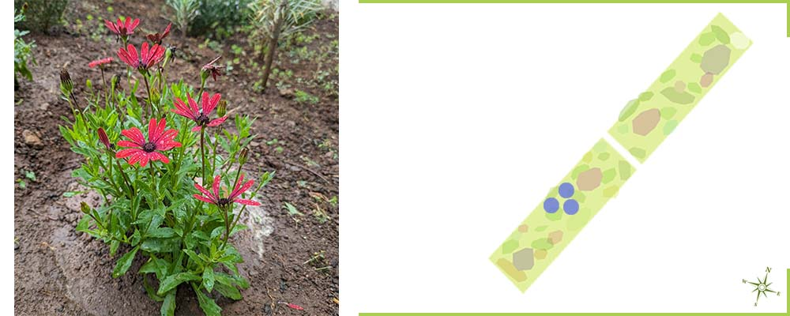

### Margarita del Cabo
💀 _Osteospermium fruticans_

Esta especie está muy cercana a las _Dimorphotecas_, en teoría es perenne mientras que las otras son anuales. Sin embargo, habrá que ver cómo se adaptan y se comportan en este jardín.
_Actualización_: Probé varios ejemplares de colores diversos, que florecieron un año para después perderse.
Por razones de sostenibilidad, finalmente no los volví a sembrar sino que he recurrido a otra especie: _Asteriscus maritimus_ 

***

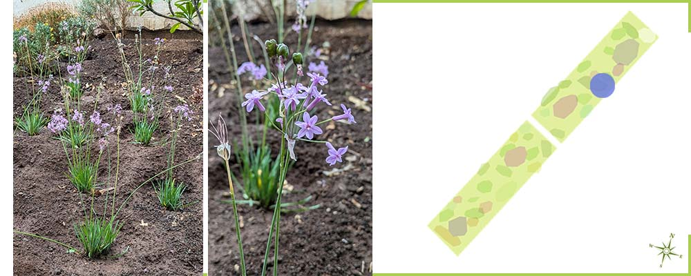
_Tulbaghias recién plantadas, octubre 2024_

### Tulbaghia
_Tulbaghia violacea_

Una planta rizomatosa, de flores violeta, de la familia de las _amarilidáceas_, que incluyen plantas comestibles como cebolla, ajo, puerro, etc y muchas plantas ornamentales como los amarilis, agapantos o narcisos.
La _Tulbaghia_ proviene de África del Sur y se recomienda para jardinería sostenible por su resistencia a la sequía.

Esta planta fue nombrada en honor de Ryk Tulbagh (1699-1771), gobernador en el Cabo Buena Esperanza cuando perteneció a los Países Bajos. Tulbagh fue un intelectual que tuvo contacto con los astrónomos Nicolas Louis de Lacaille, Charles Mason y Jeremiah Dixon y se carteó con varios botánicos incluyendo Carlos Linneo, al envió más de 200 especímenes de plantas locales. Linneo nombró la planta _Tulbaghia_ en su honor.

Se ha plantado un grupo en una mancha de flores violeta, que esperemos que mantengan floración todo el año.

***

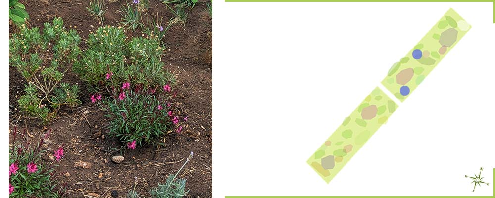
_Dibujo de Gaura por Edward Step, 1896 ([Favourite flowers of garden and greenhouse](https://archive.org/details/favouriteflowers03steprich/favouriteflowers03steprich/))_

### Gaura
_Gaura lindheimeri_

Es una planta perenne de bajo mantenimiento de aspecto delicado, pero muy resistente. Originaria del sur de Luisiana y Texas. 

_Gaura_ derivado del griego _gaûros_, "soberbio" por el tamaño y floración de algunas especies de este género. _Lindheimeri_ por Ferdinand Lindheimer (1801-1879), botánico de origen alemán que en el siglo XIX recolectó extensamente en Texas para Asa Gray, el botánico estadounidense más importante del siglo XIX. Profesor de botánica en Harvard y gran amigo de Darwin, con quien colaboró y a quien apoyó con sus teorías en EE.UU.

Los cuidados de la gaura son mínimos si se planta en el lugar adecuado. En un par de años se ha adaptado bastante bien y da una nota de color y de flores en movimiento muy interesante. 

***

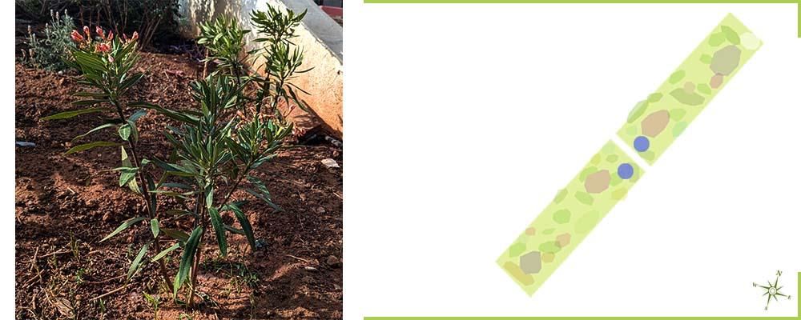

### Adelfa enana
_Nerium oleander_

Adelfa o baladre. Originariamente se encontraba como planta nativa en una amplia zona desde el Mediterráneo hasta China y Vietnam, y se ha difundido ampliamente por todas las zonas con clima propicio como planta ornamental, en jardines, medianeras de carretera. Hay numerosas variedades de jardinería, con flores con un número variable de pétalos y diferentes coloraciones que incluyen el rojo, fucsia, carmín, rosa, blanco y, más recientemente, el salmón y el amarillo pálido. También existe una forma con hojas variegadas verde-amarillas y una subespecie enana. Al tratarse de una planta de origen mediterráneo, es muy resistente a la sequía.
Se ha sembrado la variedad enana, ocupando unas esquinas difíciles, por su robustez, pequeño tamaño y abundante floración. A pesar de ello, he perdido un ejemplar, quedando tres.

_Nerium_ deriva del vocablo griego _nerión_ "agua" o "húmedo", y se puede referir a que crece naturalmente cerca de corrientes de agua (como ríos), o al dios griego Nereo, dios del Mar y padre de las Nereidas. _Oleander_ por la semejanza superficial de sus hojas con el olivo (_Olea europea_)

**La toxicidad de la adelfa**
_Nerium_ contiene varios compuestos tóxicos, e históricamente se ha considerado una planta venenosa. Sin embargo, su amargura lo hace desagradable para los humanos y la mayoría de los animales, por lo que los casos de intoxicación son muy raros, además de que en caso de ingestión causa náuseas y vómitos. El contacto prolongado con la savia puede causar irritación de la piel o los ojos.
Muchas (muchísimas) plantas del planeta, y por extensión utilizadas en jardinería, son tóxicas, venenosas o irritantes.

Un artículo de 2014 en la revista médica _Perspectives in Biology and Medicine_ proponía que la adelfa era la sustancia utilizada para inducir alucinaciones en la Pitia, la sacerdotisa de Apolo, también conocida como el Oráculo de Delfos en la Antigua Grecia. Según esta teoría, los síntomas de los trances de la Pitia (_enthusiasmos_) corresponden a la inhalación del humo o la masticación de pequeñas cantidades de hojas de adelfa, a menudo llamadas con el término genérico laurel en la Antigua Grecia, lo que llevó a confusión con el laurel que citan los autores antiguos.

Existe una persistente leyenda en la que unos lugareños españoles, durante la guerra de Independencia a comienzos del siglo XIX, aniquilan a todo un batallón del ejército francés, envenenándolos con carne de conejo asados en una hoguera ensartados en palos de adelfa. La misma leyenda aparece con varias ubicaciones diferentes, y adecuadamente ignora que los propios vapores tóxicos hubiera alertado a los soldados, que además hubieran tenido episodios de vómitos, mareos, etc. Añadiendo que en el ejército francés había médicos y científicos, como por ejemplo Apollinaire Fée, farmacéutico militar que en 1809 participó de la campaña de España y elaboró una tratado de las plantas que se iba encontrando en su avance junto al ejército y entre las que describió a la adelfa.
En [Espores](https://espores.org/es/), una publicación del Jardín Botánico de la Universidad de Valencia, se recoge esta leyenda en el artículo [Adelfa, tan bella como tóxica](https://espores.org/es/etnobotanica-es/adelfa-tan-bella-como-toxica/), con mucha otra información interesante.

En el mundo real, los estudios de toxicidad en animales han concluído que las aves y los roedores son relativamente insensibles a los glucósidos cardíacos de adelfa. Sin embargo, otros mamíferos, como los perros y los humanos, sí que pueden ser afectados. Es peligrosa para animales como ganado, ovejas, caballos. Los recortes de plantas son especialmente peligrosos para los caballos, ya que son dulces. Esto se refleja acertadamente en el nombre sánscrito de la planta, _aśvamāra_, un compuesto de _aśva_ "caballo" y _māra_ "matar".
La mortalidad humana por ingestión de adelfa es muy baja o inexistente. Cómo dato muy singular que encontré en la red, en 2000 se produjo un caso raro y bastante triste de muerte por envenenamiento con adelfa en Estados Unidos: dos niños pequeños adoptados de un orfanato comieron las hojas del arbusto de un vecino en El Segundo, California. Debido a que la adelfa es extremadamente amarga, se cree que los niños pequeños habían desarrollado una condición causada por la desnutrición (llamada pica), que hace que las personas coman cosas que de otro modo no serían comestibles. Cómo decía, una triste curiosidad.

Una última fantasía cinematográfica: en la película _La flor del mal (White oleander, 2003)_ basada en un libro de Janet Fitch y dirigida por Peter Kosminsky, Ingrid (Michelle Pfeiffer) decide envenenar a su amante Barry (Billy Connolly) con un veneno hecho de adelfa blanca.

&emsp;&emsp;_Michelle Pfeiffer recogiendo ramas de adelfa (La flor del mal, 2002). (En el cine no te lo creas todo, y con las plantas suele haber más agujeros de guion y fallos de raccord: ¿recuerdas aquella escena de Gladiator donde Máximo recordaba los jazmines de su villa en Hispania? Estas plantas llegaron a la Península Ibérica con los árabes, que las extendieron desde Oriente Medio, varios siglos después de que Hispania dejara de ser romana)_

***

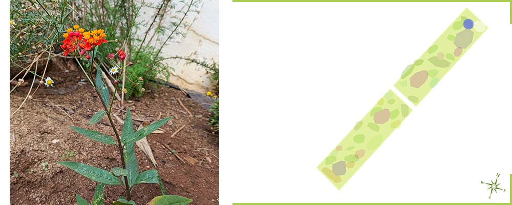

### Asclepias
_Asclepias curassavica_

Esta planta, con muchos nombres populares como: algodoncillo, venenillo, bandera española, mata ganado, etc. es una especie perenne del género _Asclepias_, en la familia _Apocynaceae_. Es nativa de la América tropical, y naturalizada en muchas otras partes del mundo. Se cultiva como planta ornamental de jardín y como fuente de alimento para las mariposas, en los jardines de mariposas. En este jardín estoy intentando aclimatarla por ese motivo: para que lo visiten las mariposas. 

&emsp;&emsp;_Asclepias con su mariposa. Grabado coloreado a mano por John Abbot. [The natural history of the rarer lepidopterous insects of Georgia, volume 1 (1797)](https://www.biodiversitylibrary.org/item/5968#page/50/mode/2up)_

_Asclepias_ por Asklepios, dios de la Medicina en la mitología griega. _curassavica_ por la isla de Curaçao, en el Caribe.

&emsp;&emsp;_Diciembre 2024. Apenas dos semanas después de plantar las Asclepias las mariposas ya localizaron  las plantas, pusieron sus huevos y nacieron orugas que empezaron a devorar  las hojas._

**La mariposa monarca**
Esta planta atrae la mariposa monarca, Danaus plexippus, un espectacular insecto, de alas color naranja con líneas negras, fácilmente reconocible.
La Asclepia es una planta hospedera para esta mariposa: los adultos visitan las flores, posteriormente los gusanos se alimentan de sus hojas y ponen huevos en la planta, reiniciando su ciclo.

**Mariposas, orugas y el veneno de la asclepias**
Las _Asclepias_ son plantas tóxicas. Los colores llamativos amarillo y negro de la oruga y naranja y negro de la mariposa adulta son un aviso (aposematismo o coloración de aviso) de que son tóxicos para la mayoría de los depredadores. Esta estrategia funciona porque la mayoría de los depredadores asocia colores chillones (especialmente naranja, amarillo y negro), con veneno y otras propiedades desagradables.
La mariposa monarca contiene glucósidos cardíacos en su cuerpo, como resultado de que las orugas comen asclepias; las integran en sus tejidos y son tóxicas, así evitan a sus depredadores. 

Es uno de los pocos insectos que logra realizar travesías transatlánticas. Unas cuantas mariposas monarca llegan al suroeste de Gran Bretaña y a España en los años de vientos favorables, e incluso se han instalado de forma permanente en las Islas Canarias desde 1804, en Tenerife. Reside en las Islas Canarias, Azores, Madeira y Andalucía.

**La migración de la Monarca**
Una de las subespecies de la Monarca es especialmente conocida por su larga migración anual, desde Canadá a México.
La migración de las mariposas monarca americanas (_D. plexippus plexippus_) es la más evolucionada de todas las especies conocidas de su tipo: vuelan hasta 5.000 km desde Estados Unidos y Canadá, donde se reproducen, hasta los bosques del centro de México, donde hibernan. Esta gran migración está bajo amenaza. El cambio climático, tanto en las áreas de hibernación en México como en las áreas de reproducción de verano en Estados Unidos, causa impacto en la migración de la monarca. La deforestación en los bosques mexicanos, la conversión de pastizales en tierras de cultivo, el uso de herbicidas y pesticidas y la reducción de las poblaciones de _Asclepia_ en sus rutas, son factores que se suman creando una tormenta perfecta para estas pequeñas criaturas.
En julio de 2022, la Unión Internacional para la Conservación de la Naturaleza (UNIC) declaró a la mariposa monarca como una especie en peligro de extinción.

Hay una historia fabulosa sobre las investigaciones sobre las migraciones de las monarcas: 

El zoólogo canadiense Fred Urquhart y su esposa Nora R. Urquhart trabajaron desde 1937 hasta 1975 buscando dónde hibernan las mariposas en México.
Durante décadas Fred y Nora Urquhart coordinaron a miles de voluntarios para poner minúsculas etiquetas de papel en las alas de las mariposas monarca y así poder documentar su ruta migratoria. La película _Flight of the Butterflies_, de 2012, cuenta esta historia. Ken Brugger y su esposa Catalina Aguado, de Ciudad de México, se unieron al proyecto y encontraron el lugar de hibernación en 1975 en los bosques de Cerro Pelón.

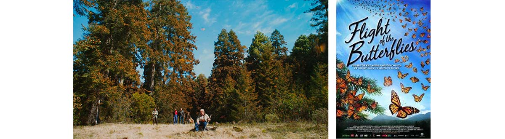

***
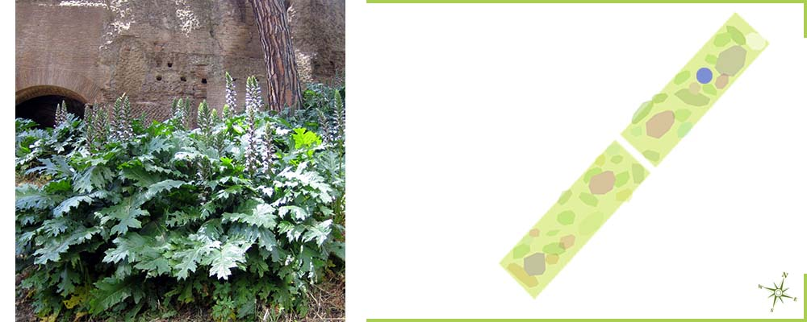
_Acantos asilvestrados en el Palatino, Roma. Foto: Anthony Majanlahti en Flickr. CC-By_

### Acanto
_Acanthus mollis_

Es un arbusto de grandes hojas brillantes y espinosas y con una floración muy elegante en espiga, de altas flores blancas y lilas.
Las tres especies de acanto son nativas del centro y este de la región mediterránea, adaptada desde la antigüedad en el cultivo de jardines, y ahora naturalizada y cultivada prácticamente en todo el mundo.
Se describió y publicó por vez primera en Species Plantarum, en 1753 por Carlos Linneo.

Tiene usos medicinales pero sobre todo, presencia en el arte. El motivo de la hoja de acanto como elemento decorativo se remonta a la antigua Grecia y Roma. Según el arquitecto romano Vitruvio, un escultor griego llamado Calímaco (siglo V a.C.) lo inventó para el capitel de estilo corintio tras ver crecer una planta de acanto a través de una cesta colocada sobre la tumba de una niña, copiando esa forma para crear un nuevo tipo de capitel. A lo largo de los siglos, este elegante diseño de hojas apareció en capiteles de columnas corintias, frisos, tallas de madera y otros elementos. Con múltiples variantes se utiliza en las épocas griega, romana, bizantina, y en toda la historia de la arquitectura hasta los neoclasicismos, el _nouveau_ y _deco_, etc. 
La revista Espores dedicó un artículo al [acanto en el arte](https://espores.org/es/es-plantas/el-acanto-en-el-arte/)

&emsp;&emsp;_El mito de la creación del orden corintio, según un dibujo de la traducción francesa de Vitruvio por Claude Perrault en 1689. Columnas corintias con capiteles de hoja de acanto en el Panteón de Roma. Foto: Carole Raddato CC-By-Sa_

***
***

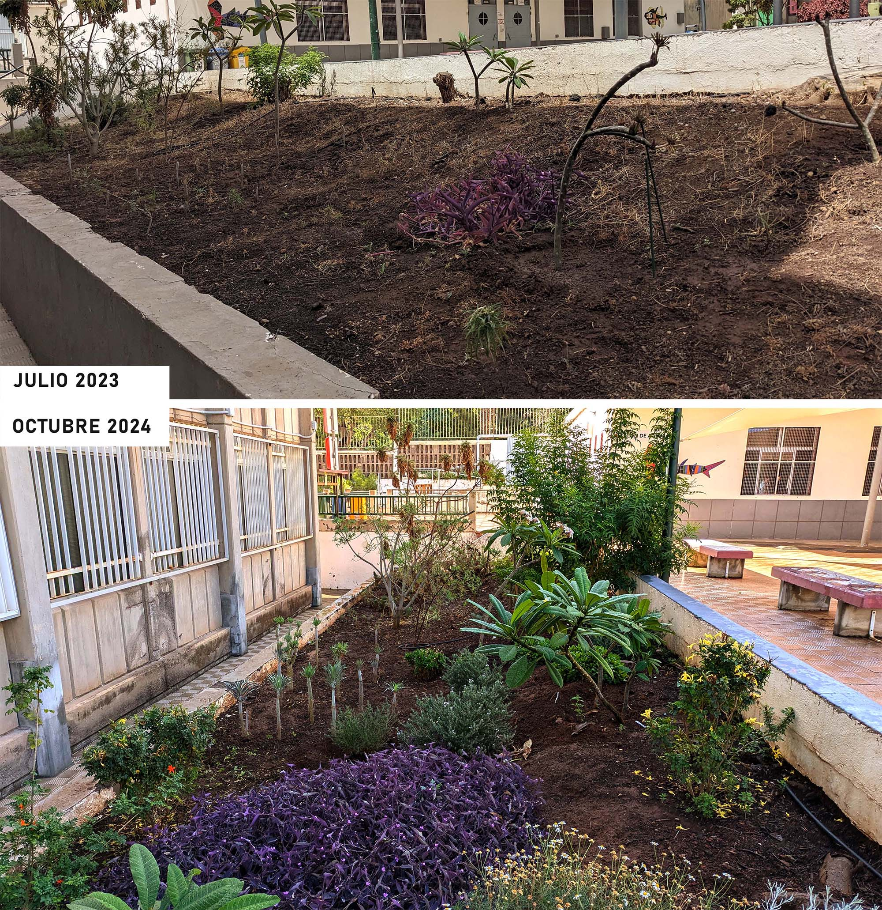
&emsp;&emsp;_Evolución de uno de los parterres en unos 15 meses_

***
***

## PLANTAS NATIVAS DE CANARIAS

Algunas de estas plantas han sido cedidas por el  **Vivero Insular de Flora Autóctona** del Cabildo de Tenerife (rosalito, alhelí, guaydil, salvia). Otras (lavanda, senecio) han nacido espontáneamente o se han recolectado en sus hábitat (magarza, salado).

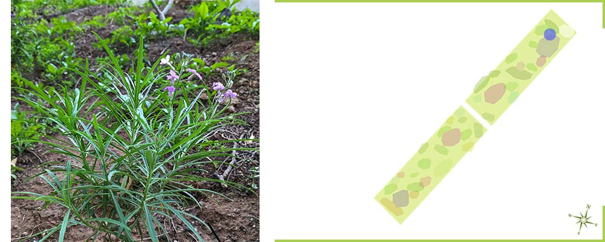

### Alhelí 
_Erysimum bicolor_

Es un pequeño arbusto, con hojas estrechas y lanceoladas, de flores violetas y blancas. Endemismo macaronésico que se encuentra en Canarias y Madeira.

Ya se ha intentado tener alhelíes en tres ocasiones. El primer año los ejemplares tuvieron un buen desarrollo, florecieron, pero en verano 2024 tuvieron un importante retroceso. Se plantaron nuevos ejemplares en otoño de 2024, que desaparecieron de nuevo en verano de 2025. 
Se está haciendo un último intento de adaptarlos desde otoño 2025, cambiando el lugar a un sitio con menos insolación.

***

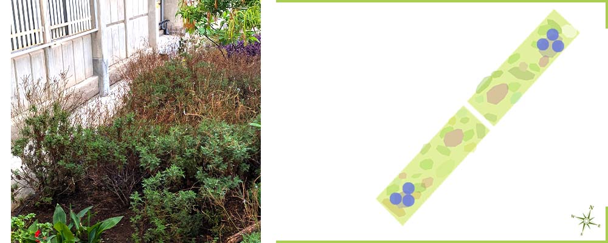

### Lavanda
_Lavandula canariensis_ 

También llamada mato risco, lavanda, romanillo o yerba risco, es un endemismo canario, frecuente y hasta abundante en barrancos y laderas pedregosas del Cardonal-tabaibal, formando parte de la vegetación típica de ese ecosistema. Aparece menos en áreas cálidas y soleadas de los bosques termófilos.
En el año 2004 se publicó una revisión del género _Lavandula_ que determinó que hay hasta siete subespecies de esta planta, una por cada una de las islas de nuestro archipiélago
Las lavandas de este jardín se trajeron de la zona costera del Valle de Güímar. Tras varios intentos una de ellas arraigó y ahora su propia semillas van haciendo que aparezcan nuevas plantas.
Es resistente a la sequía y a la insolación y es de la misma familia que las lavandas que se utilizan comercialmente para fabricar perfumes, aunque con menos olor. También se han llevado semillas al jardín del patio y allí se está multiplicando.

Desde la primera retirada de malas hierbas nacieron numerosos ejemplares en los dos parterres largos, aunque su desarrollo es muy diferente según la insolación y humedad.

***

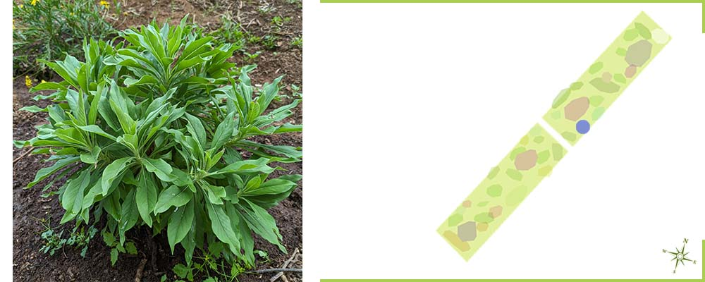

### Rosalito
_Pterocephalus dumetorus_

El rosalito salvaje es un arbusto de porte redondeada, de hasta 1,5 metros de alto con vistosas flores de color rosado. 
Endémica de Canarias crece en barrancos, laderas y riscos de la zona central de la isla de Gran Canaria, llegando a ser abundante en algunas localidades de dicha área. En Tenerife tiene su hábitat en la zona del valle de Güímar entre Igueste de Candelaria (barranco de Chacorche) y la Ladera de Güímar y algunos barrancos del sur llegando hasta el municipio de Arico. 

_Pterocephalus_ del griego _pteron_, "ala o pluma", y _kephale_ "cabeza", en referencia a la forma plumosa de las flores. _dumetorus_ del latín _dumetum_ "matorral".

Tiene un uso importante como planta ornamental debido a sus vistosas flores y su fácil cultivo. Aunque en este jardín tres años después de su plantación sigue creciendo, pero aún no ha tenido su primera floración.

***

### Senecio / Verode
_Kleinia neriifolia_

Se le suele llamar también verode, aunque el nombre, como muchos nombres comunes, va cambiando según las islas y las zonas. Esto es confuso ya que también se llama verodes a casi todo el género Aeonium.
Es una planta muy resistente, que aquí se reproduce por sí misma con las semillas transportadas por el viento. En verano pierde todas sus hojas y las recupera en invierno.

Se ha plantado un grupo de senecios, trasladando ejemplares de otras zonas del Instituto que habían nacido espontáneamente.
Es una planta muy resistente, casi indestructible. Desde el punto de vista de la jardinería tiene sus más y sus menos: en verano pierde toda la hoja (como defensa frente a la deshidratación) y queda como una estructura de tallos de poco interés. 
En otoño empieza a recuperar sus hojas y cambia su aspecto. Un par de veces al año florece y fructifica de forma espectacular, dejando que el viento disperse sus semillas voladoras, que de repente están por todas partes, con lo que también suelen aparecer ejemplares nuevos por cualquier sitio.

***

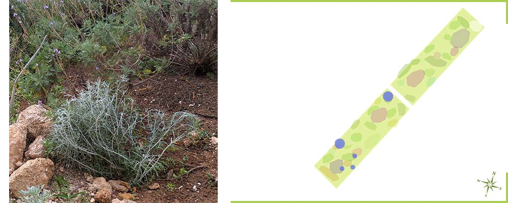
_Salado recién trasplantado, abril 2024 y noviembre 2024_

### Salado
_Schizogyne sericea_

El salado blanco, también conocido como dama en algunas islas es un endemismo macaronésico presente en el Archipiélago Canario y en las islas Salvajes, al norte de Canarias. En El Hierro la única voz que se usa es _irama_, que ha dado nombre incluso a una zona de la costa del Sur de la isla, cercana a La Restinga, en plural, Iramas. El nombre le viene, evidentemente, de la abundancia de estas plantas en el lugar.

Crece en la zona litoral de las islas, sobre sustratos de rocas, laderas y enclaves arenosos, donde la influencia de la maresía generalmente está presente. También es habitual encontrar el salado blanco colonizando los caminos y bordes de carreteras, así como aquellos terrenos alterados por la acción humana. Su área de distribución abarca desde las zonas costeras o litorales hasta altitudes de más de 400 metros. Se ha utilizado en la medicina popular canaria para el tratamiento de algunas dolencias.
Estos ejemplares se han recolectado recién nacidos en la zona costera del Valle de Güímar. Se ha adaptado muy bien, y aparte de sus pequeñas flores amarillas sus hojas tienen un color verde pálido que da una buena nota de contraste.

_Schizogyne_ procede del griego _schizein_, "partir o separar" y _gyne_, "hembra", refiriéndose al estigma partido de las flores. De la misma raíz viene la palabra “esquizofrenia” (esquizo: dividir, fren:mente). _Sericea_ procede del latín sericum, "seda", por su textura sedosa al tacto.

***

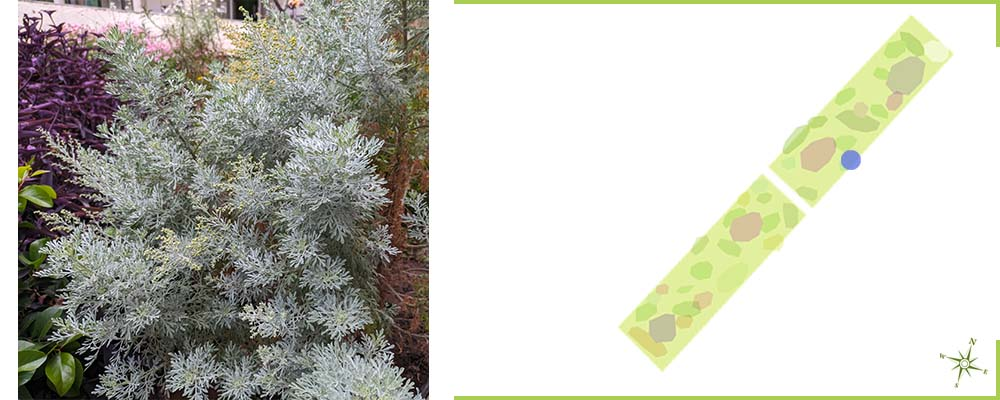

### Incienso
_Artemisia Thuscula_

Un ejemplar de esta especie apareció espontáneamente. Ha florecido varias veces de modo que quizá tenga descendencia.

Su hábitat es el tabaibal-cardonal, bosque termófilo, lavas históricas y recientes. Forma parte de los matorrales del piso basal. Con mucha frecuencia se le puede observar recolonizando bancales de cultivos abandonados, zonas roturadas y antropizadas donde puede formar amplios inciensales.

Tiene unas hojas de color blanquecino-plateado, con un olor muy fuerte y característico al rozarlas y unas inflorescencias densas y alargadas con flores muy pequeñas de color amarillo-dorado o amarillo marrón. Es una planta muy utilizada en la medicina popular y se le atribuyen numerosas propiedades medicinales.

***

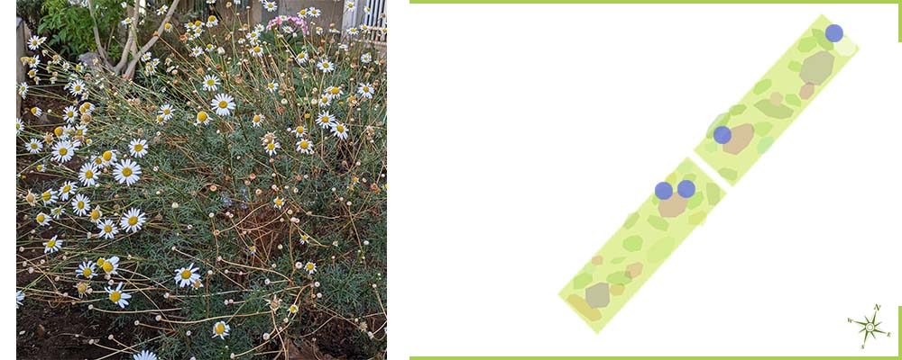

### Margarita / Magarza
_Argyranthemum frutescens_

Margarita nativa de las Islas Canarias que llegó a este jardín por sí misma, transportada por el viento o por los pájaros, y que llegó a Inglaterra, transportada por algún botánico para la colección de la reina Mary II en el [palacio de Hampton Court](https://www.hrp.org.uk/hampton-court-palace/whats-on/hampton-court-gardens/national-plant-collections/) ya en el siglo XVI, luego a Holanda, Francia etc, y desde entonces se han desarrollado (y siguen desarrollándose y patentándose) miles de cultivares con todo tipo de tamaños, colores y adaptaciones a otros climas. Su familia, las _Asteraceae_, está formada por unas 24 especies de Canarias y Madeira.

Su nombre _Argyranthemum_ procede del griego _argyros_, "plateado" y _anthemom_ "planta de flor", aludiendo a sus flores radiantes pálidas. _Frutescens_ del latín frutescere, que significa "echar o producir vástagos o renuevos" como referencia a su ramificación exuberante.

&emsp;&emsp;_Grupo de magarzas nacidas espontáneamente, marzo 2025_

***

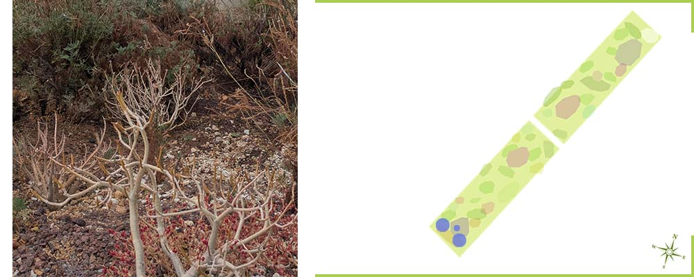

### Tabaiba dulce
_Euphorbia balsamifera_

Esta planta es de la familia de las euforbias, en Tenerife la podemos encontrar en toda la costa del sur, a veces en comunidades extensas, los tabaibales. 
Es fácil de distinguir por su forma redondeada, porte bajo, incluso se aplasta contra la tierra o la lava de los malpaíses, y color rojizo.
Se adapta muy bien a la falta de lluvia acumulando agua en sus ramas para la estación seca. En cuanto caen las primeras lluvias del invierno desarrolla rápidamente hojas, flores y frutos.

Su savia o látex no es tóxico (al contrario que la mayoría de plantas de su familia), y ha tenido diversos usos se cree que desde tiempos prehispánicos. incluso usos alimentarios, seguramente por eso se la conoce como tabaiba dulce. 

***

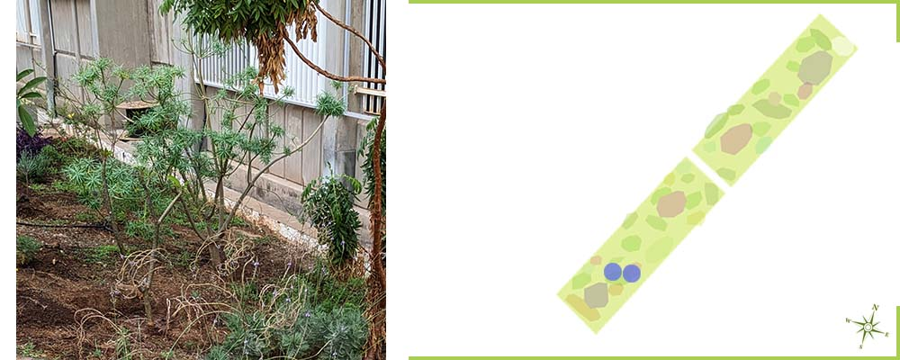

### Tabaiba amarga
_Euphorbia lamarckii_ 

Con bastantes similitudes con la tabaiba dulce, pero sus ramas son verdosas y de crecimiento vertical. En este jardín hay un ejemplar especialmente alto.
Cuidado con su látex, que es irritante para la piel y sobre todo ojos y mucosas.

Hasta hace pocos años se la llamaba _Euphorbia regis-jubae_, en honor al rey Juba de Mauritania, pero un estudio más detallado encontró algunas diferencias que hacen que la especie de Gran Canaria mantiene el nombre _regis-jubae_ y la que se encuentra en Tenerife se llame ahora _Euphorbia lamarckii_, nombre puesto en honor al naturalista francés de los siglos XVIII y XIX Jean-Baptiste Lamarck. 

***

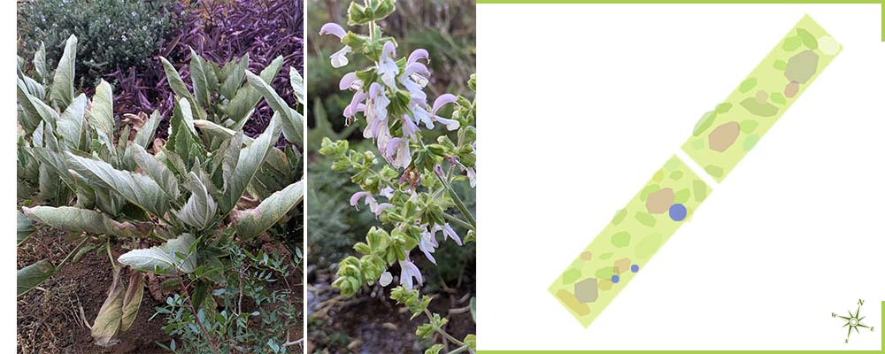
_Salvias y su floración_

### Salvia
_Salvia canariensis_

Esta salvia es una especie originaria de las Islas Canarias, presente en todas las islas aunque escasa en las orientales.
Es un arbusto perenne que puede alcanzar una altura de hasta 1-2 metros, con hojas de forma ovalada cubiertas por una fina capa de pelo. 
Tiene flores de color malva-azul intenso en racimos, follaje verde y buena resistencia a condiciones adversas. Su periodo de floración es amplio, desde finales del invierno hasta comienzos del otoño siguiente, aunque lo más común es entre los meses de febrero y agosto.
En teoría atrae a polinizadores como abejas y mariposas, aunque hasta ahora no lo he observado. 
Por todo esto, se emplea habitualmente en jardinería.

***

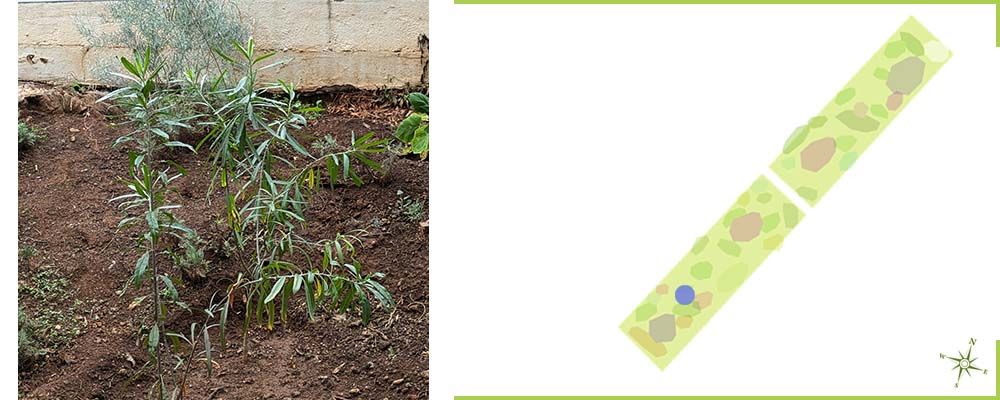
_Ejemplares de guaydil recién trasplantados, noviembre 2024_

### Guaydil
_Convolvulus floridus_

Es una  planta presente en todas las islas del archipiélago canario (aunque rara en Lanzarote y Fuerteventura). Es una endémica de carácter heliófilo y xerófilo (o sea, le gusta el sol y está adaptada a medios secos), característica de los bosques termófilos y de las zonas altas del cardonal-tabaibal. Su hábitat está entre 200 y 700 metros de altitud en riscos, laderas y barrancos. 

Tenemos dos ejemplares de guaydil, una planta nativa de Canarias, a las que les ha costado adaptarse y han crecido muy lentamente, aunque en teoría aquí tiene buenas condiciones. En unos años, si siguen progresando, serán arbustos grandes con flores blancas muy vistosas. Por su floración y su resistencia a condiciones adversas es una planta que se usa frecuentemente en jardinería pública de carreteras en Canarias.

_Convolvulus_ viene del latín _convolvere_ (enredar). _Floridus_ por su abundante y llamativa floración.
El nombre _guaydil_ se considera una palabra indígena, aunque no se ha podido precisar su significado. La especie fue descrita por Carlos Linneo el Joven (hijo de Linneo)

***

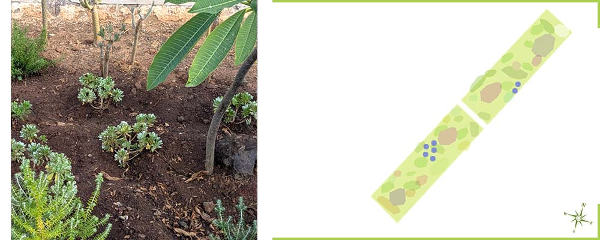

### Margarita de mar
_Pallenis maritima_

Esta es una de las primeras plantas que compré en vivero y traje al jardín, pensando que era el endemismo de Fuerteventura _jorao_ (me lo vendieron como "margarita majorera", pero nunca ha crecido más allá de unos 30 cm de alto, con lo cual ya sé que se trata de una especie muy cercana, la _Panellia maritima_, que últimamente se suele encontrar en algunos viveros. 

Es un arbusto de tamaño pequeño, hasta 30cm. de alto, de base leñosa con hojas vellosas y llamativas flores amarillas (en realidad son inflorescencias, o sea grupos de flores) semejantes a las margaritas. Florece casi todo el año, en especial desde la primavera hasta bien entrado el verano. Son sinónimos: _Asteriscus maritimus_ y _Odontospermum maritimum_. 

Soporta altos niveles de insolación, prolongadas sequías estivales y suelos salinos (halófila). Por esto es una planta ideal para xerojardinería. Es pionera en la colonización de suelos pobres, arenosos o rocosos, ayudando en la formación y estabilización de dunas costeras y previniendo la erosión. En el medio natural se la encuentra en acantilados, arenales costeros, de 0 a 200 msnm. 

Es originaria del Mediterráneo occidental y central hasta Grecia, norte de África e islas Canarias. Se la llama también margarita de mar, asterisco marítimo, estrella de mar, Mediterranean Beach Daisy o Gold Coin. En inglés se la nombra también como _Canary Island daisy_, lo que quizá explique que a veces en viveros se la llame _margarita majorera_, causando confusión con el _jorao_.

_Pálea_ (del Latín paja), es un término empleado por Carlos Linneo para las escamitas que existen en el receptáculo de numerosos miembros de la familia Asteraceae en la base de las flores, y se llama «receptáculo paleáceo» al que las tiene. _Maritima_, del mar.

***

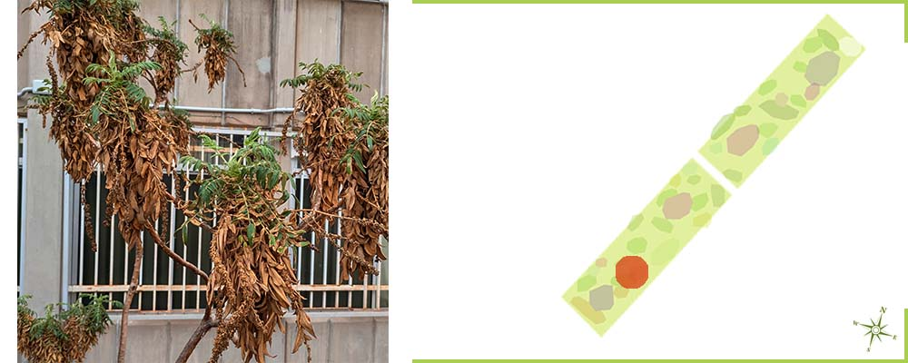 

### Bencomia
💀 _Bencomia caudata_

Esta planta ya estaba en el jardín, plantada por varias profesoras que tuvieron una iniciativa de introducir flora canaria, vía el vivero del Cabildo. La bencomia prosperó y alcanzó 3-4 metros de altura. 

En verano de 2025, tras una floración, ha ido en retroceso hasta secarse por completo. 

_Bencomia_ es un género de plantas perteneciente a la familia de las rosáceas.
La bencomia de monte (_Bencomia caudata_) es un endemismo macaronésico presente en Madeira y en Canarias (Tenerife, La Palma y Gran Canaria). Es un arbusto o arbolito de 2 a 4 metros de altura, con una copa amplia y llamativa de color verde oscuro que contrasta con el color marrón o pardo de la corteza.
En Canarias existen 4 especies de Bencomia, tres ellas endémicas del archipiélago (_Bencomia brachystachya_, _Bencomia extipulata_ y _Bencomia sphaerocarpa_), y _Bencomia caudata_, endémica de la Macaronesia.
_Bencomia caudata_ fue descrita por Aiton, Webb et Berth y publicado en [Histoire Naturelle des Îles Canaries](https://bibdigital.rjb.csic.es/idurl/1/9789) en 1846.

_Bencomia_: género dedicado a Bencomo, uno de los menceyes guanches de Tenerife en la época de la Conquista de las islas. _caudata_ del latín cauda, que significa cola, por la apariencia de sus inflorescencias colgantes. Se recoge también el nombre popular zumaquero.

**Otras bencomias: La Bencomia exstipulata**
Esta especie de Bencomia es una de las plantas endémicas en peligro de extinción que se está recuperando en el Jardín Botánico del Parque Nacional del Teide, ubicado en El Portillo. Allí se han reproducido ejemplares que en principio garantizan que no desaparezca. Si vamos al P.N. del Teide, es muy recomendable parar un rato en El Portillo y visitar este jardín botánico, especialmente a partir de marzo, cuando las plantas empiezan a despertar del invierno.

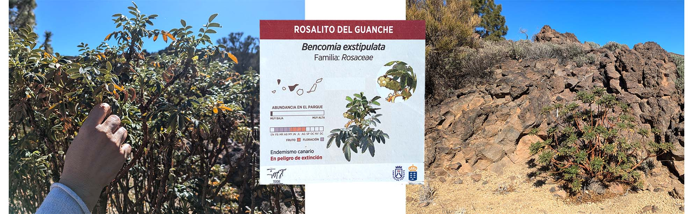

***

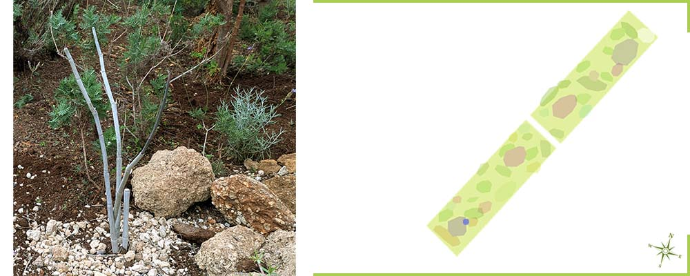

### Cardoncillo
_Ceropegia fusca_

Aunque se llame cardoncillo es una especie totalmente diferente al cardón.
En los jardines del patio he introducido en marzo 2025 la especie de las zonas más áridas (_Ceropegia fusca_). Suele encontrarse en la misma zona que las tabaibas o el cardón, en comunidades de tabaibal-cardonal, aunque mucho más escasa que estos.

***

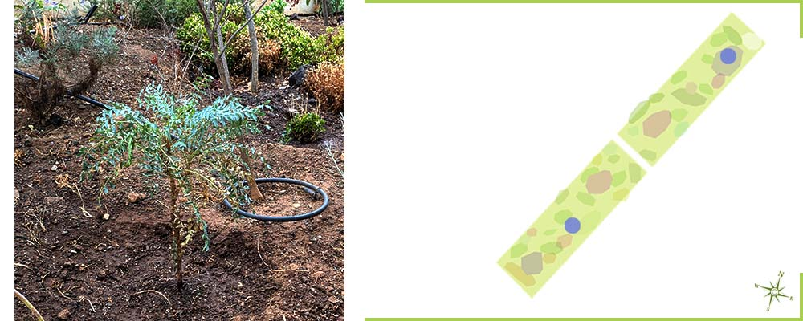

### Palo sangre
_Marcetella moquiniana_

Es un árbol o arbusto que puede llegar a tener 4 m de altura,
En las ramas superiores tienen unos pelos rojos glandulares, que dan a los tallos un color rojo-sangre característico, al que alude su nombre vulgar: palo de sangre. este color rojizo y sus delicadas ramas le dan un alto valor ornamental, así que esperemos que los dos ejemplares que ha cedido el Vivero de El Cabildo se adapten bien.

_Marcetella_ es un género exclusivo de la Macaronesia: _Marcetella moquiniana_ se encuentra en el archipiélago canario, mientras que _Marcetella maderensis_ se encuentra en Madeira, tratándose de un claro ejemplo de especiación por separación geográfica. En Canarias es endémica de las isla de Tenerife, La Gomera y Gran Canaria. En Tenerife habita en  paredes rocosas de los barrancos profundos del sur y del oeste desde Güímar hasta Teno, destaca su presencia en Arona, barranco del Infierno, Masca, Los Silos (barranco Cuevas Negras) etc. También en la vertiente norte presenta algunas poblaciones, aunque es más escasa (Ladera de Tigaiga). Asimismo, se encuentra en el macizo de Anaga siendo muy abundante en el barranco del Tomadero tanto en las laderas como en el fondo del barranco. Generalmente se sitúa en la franja entre los 200 y 1000 metros de altitud. En Gran Canaria se encuentra en los riscos de Guayadeque a 1000 metros de altitud con pocos ejemplares. En La Gomera hay varias poblaciones en la zona del barranco de Santiago caserío de Imada y Risco de Santiago

_Marcetella_: género dedicado a Adeodato F.Marcet (1875-1964), monje del Monasterio de Monserrat, amigo del botánico sueco Sventenius, autor que describió este género.
_moquiniana_: especie dedicada a Moquin-Tandon (1804-1863), botánico francés.

***

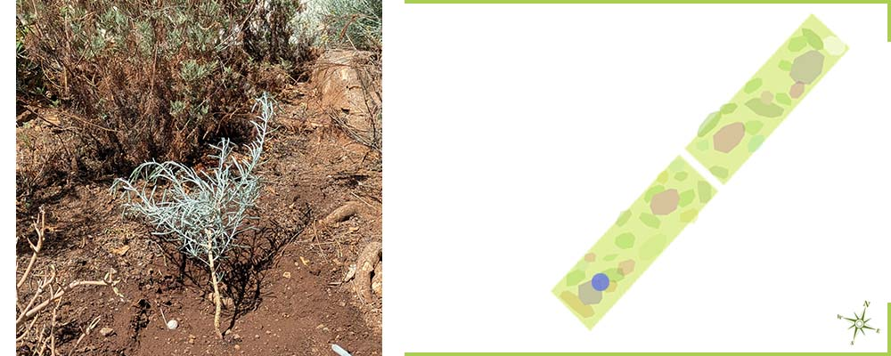

### Orijama
_Cneorum pulverulentum_

Arbusto bastante común en las comunidades de Euphorbia, leñoso y ramificado, que puede llegar a medir más de un metro de altura, de hojas lanceoladas, duras y  cubiertas de pelos cortos y grisáceos, como en las ramas jóvenes, lo que le da a la planta un aspecto ceniciento. Flores amarillas muy vistosas y frutos casi esféricos y poco carnosos. Es endémica de las Islas de Tenerife, Gran Canaria, La Gomera y El Hierro.

Nombres comunes: leña buena, leña blanca, leña santa u orijama. Orijama u orihama proviene del vocablo aborigen _Ori-ahoram_ que significa leña buena o leña santa. Según Berthelot.

Hay una interrelación entre la leña buena y los reptiles del género _Gallotia_, o sea los lagartos canarios, desde los tizones hasta los lagartos gigantes: la planta es básica en la alimentación de los lagartos, que a su vez dispersan sus semillas. Se cree que la disminución de las poblaciones de lagartos es uno de los factores que afecta a las poblaciones de la planta. Otro factor en su contra fue su uso como leña: en el matorral costero era el mejor combustible. Ha terminado por ser una planta escasa.

Tiene propiedades antibacterianas y analgésicas, con un uso medicinal tradicional importante. También tuvo usos en la fabricación de agujas, lanzaderas para telares y utensilios de pequeño tamaño, al ser su madera dura y perdurable.

# 3. Jardín del Patio central - sombra

Continuando los parterres del Patio central, entre el Pabellón 1 y el Aula ATECA hay unos parterres alargados con unas condiciones de semisombra y humedad que crean un ambiente diferente.

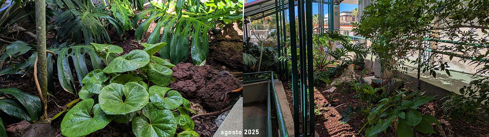

Busco una combinación de plantas interesantes que vivan bien en esas condiciones y que ofrezcan una variante respecto a los otros jardines, creando un pequeño espacio un poco selvático y refrescante. 

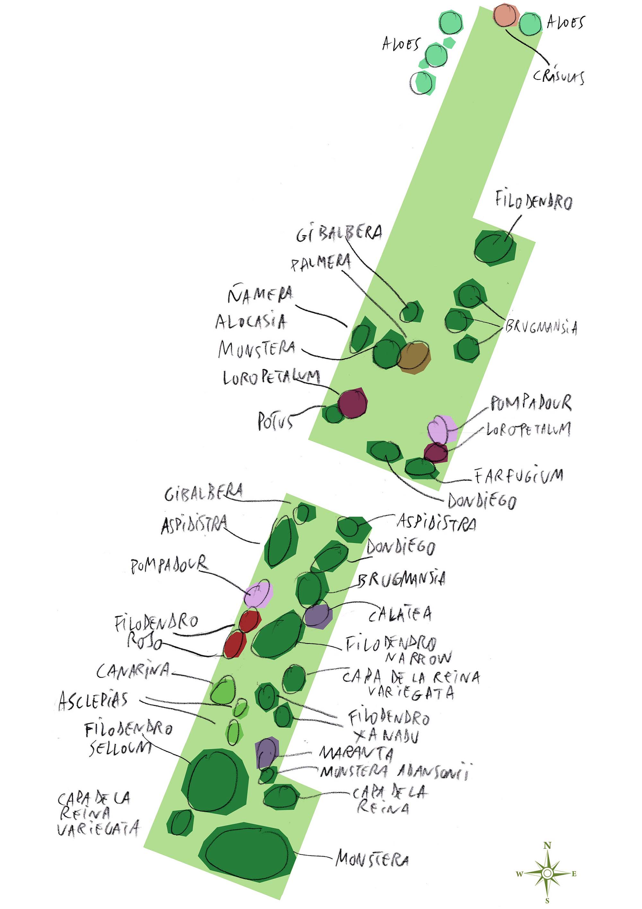

## ESPECIES NO NATIVAS

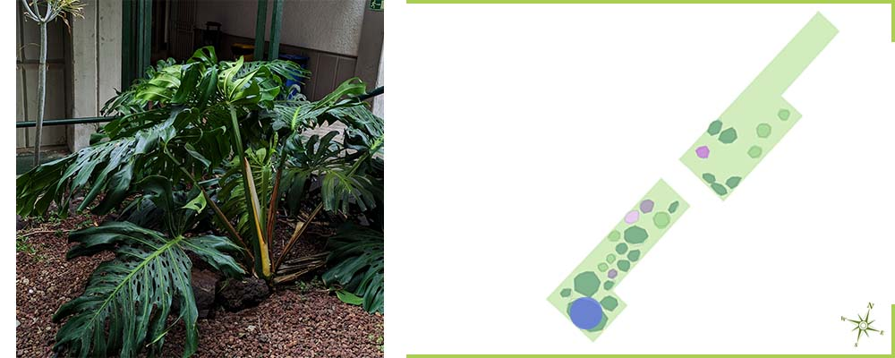

### Costilla de Adán (esqueleto, o en Sudamérica _cerimán_)
_Monstera deliciosa_

Este ejemplar lo trasladó el personal de limpieza (desde aquí, gracias por su ánimo constante en el trabajo en estos jardines) desde otra ubicación menos favorable. y aquí, se ha ido dividiendo por esquejes. 

La _Monstera deliciosa_ es nativa de las selvas tropicales de América Central, desde el sur de México hasta Panamá. En su entorno natural, crece en suelos húmedos y en la sombra de árboles altos, trepando por sus troncos gracias a sus raíces aéreas. Este ambiente selvático proporciona temperaturas cálidas, alta humedad y luz indirecta, factores esenciales para su desarrollo. Muy reconocible por sus grandes hojas agujereadas .
La _Monstera deliciosa_ ha sido introducida en muchas otras partes del mundo como planta ornamental, tanto en jardines tropicales como en interiores. Comparte hábitat con otras especies tropicales como las _Philodendron_ y las _Calathea_, que requieren condiciones similares de luz, humedad y temperatura. En este jardín la he acompañado de esas mismas especies. En algunos países con climas cálidos se ha vuelto invasora debido a su rápido crecimiento. Es una planta muy presente en la jardinería popular en Canarias

_Monstera_: viene de la palabra latina para "fuera de lo normal", ya que el género se distingue por sus hojas inusuales con agujeros naturales. _deliciosa_ "deliciosa", ya que el fruto es comestible siempre que esté bien maduro, con un sabor similar a la piña. El consumo de la fruta inmadura con las pepitas firmes, expone la garganta a concentraciones elevadas de ácido oxálico, muy irritante y hasta peligroso.

***

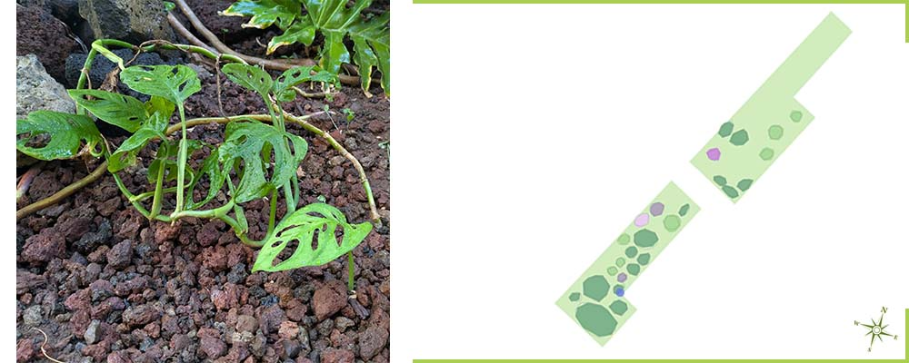

### Planta “queso suizo” 
_Monstera adansonii_

La _Monstera adansonii_ procede de las selvas de América Central e Indias Occidentales, con una característica poco habitual: sus hojas en forma de corazón están llenas de orificios. Es parecida a la Monstera deliciosa, pero en tamaño reducido.
Necesita calor, humedad y poca insolación (reproduciendo las condiciones de una selva tropical). Se cree que los agujeros son un mecanismo para permitir que pase luz y agua a las partes bajas de la planta. 

Se la ha cambiado de ubicación después de un año en que no se desarrollaba bien, y ahora, a finales de 2025, parece que ha encontrado un buen sitio.

***

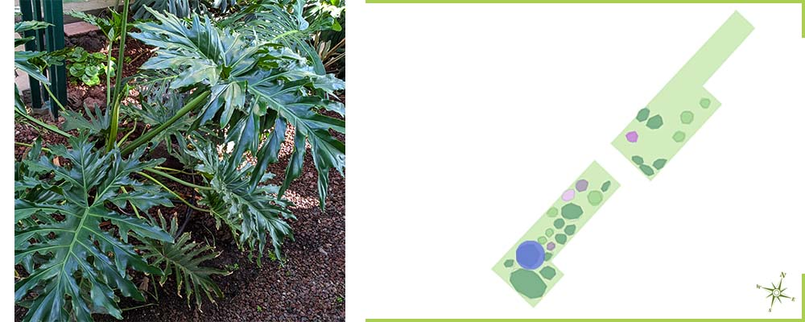

### Filodendro selloum y Filodendro xanadu
_Thaumatophyllum bipinnatifidum_ y _Thaumatophyllum xanadu_

Hoy hay aceptadas más de 600 especies de filodendros. En este jardín tenemos 4 de ellas. 
Estos populares filodendros, nativos de Brasil, Bolivia, Argentina y Paraguay se han extendido en paisajismo y jardinería en todo el mundo.  En América se le conoce como -güembé_.

Hay dos especies muy similares usadas en jardinería: el _selloum_, de mayor desarrollo, y el filodendro _xanadu_. Los _xanadu_ se han plantado en febrero 2025. Estos ejemplares fueron donaciones de una asociación cultural y un amigo.

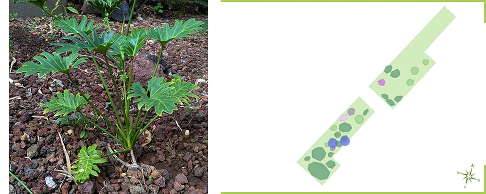
_P. xanadu_

***

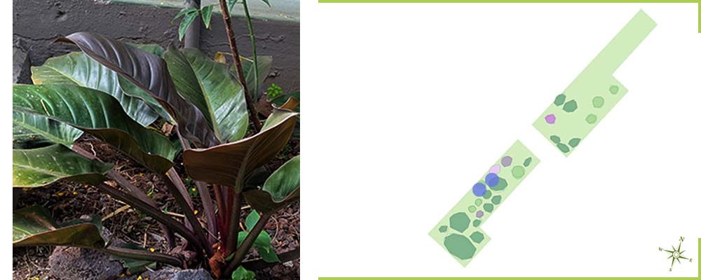

### Filodendro rojo
_Philodendron erubescens_

El filodendro _erubescens_ se caracteriza por sus grandes hojas en forma de flecha y su pecíolo de coloración rojiza, y ese es su interés en jardinería, ya que sus flores son muy discretas.

Es un filodendro trepador, originario de las selvas de Colombia. Según va creciendo su tallo se alarga creando raíces aéreas que se introducen en los distintos soportes, dando rigidez a la planta en la búsqueda continua de la luz dentro del sotobosque tropical húmedo de donde es originaria. Las nuevas hojas son de color verde brillante, pero al madurar adquieren tonalidades de verde más oscuro.

Hay más de una docena de cultivares comerciales. Los de este jardín quizá sean _Imperial red_ y no trepadores.

***

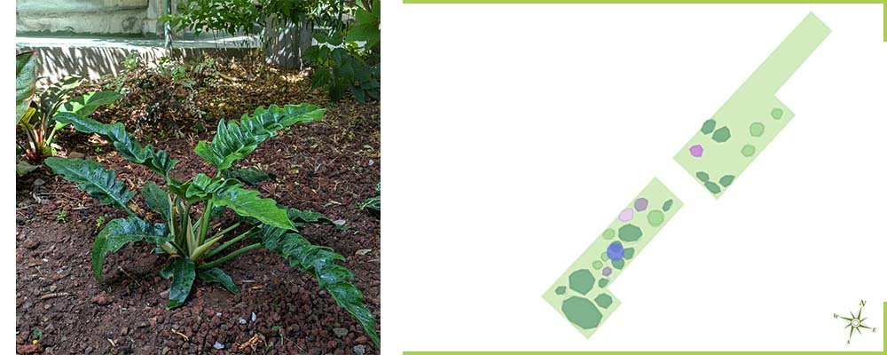

### Filodendro narrow
_Philodendron bipinnatifidum_

Filodendro "narrow" es un cultivar de la especie _bipinnatifidum_. Se caracteriza por sus hojas simples, estrechas grandes, profundamente lobuladas, generalmente colgantes y elegantes. Puede ser epífita o terrestre.
Puede cultivarse a pleno sol, y tolera y se adapta a la sombra profunda. Crece mejor en suelos ricos y con buena retención de humedad, que pueden ser ligeramente alcalinos. Sin embargo, no tolera altas concentraciones de sal. Es capaz de sostenerse a grandes alturas gracias a sus bases arbóreas. Sin embargo, exhibirá características epífitas si se le da la oportunidad de adherirse a un árbol cercano y trepar por él. El tronco de esta planta puede desarrollar numerosas raíces aéreas fuertes que no solo dan soporte a la masa vegetal, sino que también sirven para absorber agua y nutrientes del suelo. 

Su nombre local común es _güembé_ (al igual que otras especies). De la familia _Araceae_, es nativa del este de América del Sur: Brasil, Bolivia, Argentina y Paraguay y se cultiva como planta ornamental en muchos países tropicales, subtropicales y templados cálidos, incluyendo Filipinas, en toda Australia, la costa del Golfo y la costa este de Estados Unidos, incluyendo Florida y California, y en Sudáfrica y el norte de Nueva Zelanda. Se cultiva como planta de interior en regiones templadas frías. Ha recibido el Premio al Mérito en Jardinería de la Royal Horticultural Society.

**La estrategia de producir calor*
Un dato muy curioso es su polinización: es realizada por especies de escarabajos _Erioscelis_ y _Cyclocephala_, y las flores masculinas estériles producen y mantienen una temperatura constante de 34°C, pudiendo llegar a más de 40°C. Durante los dos días que toda la estructura de la flor está abierta quemando tejido graso almacenado, comparable a la producción metabólica de un gato pequeño. _P. bipinnatifidum_ metaboliza grasa, en lugar de carbohidratos, para impulsar este proceso. Esta característica indica una posible convergencia evolutiva donde esta especie vegetal y la especie animal derivaron mecanismos similares para utilizar las reservas de grasa para el consumo de energía. La razón principal para elevar y mantener la temperatura de la flor es para volatilizar y dispersar olores que atraen a los insectos. La producción constante de calor aumenta la distancia a la que el escarabajo puede percibir el aroma y aumenta la probabilidad de polinización. Además, el calor crea un clima acogedor que estimula la actividad del escarabajo una vez dentro de la flor y lo induce a aparearse. Esto también aumenta la probabilidad de polinización al permanecer en ella.

***

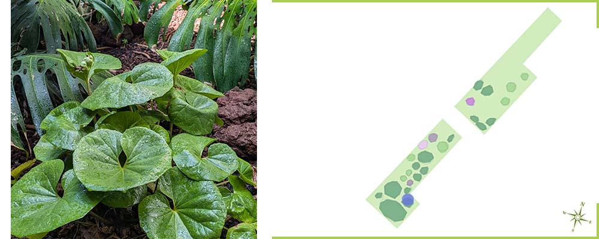
_Capa de la reina en febrero 2025_

### Capa de la reina
_Farfugium japonicum_

Es una planta perenne rizomatosa que crece en matas sueltas de unos 60 cm de alto y ancho, con hojas grandes, redondas o arriñonadas, de textura ligeramente carnosa. Muy presente en jardinería popular en Canarias, en Santa Cruz de Tenerife se la encuentra en jardines públicos como el Parque García Sanabria, Plaza Weyler, etc. Es una planta nativa de acantilados rocosos costeros de Japón, Corea y Taiwán (de ahí su nombre científico).
_Farfugium japonicum_ (sinónimo _Ligularia tussilaginea_) se conoce como _capa de la reina_ o en inglés _leopard plant_, _green leopard plant_ or _tractor seat plant_ . En Japón, se le llama tsuwabuki.

_El espectáculo diario de las capas de la reina en la Plaza Weyler_

Además de sus espectaculares hojas de forma redondeada tiene una floración interesante, con tallos largos y flores de amarillo intenso semejantes a las margaritas. Se han introducido también dos ejemplares de un cultivar de capa de la reina variegada.

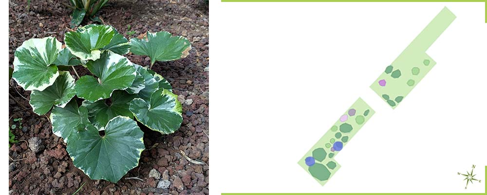
_Capa de la reina variegada_

***

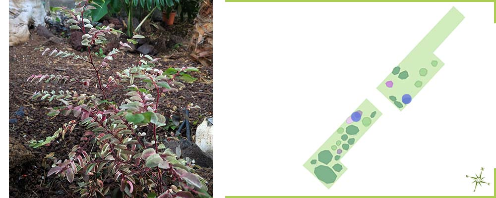

### Pompadour
_Breynia dischita_

_Breynia_ es un género de plantas con flores perteneciente a la familia _Phyllanthaceae_. Tiene 35 especies de arbustos originarios del sudeste asiático y Australia. 
Es conocida por los nombres vulgares de Árbol de nieve, breina, breinia o en inglés _snowbush_. En Canarias se usa en jardinería tradicional, con el nombre popular de Pompadour, desconozco el motivo, ya que _pompadour_ también se encuentra como nombre vulgar de los cóleos (_Coleus_, planta ornamental muy utilizada, casi 300 especies) o de la planta africana _Flueggea virosa_.

Es un arbusto de finos tallos rojos que puede alcanzar los 2 metros de altura. Hojas de forma oval rosadas cuando la planta es joven y color crema o verde claro en los ejemplares adultos. Las flores no son interesantes ornamentalmente al ser muy pequeñas y sin pétalos, pero el arbusto en sí es una explosión espectacular de hojas rosa, rosa pálidos, rojos. Una planta muy interesante porque aporta un color distinto y un toque de luz entre plantas de hoja ancha y un ambiente más sombrío. 

***

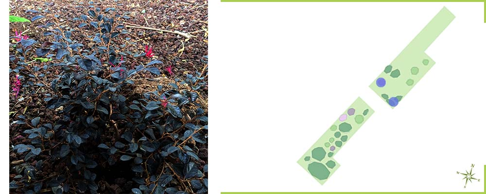

### Loropetalum
_Loropetalum chinense_

_Loropetalum_ es un género de arbustos nativo de Japón y sudeste de Asia. También se le conoce como como flor de fleco china, flor de correa, chinese fringe flower, strap flower, jìmù, afajimu, zhimu, o zhimofa. El nombre _Loropetalum deriva del griego_ y se refiere a sus flores con forma de cinta o correa: _loron_ significa "correa" y _petalon_  "pétalo". 

Además de su color rojizo, que aporta contraste con el resto de plantas verdes, destaca por su resistencia, su escaso mantenimiento y su espectacular efecto ornamental durante todo el año.

Las hojas, flores y raíces de _L. chinense_ se utilizan en la medicina tradicional china.

***

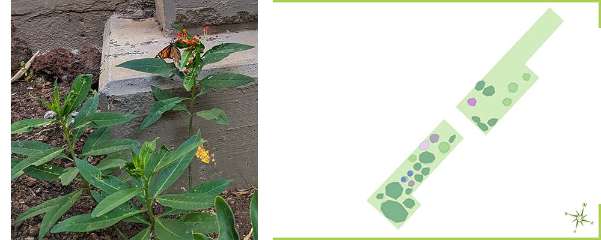
_Asclepias asediadas por las mariposas monarca, verano 2025_

### Asclepias
_Asclepias curassavica_
En este parterre estoy intentando aclimatarlas también para atraer a las mariposas. Las condiciones de luz y humedad parecen serle más favorables.

***

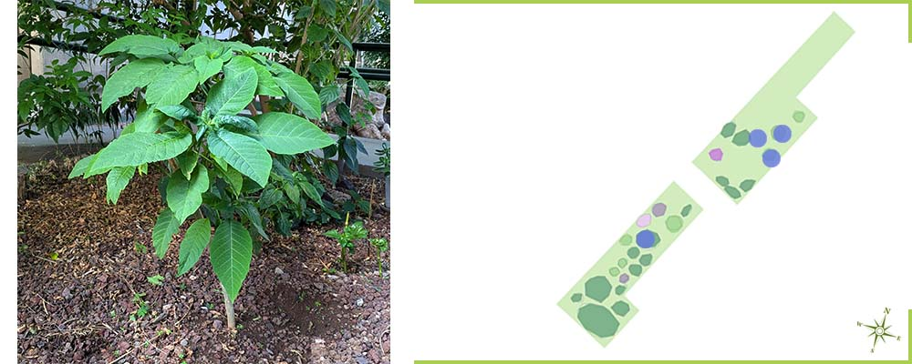

### Santas noches
_Brugmansia suaveolens_

Una planta de uso en la jardinería popular y tradicional de Canarias. Nativa de Perú, es cultivada en todo el mundo por sus espectaculares flores en forma de trompeta, blancas o rosáceas. 

Estos esquejes vienen de la zona de los volcanes de San Antonio, en la zona alta de La Matanza. Tiene numerosos nombres populares, entre ellos: trompetero, floripondio, etc. o en Canarias santas noches.

***

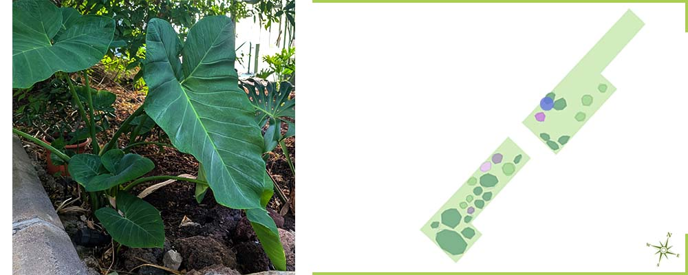

### Ñamera
_Colocasia esculenta_

Planta de la familia de las _aráceas_ cuya raíz es el _ñame_. Las ñameras necesitan terrenos muy húmedos. En algunas zonas de Canarias se conoce también con el nombre de ñamero. Tiene muchos nombres, como quiscamote, taro, uncucha, pituca, papa china, malanga, ñampí, yautía coco, y gabi en el español filipino. En Canarias se llama ñamera a la _Colocasia esculenta_, que es conocida en el mundo como _taro_; mientras que por ñame en el resto del mundo se conoce otra planta de la familia de las Dioscoreáceas, que aún teniendo hojas acorazonadas es muy distinta del ñame canario.

Parece ser originaria de una amplia zona desde el nordeste de la India al Sureste de Asia, según otros autores se extiende también hasta Australia, Nueva Guinea, Islas Marshall. Se cultiva desde hace miles de años en las montañas de Papúa Nueva Guinea, doinde se la conoce como _taro_. Puede vegetar en arrozales o en tierras altas donde el agua es suministrada constantemente por lluvia o irrigación. Algunas variedades crecen también fuera de los trópicos, en lugares como Galicia, Corea y Japón.

Es un alimento tradicional en muchas áreas tropicales del mundo y la base para hacer el _poi_ en Hawái. La planta es indigerible si se come cruda (cruda es, de hecho, tóxica). Cocinada es rica en vitaminas y minerales y fuente de fibra. Se consume como acompañamiento de platos de carne, pollo o pescado o bien formando parte del popular sancocho (principalmente en Venezuela, Colombia, República Dominicana y Panamá). En Canarias se suele usar como parte de la cocina tradicional (el ñame cocido es una comida asociada a las celebraciones navideñas), siendo uno de tantos vínculos canarios con Cuba y el Caribe también. 
Aún hay algunos cultivos en los barrancos de Anaga y sobre todo en La Palma y La Gomera, aunque se considera un cultivo en vías de extinción.

&emsp;&emsp;_Cultivos de Ñamera en el Macizo de Anaga, Tenerife. Típica plaza en Canarias con ñameras en una fuente_

***

### Hoja de salón / Aspidistra
_Aspidistra elatior_

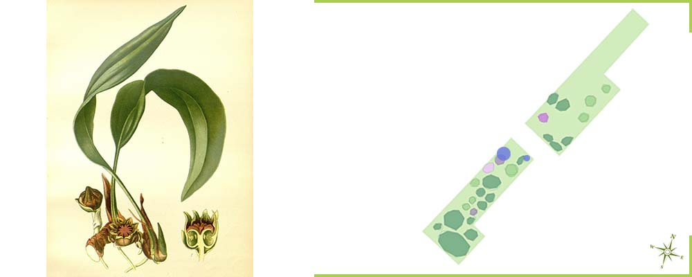
_Aspidistra en [Favourite flowers of garden and greenhouse 1897. Edward Step](https://archive.org/details/mobot31753000580800)_

La _Aspidistra_ tiene como nombres comunes pilistra, orejas de burro o en Canarias a veces hoja de salón. En inglés _cast-iron-plant_ o _bar-room plant_, planta de hierro (por su gran resistencia a todo tipo de condiciones adversas) o planta de los bares (por usarse en el siglo XIX para interiores de bares en Inglaterra porque resistía el humo de los fumadores).

Plantas perennes y muy longeva (hasta más de 100 años) de raíces rizomatosas con tallos subterráneos  de los que brotan hojas grandes en forma de lanza de color verde oscuro. Las hojas pueden estar veteadas en blanco en las especies variegadas, otras moteadas, etc. Es originaria de China, Himalaya, Vietnam y Japón, donde brota silvestre en zonas más umbrías. El género tiene alrededor de 100 especies, casi todas descibertas recientemente. En la década de 1970 se describían entre 8 a 10 especies, pero hacia 1980 se describieron 30 nuevas especies en China, sobre todo en la provincia de Guangxi. Aún se están encontrado nuevas y el foco de diversidad se ha trasladado a Vietnam donde se han descrito 28 y se sabe que existen muchas más. 

Muy del gusto de la era victoriana, causó sensación en el Reino Unido durante el siglo XIX como planta de interior de las casas acomodadas. 

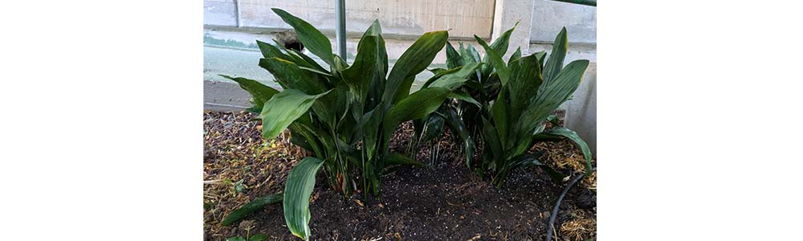

En este jardín de sombra he plantado dos grupos, la variedad tradicional y otra variegada de hoja más pequeña y color más claro.

***

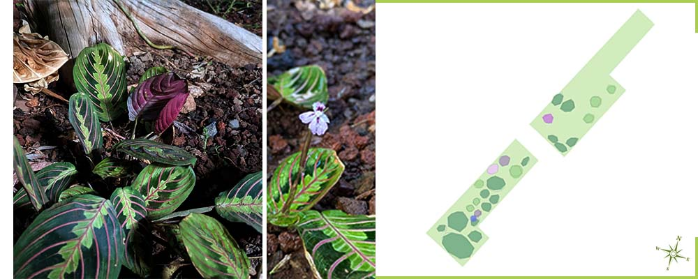
_Maranta al anochecer, elevando sus hojas. Diminuta flor de la maranta_

### Maranta
_Maranta leuconeura_ - tricolor

La _Maranta_, originaria de las selvas tropicales de América Central y del Sur, es una planta exótica conocida por sus llamativas hojas decoradas con patrones únicos.
El nombre específico _leuconeura_ significa "de nervaduras blancas", en referencia a las hojas. Estas hojas permanecen extendidas durante el día y se pliegan hacia arriba por la noche, como si rezaran, de ahí su nombre común de "planta de la oración". Este comportamiento es un ejemplo de ritmo circadiano. Sus flores son pequeñas, de color blanco a púrpura, no tan llamativas como el follaje. Los dibujos de sus hojas son el motivo de su uso en jardinería.

Linneo la nombró en homenaje al botánico italiano Bartolomeo Maranta (ca. 1500 - 1571) fue un médico, botánico, y teórico literario italiano. De 1554 a 1556, trabajó en el Jardín Botánico de Nápoles, que Gian Vincenzo Pinelli había fundado, y hacia 1568 había ayudado a desarrollar un incipiente jardín botánico en Roma.

&emsp;&emsp;_Cultivares de maranta_

***

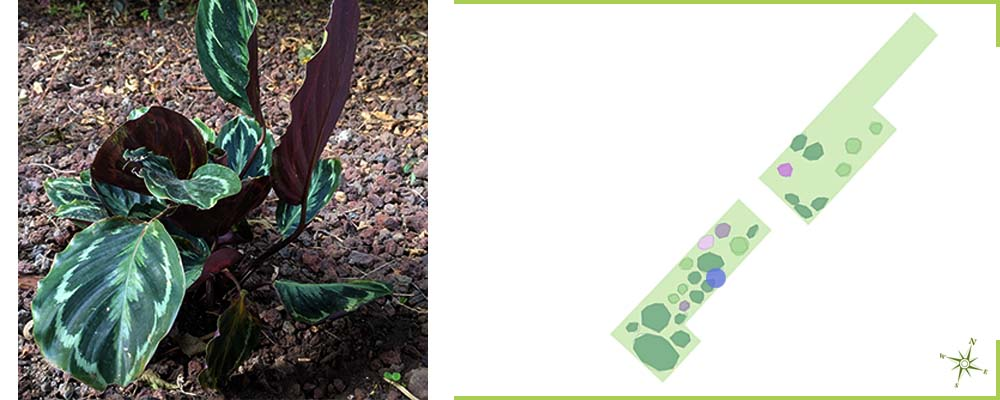

### Calatea Medallion
_Goeppertia veitchiana_

_Calathea_ es un género de plantas con flores perteneciente a la familia _Marantaceae_, con alrededor de 60 especies. Originarias de las Américas tropicales, muchas de estas especies son populares como plantas de maceta. Las hojas de _Calathea_ suelen ser grandes y con patrones coloridos con colores como rosa, naranja, rojo y blanco, y envés suele ser morado.

Este género prefiere luz baja o media, y necesitan una humedad alta para imitar su hábitat natural. La especie se introdujo por primera vez como planta de interior en las décadas de 1970 y 1980. Con el paso de los años, las calateas se han convertido en una planta de interior popular gracias a sus atractivas hojas. Debido a la destrucción del hábitat, varias especies están en peligro de extinción.

_Goeppertia veitchiana_ es endémica de Ecuador, recogida por el recolector de plantas Richard Pearce en 1862.

***

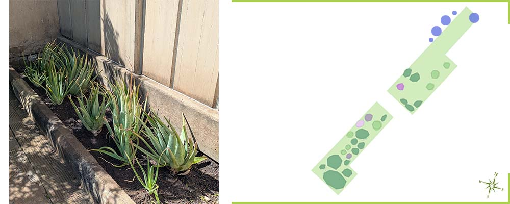

### Aloe
_Aloe vera_

Hasta el siglo XIX, su nombre más popular era _acíbar_, también se le conoce como aloe, aloe vera, zábila, penca zábila o aloe de Barbados, entre otros, es una especie suculenta de la familia _Asphodelaceae_. Con unas quinientas especies, el aloe está muy distribuido y se considera una especie invasora en muchas regiones del mundo. 
Es una planta de hoja perenne, probablemente se originó en la Península Arábica, pero crece de forma silvestre en climas tropicales, subtropicales y áridos de todo el mundo. El aloe vera ha sido ampliamente cultivado como planta ornamental por sus llamativas flores amarillas y por su forma. Los pájaros silvestres beben el néctar de sus flores, los puedes ver por las tardes en este mismo jardín. Acumula agua en sus hojas, lo que le permite sobrevivir en áreas de poca lluvia, lo que la hace ideal para rocallas y jardines de bajo consumo de agua.

Se usa como planta medicinal para la piel, en muchos productos: lociones para la piel, cosméticos, pomadas o gel para quemaduras menores y quemaduras solares, incluso en bebidas, aunque hay evidencias contradictorias sobre si el _Aloe vera_ es tan efectivo.

El nombre botánico deriva del latín, _aloe_, del griego sal que designaba tanto a la planta como a su jugo, debido a su sabor, que recuerda al agua del mar. _Vera_ por verdadero en latín.

***

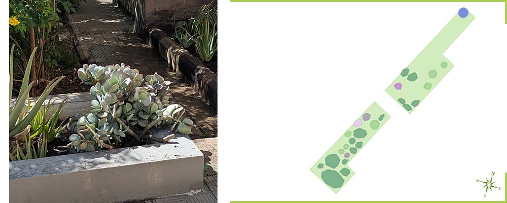

### Suculenta
_Crassula arborescens_

El género _Crassula pertenece_ a la familia de las _Crassulaceas_ y engloba unas 200 especies.
Las variedades más cultivadas y apreciadas por los amantes de las suculentas, provienen todas ellas de la Provincia Cabo Oriental en Sudáfrica. Además de las variedades naturales, existen numerosos híbridos.

Su nombre _Crassula_ proviene de la palabra latina _crassus_ que significa gruesa en referencia en abultadas hojas llenas de agua.

La Crassula arborescens es una de las más grandes del género, con una altura que va desde los 60 centímetros hasta el metro y medio. Es endémica de El Cabo, en Sudáfrica, y presenta hojas blanquecinas con el margen rojo.

***
***

## PLANTAS NATIVAS DE CANARIAS

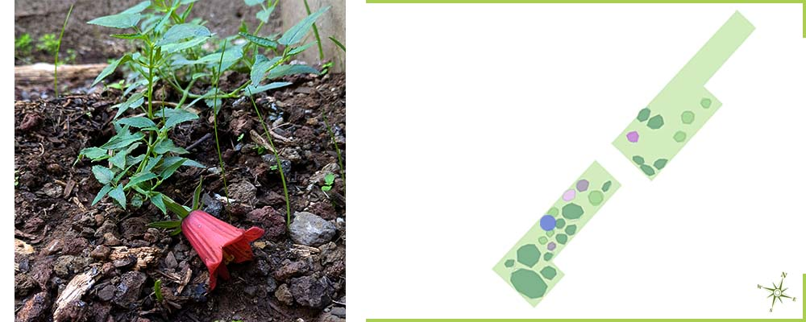
_Canarinas en su primera floración, en 2025_

### Bicácaro
_ Canarina canariensis_

El vivero del Cabildo cedió tres ejemplares de canarina, trasplantadas en noviembre.
Su hábitat principal son los bosques de laurisilva del archipiélago. Es una de las especies vegetales más emblemáticas de Canarias, considerada por algunos autores como la _flor nacional_ de las Islas. Tiene largos tallos trepadores, colgantes, o rastreros de hasta tres metros de longitud, y unas características flores, pedunculadas, de color anaranjado a rojo, en forma de campanilla, de  entre 3 y 6 cm. Su floración tiene lugar entre los meses de noviembre y mayo. Puede darse entre los 300 y los 1000 metros de altitud, en lugares sombríos y húmedos, en las islas de Tenerife, Gran Canaria, La Gomera, La Palma y El Hierro.

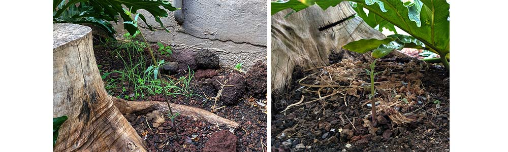

Tras florecer, las tres plantas desaparecieron en verano de 2025, siguiendo su ciclo natural y empiezan a rebrotar de sus rizomas en otoño.

La _Canarina_ fue uno de los primeros endemismos canarios reconocido como tal por Linneo, descrito en su obra [Hortus Cliffortianus](https://bibdigital.rjb.csic.es/idurl/1/11198) en 1738.

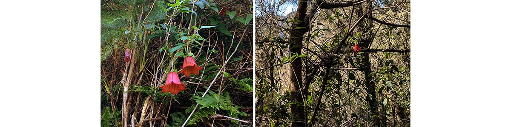
&emsp;&emsp;_Canarinas silvestres en el Monte del Agua. Los Silos, Tenerife._

***

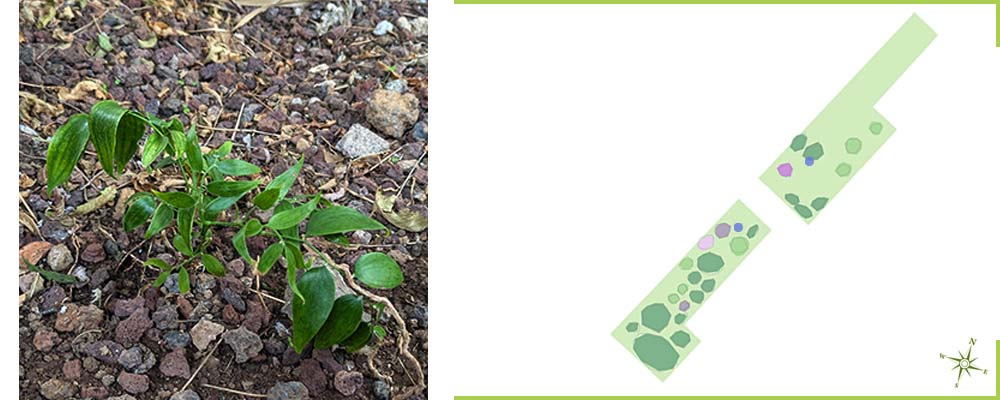
_Gibalberas cedidas por el Vivero la Tahonilla, recién plantadas en octubre 2025_

### Gibalbera
_Semele androgina_

La gibalbera es un endemismo macaronésico presente en Madeira y en las islas centrales y occidentales de Canarias.

Es una especie trepadora que puede llegar a alcanzar los 8 metros de largo. Con sus tallos largos, delgados, flexibles y nudosos se abraza a los troncos y ramas de los árboles más altos para llegar a sus copas y captar mejor los rayos solares. La gibalbera o alicacán es una de las especies trepadoras presentes en Canarias. Es frecuente formando parte del sotobosque de la laurisilva en las islas centrales y occidentales de nuestro archipiélago. En Gran Canaria hay otra especie de gibalbera (_Semele gayae_) endémica de esta isla. Una de las curiosidades de la gibalbera es que lo que generalmente vemos como hojas son en realidad tallos transformados que reciben el nombre de cladodios laminares, que hacen el papel de una hoja verdadera con función clorofílica. Los frutos son bayas globulares muy llamativas al madurar pues se vuelven de un rojo intenso.

Su nombre genérico deriva de la mitología griega, de Semele hija de Cadmo, fundador de Tebas y madre de Bacchus. El epíteto procede de _andros_ que significa masculino y _gyne_ que significa femenino, por las flores hermafroditas de la planta.

La gibalbera era empleada tradicionalmente en las fiestas de muchos pueblos, tanto para adornar las entradas a las plazas y los balcones de las viviendas como las carrozas en las populares romerías, este uso se debe a que la gibalbera conservaba durante mucho tiempo las falsas hojas y los tallos con una coloración verde, como si estuviera recién cogida. 

&emsp;&emsp;_Gibalberas en los bosques del Macizo de Anaga. | Decoración tradicional con gibalberas en la Ermita de El Socorro, Güímar, en 2007 con motivo de la Bajada anual de la Virgen_

***

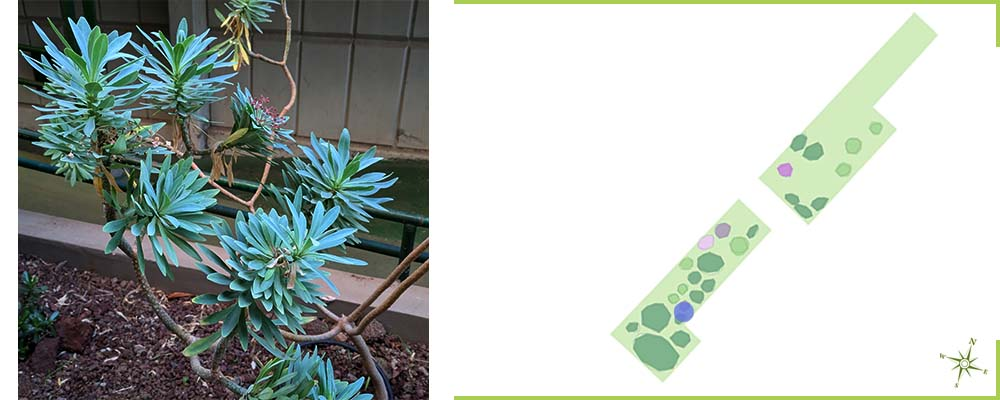

### Tabaiba majorera
_Euphorbia atropurpurea_

A pesar de su nombre vulgar, tabaiba majorera, nada tiene que ver con la isla de Fuerteventura. Es endémica de la isla de Tenerife. Se desarrolla entre los 300 a 1100 msnm en el sur y oeste de la isla, desde el valle de Güímar hasta el macizo de Teno, creciendo en barrancos y laderas. Sus flores son llamativas inflorescencias de color rojo-púrpura. En este jardín tiene un crecimiento muy lento.
Al igual que otras especies del género _Euphorbia_, toda la planta posee un látex de color blanco, pegajoso y detóxico.

Ocasionalmente se hibrida con _Euphorbia lamarckii_, dando lugar a un híbrido denominado _Euphorbia x navae_, y con _Euphorbia aphylla_, generando el híbrido llamado _Euphorbia x petterssonii_. También se ha citado su hibridación con _Euphorbia bourgeana_ en la Ladera de Güímar.
Este caso es un buen ejemplo de por qué en jardinería con plantas nativas es recomendable usar especies que estén dentro de su área de distribución natural, dado el peligro de contaminación genética que supone el ponerlas en contacto con poblaciones de otras especies de su mismo género. Por ejemplo, ¿qué pasaría si usaras tajinaste rojo, especie de Tenerife, especialmente Las Cañadas del Teide y La Palma (_Echium Wildpretii_) en jardines en la zona del campus de Tafira, en Gran Canaria? ¿Afectaría a las poblaciones endémicas de tajinaste blanco (_Echium decaisnei_). De hecho, ya se considera una especie traslocada a la isla de Gran Canaria, escapada de su uso en jardinería, lo que quizá no haya sucedido aún es esa contaminación genética.

# 4. Jardines de Secretaría

En 2025 se empezaron a reacondicionar dos parterres junto al edificio de Secretaría. 

## Parterre corto
En el parterre corto había una serie de plantas dispares en malas condiciones: platanillo, strelitzia y tradescantia, con requisitos de agua muy diferentes, etc.
Este parterre debe tener una vegetación más bien baja, para no tapar la perspectiva del patio, con plantas separadas del borde, por la circulación de la gente, y alguna aromática que en caso de roce emita bien olor.

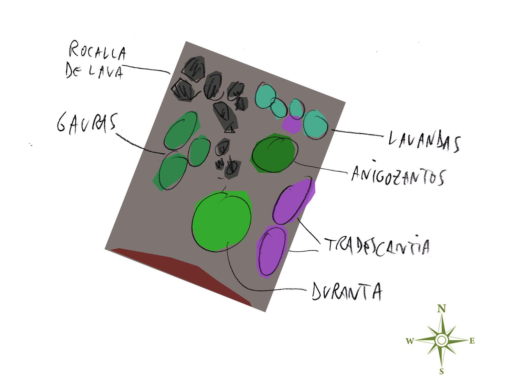

Se han trasladado las plantas en mal estado (casi todas) a otros parterres más adecuados a sus necesidades y se han unido los grupos de Tradescantia. 

Se han plantado pocas especies, (4) en gama de violetas y lilas principalmente (colores asociados a la imagen de marca del CIFP), relativamente resistentes a la sequía y la insolación. También se ha organizado una rocalla de piedra volcánica, a juego con el _mulch_ de picón rojizo que se ha mantenido.
Una _Duranta_, de flores violeta, que se ha de mantener en un tamaño mediano mediante podas. En pocas semanas ha crecido con energía.
Un grupo  de _Gauras_ de color fucsia intenso, que  deberían formar un grupo más o menos compacto de tallos medianos muy móviles, con floración prolongada.
Un grupo pequeño de _Anigozanthos_ de color rojizo-rosáceo que se están adaptando muy mal.
Un grupo de _Lavandula_ de dos variedades de diferente altura junto a la esquina más transitada.

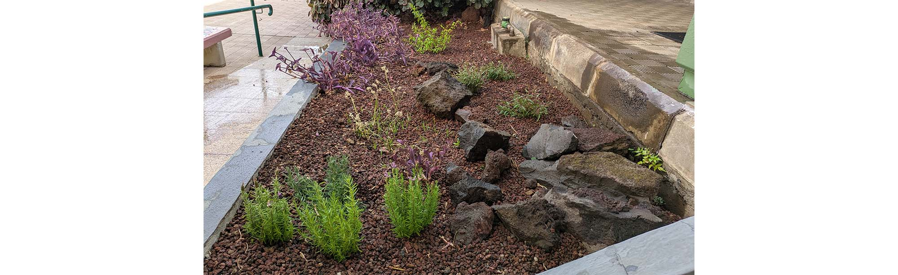
&emsp;&emsp;_Parterre recién plantado, agosto 2025_

## Parterre largo
De momento estoy dando forma a un proyecto, que pasa por mantener un rosal y reorganizar una serie de hortensias que están en una línea dispersas, además de plantear un jardín basado en grupos de la misma planta, en general de porte bajo para mantener la visión en perspectiva (es un jardín más para mirar que para circular por él). Se intentará incluir especies de flora canaria junto a otras de bajo mantenimiento, Hay que retirar una crásulas que están en primer plano, sobrecrecidas, y que tapan la vista del resto del parterre

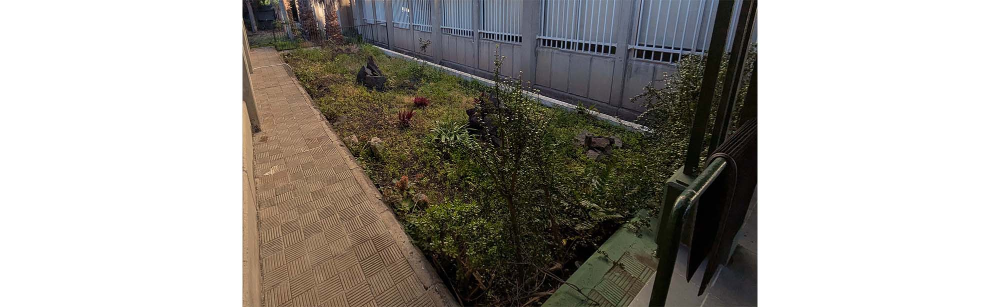
&emsp;&emsp;_Vista del parterre, agosto 2025_

Este proyecto se intentará llevar a cabo a partir de septiembre-octubre 2025.

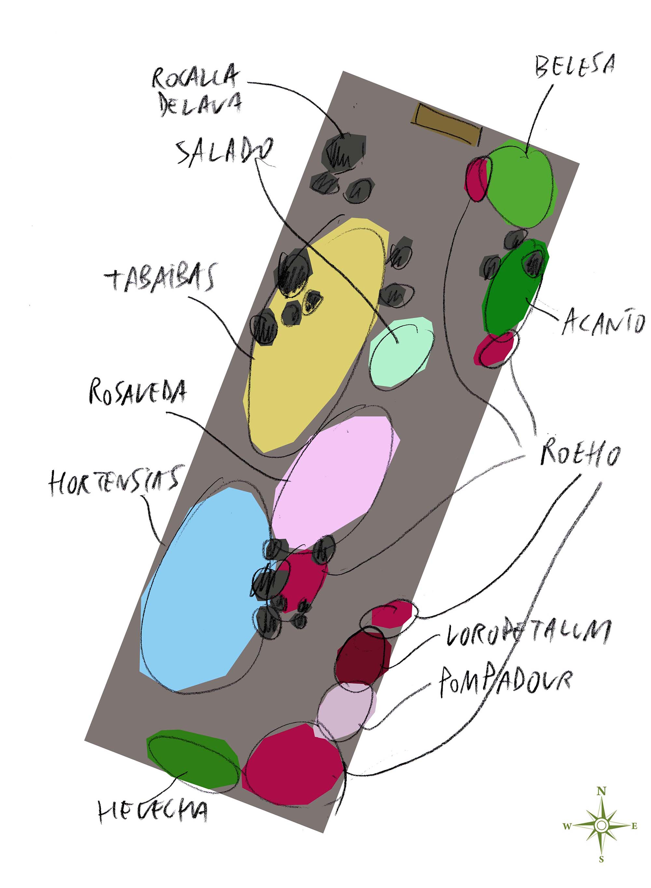

# 5. Jardines de la Casita de Sonido

En octubre 2024 se empezaron a reacondicionar varios parterres alrededor de la Casita de Sonido.
De momento se han plantado ejemplares de _Plumeria rubra_, recogidos de la tala de un antiguo ejemplar en la calle Heliodoro Rguez. Glez. de Santa Cruz.

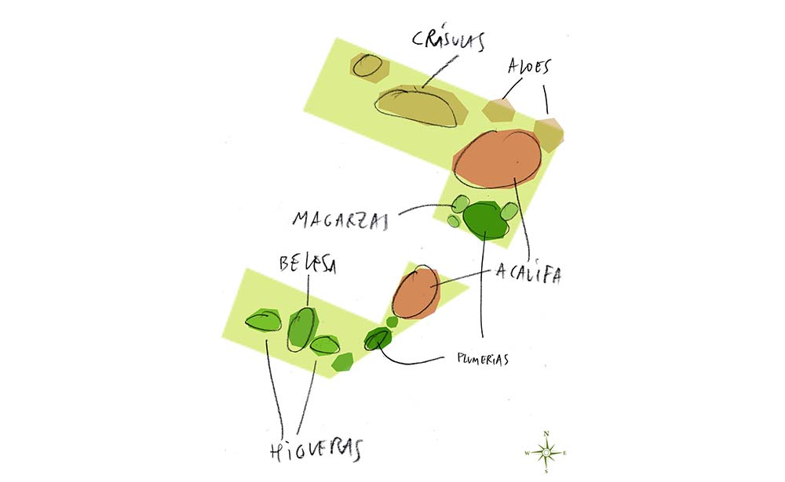

En proyecto está controlar el excesivo crecimiento de las parchas, reorganizar los aloes y crasas, mantener magarzas que están brotando de forma natural, limpiar las belesas, plantar unos ejemplares de higuera, y poco a poco plantear un ajardinamiento.

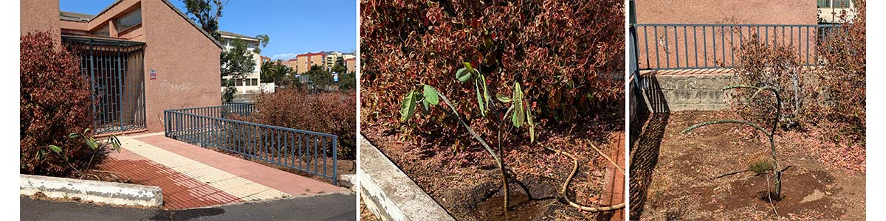
&emsp;&emsp;_Plumerias recién plantadas, octubre 2024_

***
url: [www.jardinedu.es](https://jardinedu.github.io/cifpcm/inicio) / contacto: correoprofe@gmail.com / [bio](https://jardinedu.github.io/cifpcm/about) 

***
