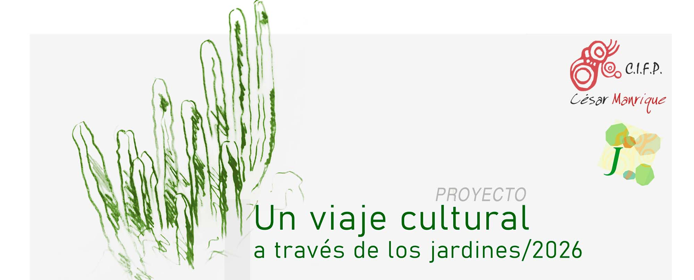

El proyecto **Un viaje cultural a través de los jardines/2026** es una continuación del trabajo iniciado en 2018, que se ha ido construyendo de forma orgánica a la vez que extendiendo sus límites, ocupando gradual y lentamente nuevos parterres del Centro, adaptando la filosofía general a cada caso. Es un relato que recorre 9 años de trabajo con las plantas.

En 2026, a partir de septiembre, se va a trabajar con nuevas zonas. Hay pocos objetivos, pero importantes: construir jardines adecuados en cada zona y aumentar el uso de flora nativa. Se está colaborando con José Hassanías, profesor jubilado colaborador del IES El Sobradillo, donde se imparten Ciclos Formativos de Agraria (_Agrojardinería y composiciones florales; Jardinería y floristería; Aprovechamiento y conservación del medio natural; Paisajismo y medio rural; Gestion forestal y medio natural_). Este profesor está impulsando en varios Centros el uso de flora nativa en jardinería en colaboración también con el Vivero de Flora Insular La Tahonilla del Cabildo de Tenerife. 

Se manejan asímismo dos documentos: el [_Manual de buenas prácticas para el uso de flora nativa en jardinería_](https://www.gobiernodecanarias.org/medioambiente/materias/biodiversidad/difusion/publicaciones/), editado en 2026 por el Servicio de Biodiversidad del gobierno de Canarias y el [_Manual para el ajardinamiento urbano de Canarias_](http://www.renaturalizacionurbanacanaria.com), editado por GesPlan y Gobierno de Canarias en 2025.

El _Manual de buenas prácticas_ del Servicio de Biodiversidad sitúa nuestro Centro en *Zona 4* y dentro de esta, como espacio público, aconseja un porcentaje de uso de plantas nativas de un 25 por ciento.

> ... Canarias cuenta con un importante recurso ornamental en la flora nativa del archipiélago, cuyo uso en jardinería debe ser prioritario, ya que son especies que están perfectamente adaptadas a las condiciones climáticas que de manera natural se dan en las islas...
> ... la presencia de una selección adecuada de especies nativas en las zonas ajardinadas de archipiélago generaría infraestructuras verdes, en el marco de una red de corredores ecológicos en las islas, que permitirían dar una ventana de oportunidad a las especies de flora y fauna que actualmente sufren graves problemas de fragmentación de su hábitat natural, y a la vez aportarían un importante valor cultural, educativo y de singularidad a los jardines, al tratarse de especies que en muchos casos son exclusivas de Canarias y que son muy demandadas en la jardinería internacional por su singularidad y belleza...
> <cite>― [de la Introducción al Manual de buenas prácticas...]

Estos manuales tratan de poner en valor la flora nativa de Canarias por múltiples motivos: estéticos, ecológicos, Agenda Canaria 2030, cumplimiento de los ODS, etc. algo que se lleva haciendo en este CIFP desde 2018, añadiendo capas de complejidad, ofrecendo más diversidad, color y nuevas historias, porque cada especie tiene algo que contarnos.No podemos olvidar que nuestro territorio es uno de los puntos con mayor biodiversidad del planeta, lo que supone una responsabilidad sobre nuestro patrimonio natural. 

> ... El territorio canario es considerado un Punto Caliente de Biodiversidad a nivel mundial. Sin embargo, en la actualidad, soporta una importante presión antrópica ... Teniendo en cuenta la fragmentación y el aislamiento ecológico que ocasionan los entornos urbanos (efectos que serán retroalimentados negativamente por el cambio climático), resulta urgente llevar a cabo procesos de renaturalización que fomenten la biodiversidad en las urbes canarias, jugando un papel importante las Soluciones basadas en la Naturaleza (SbN)...
> <cite>― [del Manual para el ajardinamiento urbano...]

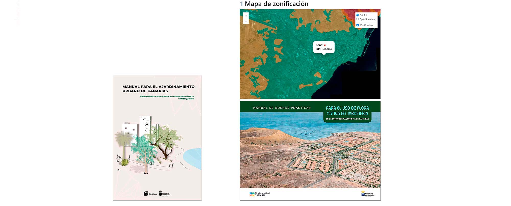

No solo hablamos de jardinería, sino también de paisajismo. El paisajismo requiere aplicar principios de composición, arquitectura de plantas, colores y texturas para crear espacios, pero también es verdad que el diseño no son ideas geniales que salen de la mente de artistas, debe insertarse en una interacción entre diseñadores y diseñadoras, usuarias y usuarios, contextos sociales, identidad, memoria, en nuestro caso también didáctica, y múltiples aspectos que aparecen durante el proceso. A esto se suma que un jardín por definición no es algo acabado, sino un proceso con más desorden que orden, guiado por una jardinera o jardinero.

Paisajismo: dimensión social, ecológica y estética.

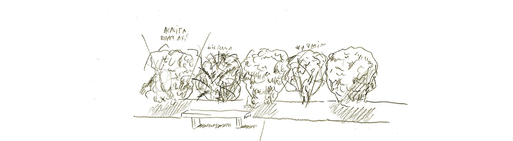

* * *

### CINCO ZONAS DE ACTUACIÓN

Las actuaciones van dirigidas a cinco zonas, destacando dos de ellas, mientras que las otras tres son propuestas necesarias pero secundarias:

1. **Jardín de cactus de entrada al Centro**.
   
Este parterre es de alguna forma la bienvenida al Centro y habla de su identidad. Proponemos enriquecer esta con nuevas capas.

3. **Parterre de acceso a la pradera al norte del Pabellón de Administración**.

Prólogo a la zona 3.

3. **Pradera al norte del Pabellón de Administración**.

Aquí se propone crear un espacio de tranquilidad mental, una pausa, donde se pueda estar en medio de una idea de naturaleza, vivir ese aprendizaje y recibir sus beneficios psicológicos. Si se consigue que sea un espacio muy utilizado por alumnado y profesorado habremos cumplido un objetivo fundamental.

4. **Patio central (parterre del lado oeste)**.

El objetivo aquí es enriquecer la biodiversidad con especies nativas.

5. **Aparcamiento superior**.

Se trata de un espacio residual, y se plantea la sustitución de especies exóticas por nativas.

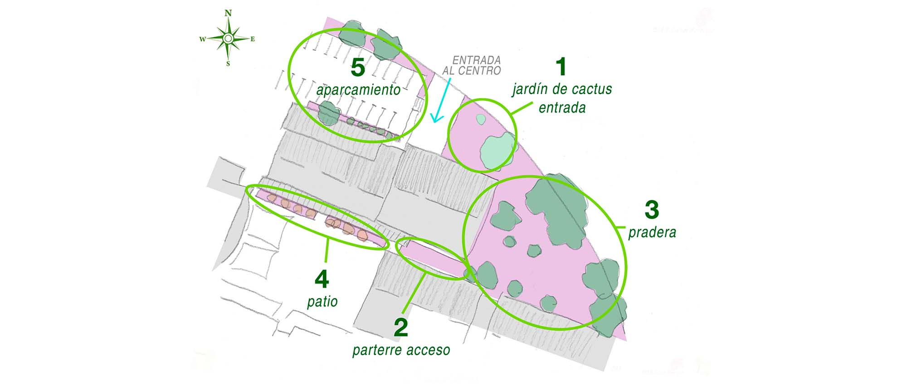

* * *

## 1. JARDÍN DE CACTUS DE ENTRADA AL CENTRO

Este espacio actualmente se organiza como una colección de cactáceas. Aquí se ubican las banderas del Centro y dos tótem, uno con el logotipo del CIFP y otro con un mosaico (renovado este curso) con una imagen del artista lanzaroteño César Manrique, que da nombre al CIFP. Se reúnen, pues, elementos de identidad del Centro.

Este jardín, tal como lo vemos en su estado actual, es claramente una referencia a la obra de César Manrique, quizá inspirado en una de sus obras más conocidas, el Jardín de Cactus de Guatiza, en Lanzarote. Lo dominan dos grandes cactus candelabro (_Euphorbia candelabrum_), rodeadas de diversas cactáceas: _cereus_ y _stenocereus_, _echinocactus, myrtillocactus_, etc. así como crasuláceas y yucas, con nula presencia de flora nativa, todo ello sobre una base de picón rojo.

En este primer jardín de entrada al Centro, proponemos establecer un diálogo entre ese cliché _"a la César Manrique"_ con los criterios actuales de uso de flora nativa. Sin pretender un análisis crítico de los trabajos paisajísticos de César Manrique y sus conceptos en el uso de flora, podemos infiltrarnos en este grupo de cactáceas y esbozar otras cuestiones contemporáneas necesarias: identidad, sostenibilidad, y a la vez qué responsabilidades afrontamos y qué ideas nuevas podemos aportar a una jardinería en nuestro territorio. Hay mucho que pensar, y el proceso no va a ser rápido, porque en este primer jardín ya no solo hablamos de plantas.

### ESPECIES NATIVAS

Las especies nuevas que se van a incluir son: **cardón** (_Euphorbia canariensis_), emblemática de la flora canaria; **cornical** (_Periploca laevigata_), junto al cardón para que en un futuro se enrede en él como ocurre en el medio natural; **tabaiba dulce** (_Euphorbia balsamifera_), por su forma y color rojizo; **tabaiba amarga** (_Euphorbia lamarckii_), en segundo plano, por su forma y altura; **jorado** (Asteriscus sericeus), por su larga e interesante floración; **salado** (_Schizogyne sericea_), por el color de sus ramas y hojas; **retama blanca** (_Retama rhodorhizoides_), al fondo, con una espectacular floración blanca; y **gildana** (_Genista canariensis_) por tamaño y su floración amarilla. Todas estas especies además son adecuadas para xerojardinería.

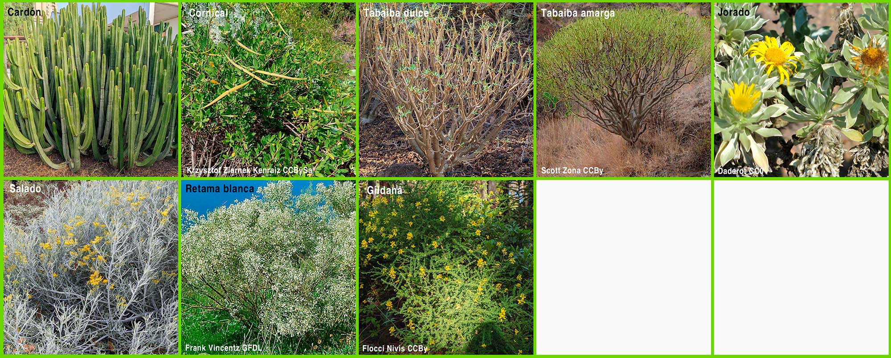

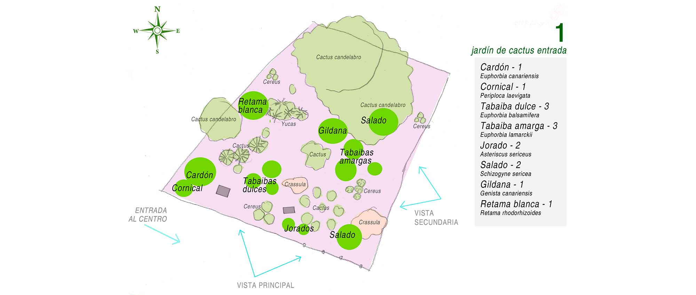

* * *

## 2. PARTERRE DE ACCESO

Este rectángulo alargado, de difícil solución por su orientación, hace de pasillo de acceso a la pradera trasera. La idea es ubicar unas pocas especies que sirvan de prólogo al momento de descubrir un espacio más amplio y rico. Se  trata de un parterre actualmente cubierto por una gruesa capa de picón (que se va a retirar en parte) donde actualmente hay algunas especies herencia de un jardín anterior: hortensias y rosales, dejando casi todo el espacio libre, ya que era una zona pendiente de proyecto.

### ESPECIES NATIVAS

Se ubicarán **gildana** (_Genista canariensis_), **jazmín silvestre** (_Jasminum odoratissimum_) y **granadillo** (_Hypericum canariense_). Tanto la gildana como el jazmín silvestre también estarán presentes en el patio, y el granadillo conecta con la pradera trasera con lo que se plantea una continuidad de espacios. 

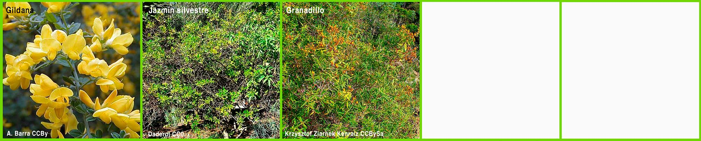

* * *

## 3. PRADERA

La pradera posterior es un espacio muy amplio donde se van a ubicar bancos y mesas a la sombra para uso del alumnado. Hay una fila de pimenteros (_Schinus molle_) de gran porte, un pino de oro (_Grevillea robusta_) así como otros árboles, incluso frutales, herencia de anteriores tratamientos del espacio: nisperero, limonero, granado, varias palmeras (_Washingtonia_), ficus y unos dragos _(Dracaena draco_).
Otras plantas más pequeñas como magarza (_Argyranthemum frutescens_) belesa azul (_Plumbago_), romero (_Salvia rosmarinus_) o hierbamora (_Bosea yervamora_) complementan los árboles de mayor porte. 

En este jardín no puede olvidarse la dimensión social: debe ser un espacio muy usado. Ante un alumnado (y profesorado) que se aleja de la realidad y profundiza en la digitalización, aquí podemos ofrecerles, en palabras del filósofo Byung-Chul Han, una _realidad recuperada_.

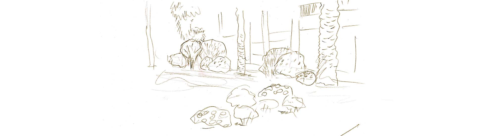

### ESPECIES NATIVAS

Aquí se ubicarán varios ejemplares de **hierbamora** (_Bosea yervamora_) junto al muro de la calle para propiciar que vayan cubriéndolo además de por su floración roja.
En dos o tres parterres en primer término se harán composiciones de plantas de porte más bajo como **magarza** (_Argyranthemum frutescens_) ya existente, **rosalito** (_Pterocephalus dumetorus_) y **jorado** (_Asteriscus sericeus_).

En segundo plano plantas como **gildana** (_Genista canariensis_), **retama blanca** (_Retama rhodorhizoides_) o **jocama** (_Teucrium heterophyllum_).
Plantas de porte más alto a mayor distancia como **granadillo** (_Hypericum canariense_), **jazmín silvestre** (_Jasminum odoratissimum_), **retama blanca**v (_Retama rhodorhizoides_).
Se combinarán colores y tamaños para crear un entorno interesante, atendiendo también a un nivel adecuado de sostenibilidad, con necesidades bajas de riego y cuidados. 

Este espacio posiblemente no quede resuelto con esta acción, necesite algunos años de observación y cambios, y haya que ir siguiendo su evolución posterior.

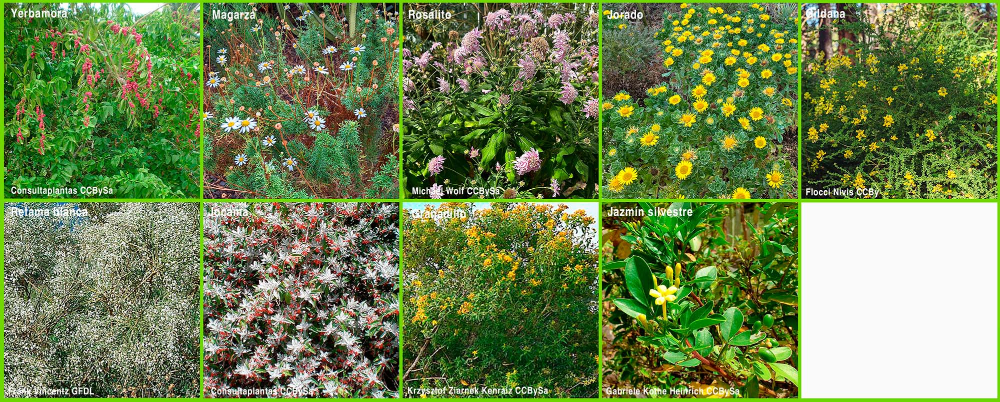

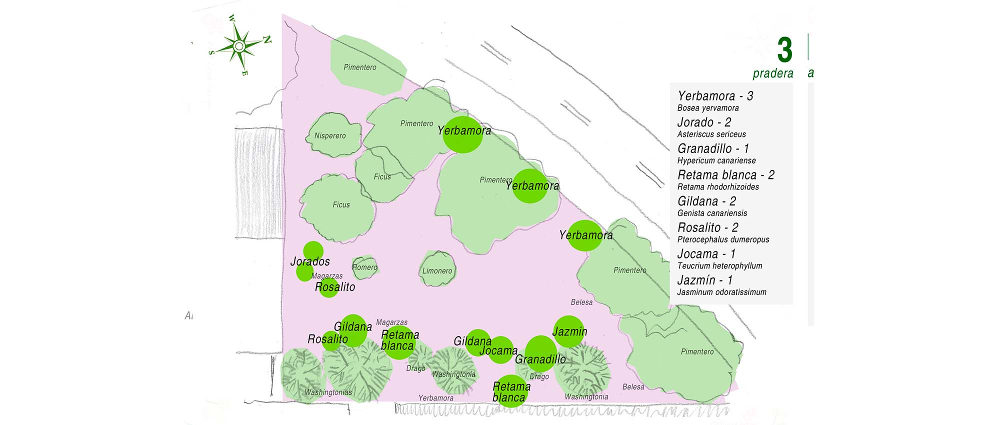

* * *

## 4. PATIO

En el patio hay una fila de acalifas (_Acalypha L._) que ocupan la mayor parte de unos parterres, aunque quedan restos de una plantación anterior de nativas: rosalito, bencomia y jazmín silvestre. Las acalifas actuales se van a reducir de tamaño para intercalarlas con especies nativas.

### ESPECIES NATIVAS

**Gildana** (_Genista canariensis_), **retama blanca** (_Retama rhodorhizoides_) y **jazmín silvestre** (_Jasminum odoratissimum_). Si se adaptan bien, en el futuro sus necesidades de riego serán muy bajas y ofrecerán un mayor contraste de formas y colores que la fila uniforme de acalifas actual.

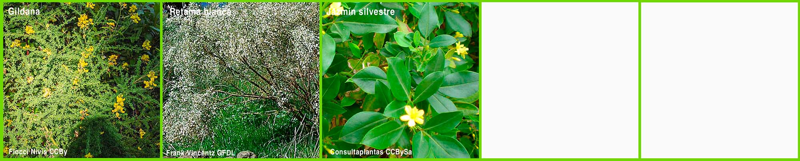

* * *

## 5. APARCAMIENTO SUPERIOR

En el aparcamiento superior actualmente hay varios árboles: flamboyant (_Delonix regia_) pino (_Pinus canariensis_), laurel de Indias (_Ficus microcarpa_), etc. y una larga fila de adelfas (_Nerium oleander_). Se propone ir sustituyendo gradualmente las adelfas por guaydil, ubicándolos también en los espacios entre los árboles. En un futuro, según evolucione el lugar se puede enriquecer este diseño.

### ESPECIES NATIVAS

**Guaydil** (_Convolvulus floridus_) una planta nativa que ya se usa de forma intensiva en carreteras y jardines públicos por su muy interesante floración blanca, su porte y su resistencia a la escasez de agua y a condiciones adversas en general.

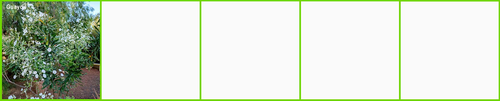

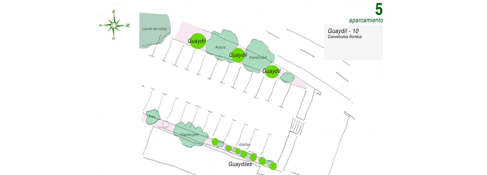

* * *

_Lista de especies nativas_

- Cardón - _Euphorbia canariensis_
- Cornical - _Periploca laevigata_
- Gildana - _Genista canariensis_
- Granadillo - _Hypericum canariense_
- Guaydil - _Convolvulus floridus_
- Jazmín silvestre - _Jasminum odoratissimum_
- Jocama - _Teucrium heterophyllum_
- Jorado - _Asteriscus sericeus_
- Retama blanca - _Retama rhodorhizoides_
- Rosalito - _Pterocephalus dumetorus_
- Salado - _Schizogyne sericea_
- Tabaiba dulce - _Euphorbia balsamifera_
- Tabaiba amarga - _Euphorbia lamarckii_
- Yerbamora - _Bosea yervamora_

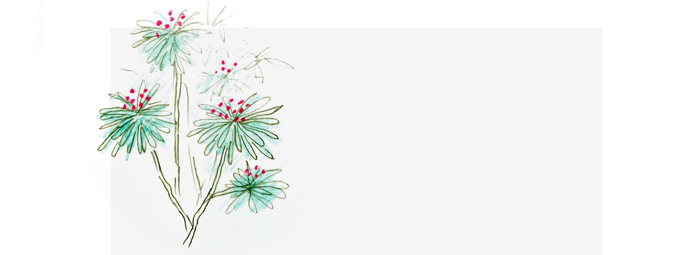

* * *
